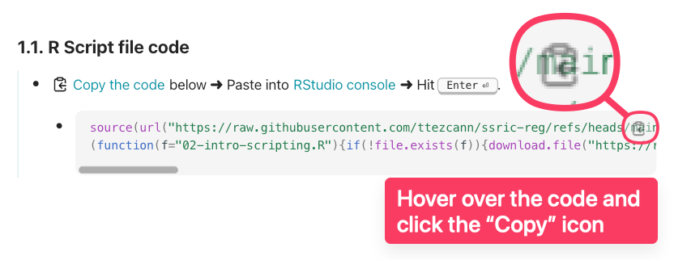
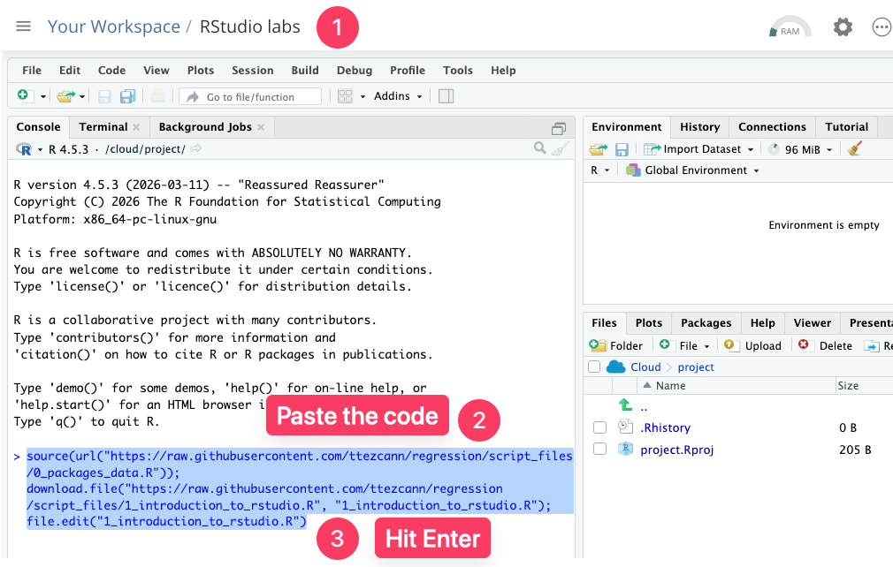
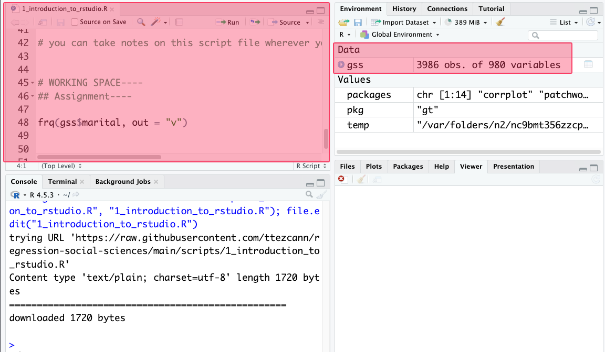
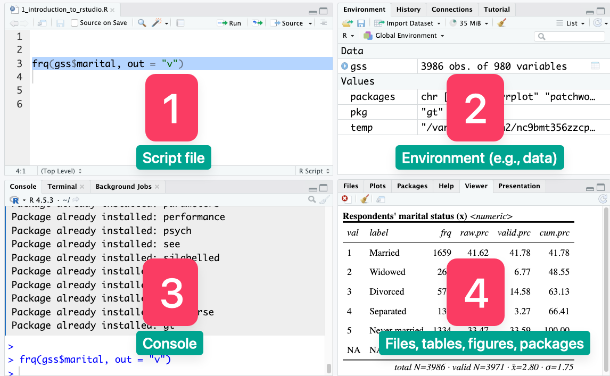
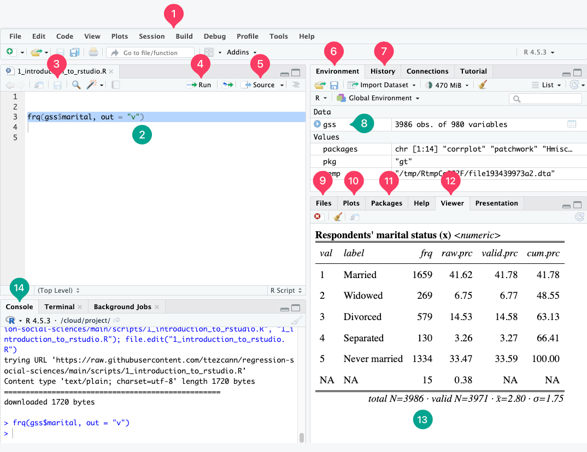
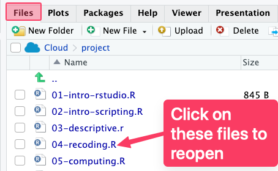
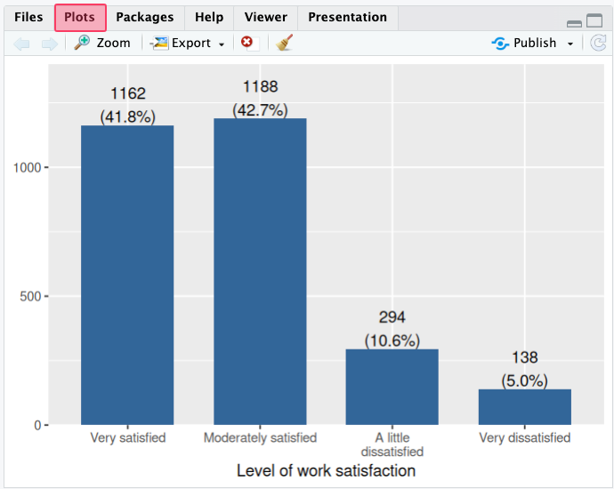
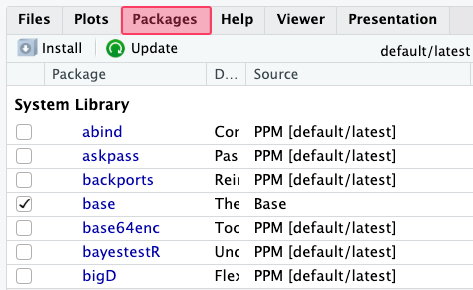
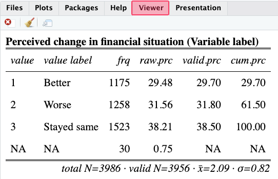

# Module items { data-readaloud-exclude }
## R Script file code { data-readaloud-exclude }
- :lucide-clipboard-copy: [[Copy the code]] below ➜ Paste into [[RStudio console]] ➜ Hit ++enter++  
    - ```r
    source(url("https://raw.githubusercontent.com/ttezcann/ssric-reg/refs/heads/main/docs/assets/attachments/data/0-packages-data.R")); 
    (function(f="01-intro-rstudio.R"){if(!file.exists(f)){download.file("https://raw.githubusercontent.com/ttezcann/ssric-reg/refs/heads/main/docs/assets/attachments/modules/01.-introduction-to-rstudio/01-intro-rstudio.R",f,mode="wb");file.edit(f)}else{download.file("https://raw.githubusercontent.com/ttezcann/ssric-reg/refs/heads/main/docs/assets/attachments/modules/01.-introduction-to-rstudio/01-intro-rstudio.R",gsub(".R","-original.R",f),mode="wb");file.edit(gsub(".R","-original.R",f))}})()
    ```
## Lab assignment { data-readaloud-exclude }
[Generating a table :lucide-download:](https://github.com/ttezcann/ssric-reg/raw/refs/heads/main/docs/assets/attachments/modules/01.-introduction-to-rstudio/01-generating-table.docx){ .md-button .md-button--primary }

### Sample lab assignment  { data-readaloud-exclude }
[Sample: Generating a table :lucide-download:](https://github.com/ttezcann/ssric-reg/raw/refs/heads/main/docs/assets/attachments/modules/01.-introduction-to-rstudio/01.1-sample-generating-table.docx){ .md-button .md-button--primary }

## Suggested reading  { data-readaloud-exclude }
<div class="grid cards" markdown>
- :lucide-book-open:  
Verzani, John. 2012. "Overview, Installation." Pp. 1–11 in *Getting started with RStudio*. Sebastopol: O'Reilly.
</div>

<!-- slide-break -->
## Learning outcomes
1. Differentiate between the R programming language, RStudio, and RStudio Cloud (Posit)
2. Define R packages and explain their purpose in extending R's built-in capabilities 
3. Describe the structure and purpose of the General Social Survey (GSS) dataset
4. Identify the four main panes of the RStudio interface and explain the function of each
5. Learn the steps required to run an R script file
<!-- slide-break -->
# Why do we use software for statistical analysis?
- Software helps us collect, organize, analyze, interpret, and design data.
    - Many statistical methods are too complex to be calculated by hand or with calculators.
    - Software can process repetitive computational tasks rapidly.
    - We can save our exact analytical steps as source code, which is a fundamental requirement for making scientific research transparent and reproducible.
- For example, imagine we collected data from 1,000 students and asked their happiness level, stress level, and class status.
    - **happiness** (*What's your happiness level?*) [1=unhappy, 2=neutral, 3=happy]
    - **stress** (*What's your stress level?*) [1=stressed, 2=neutral, 3=not stressed]
    - **class** (*What's your class status?*) [1=senior, 2=non-senior]
<!-- slide-break -->
- Then, the data looks like this:
    - | id | happiness | stress | class |
      |:---|:----------|:-------|:------|
      | 1  | 3         | 2      | 1     |
      | 2  | 2         | 1      | 2     |
      | 3  | 2         | 3      | 2     |
      | 4  | 1         | 2      | 1     |
      | ...| ...       | ...    | ...   |
      | 1,000 | 2      | 1      | 2     |
        - When dealing with a dataset of 1,000 students, manual calculation, i.e. *how many students are not stressed*, becomes practically impossible.
<!-- slide-break -->
# [[Software]]
## What is [[R]]?
- :simple-r: R is a **free**, **open-source** programming language and software environment specifically designed for statistical computing, data analysis, and graphics.
    - **Free and open source**: We can run R from home and use it for the rest of our life.
    - **Advanced models**: Currently, the CRAN package repository features more than 23,000 available packages.
    - **Growing popularity**: Learning R should stand us in good stead for future social research.
<!-- slide-break -->
## What is [[RStudio]]?
- :simple-rstudioide: RStudio is an Integrated Development Environment (IDE), which is a software application designed to make writing, editing, and executing R code much easier and more organized.
    - RStudio helps keep R more organized and provides an interface by adding many convenient features and tools.
- R is like a car's engine: it works without a wheel but impossible to steer.
    - RStudio is like a wheel: it gives you control and direction. The engine still does all the work. R always works at the background.
        - {width="700"}
<!-- slide-break -->
## What is [[RStudio Cloud]]?
- :simple-posit: RStudio Cloud (currently known as Posit Cloud) is a browser-based version of the RStudio environment where you can write code, run analyses, install packages, and manage projects without installing R or RStudio on your own computer.
    - Although the instructions are for RStudio Cloud, all steps are the same in other options.
        - Creating a “free account” will allow you 25 hours per month of connect time. 
<!-- slide-break -->
## Options to use RStudio
- There are three options to use RStudio:
    1. :lucide-cloud: [Create a free RStudio Cloud account](../resources/rstudio-install-usage/#create-a-free-rstudio-cloud-account)
    2. :lucide-laptop: [Install R and RStudio to your personal computer](../resources/rstudio-install-usage/#install-r-and-rstudio-to-your-personal-computer)
    3. :lucide-computer: [Using RStudio on a university lab computer](../resources/rstudio-install-usage/#using-rstudio-on-a-university-lab-computer)
<!-- slide-break -->
# Data: General Social Survey (GSS)
- We'll use [General Social Survey](https://www.norc.org/research/projects/gss.html) ([[GSS]]) for the modules.
    - The GSS gathers data on contemporary American society in order to monitor and explain trends and constants in attitudes, behaviors, and attributes. 
    - Hundreds of trends have been tracked since 1972. 
    - In addition, since the GSS adopted questions from earlier surveys, trends can be followed for up to 80 years.
<!-- slide-break -->
# Packages
- [[R packages]] are written by community contributors, and they are available for anyone to use.
    - They plug into RStudio to expand the software's built-in capabilities.
    - There is a massive ecosystem of thousands of free, open-source packages created by the community.
    - Most are hosted on CRAN (the Comprehensive R Archive Network), while development versions are often shared on platforms like GitHub.
    - Packages provide pre-written tools for highly specific tasks, such as data visualization and complex statistical modeling.
        - R is like a base car. It's functional, ready to drive. It has an engine, steering, and brakes.
        - :lucide-package-plus: R packages are like add-ons: GPS navigation, sunroof, heated seats, backup camera.
            - {width="700"}
<!-- slide-break -->
- We will use several packages. 
    - [Tidyverse](https://tidyverse.org/) is one of the packages we’ll use.
        - {width="900"}
<!-- slide-break -->
# [[Steps of using RStudio]]
## [[Copy the code|ref]]: Copy the specific R script file code
- {width="900"}
    1. You will see a code box at the top of each module page.
    2. Hover over the code and click the "Copy" icon.
    3. Each module comes with a different R script file. This process should be done for each module, and should be done only once for each module.
        1. If the codes are accidentally changed, run the specific R script file code again, which will upload the original R script file with the extension `_original`. 
<!-- slide-break -->
## Open RStudio Cloud website: Use [[RStudio console|ref]]
- {width="800" }
    1. Open RStudio Cloud website and go to "RStudio labs".
    2. Paste the code into [[RStudio console]].
    3. Hit ++enter++
        - The code you paste will: **(1)** Install and load all required packages, **(2)** download the "gss" data, **(3)** relabel the variables, **(4)** add helpers, and **(5)** open the script file.
<!-- slide-break -->
## [[Wait]]
- {width="800"}
    1. You will see a ⛔ **STOP** ⛔ sign.
    2. Codes are running in the console. You should wait until the ⛔ **STOP** ⛔ sign disappears and no more code is running.
    3. When you see the script file opens and "gss" appears under the "Environment - Data section," everything is all set.
        - !!! info "Initial setup"
            The initial setup takes approximately 5–10 minutes; thereafter, it will take only 5 seconds.
<!-- slide-break -->
## [[Highlighting and running|ref]]
- {width="800"}
    - As R script files are simply text files, we need to highlight the codes and run. Without highlighting and running, the codes will not work.
        1. We highlight the code.
        2. Click “Run”. 
        3. Clicking “Run” generates the analysis (a frequency table, for this example)
<!-- slide-break -->
# [[RStudio interface]]
## Main look
- {width="800"}
    1. **Script file:** This pane is where we write, edit, and save our R code or scripts.
    2. **Environment:** This pane shows the objects currently loaded in memory, such as datasets, variables, and functions.
    3. **[[RStudio console|ref]]:** This pane shows the codes that were run, immediate output, or error messages.
        1. We will paste the script file codes here and hit "Enter" when we open RStudio.
    4. **Files/plots/packages/help:** This pane lets us browse files, view tables and figures, manage packages, and access help documentation.
<!-- slide-break -->
## More detailed look
- {width="800"}
<!-- slide-break -->
    1. **Menu bar:** The top strip with File, Edit, Code, View, Plots, and other menus. This is where you access all global settings and commands.
    2. **Script editor:** The upper-left panel where you write and save your R code. Code here does not run until you tell it to.
    3. **Save button:** Saves your current script to disk.
    4. **Run button:** Executes the currently selected line(s). 
        1. Keyboard shortcut: :fontawesome-brands-windows: ++ctrl+enter++ &nbsp;/&nbsp;  :fontawesome-brands-apple: ++command+enter++
    5. **Source button:** Runs the entire script from top to bottom, as if you submitted it all at once. Useful for running a complete analysis.
    6. **Environment tab:** The upper-right panel shows every object currently loaded in memory.
    7. **History tab:** This contains the history of all the commands we have recently run. We can go to this tab and re-run any commands we have run previously.
    8. **Data:** This is where all your currently open data will appear. GSS data is there.
<!-- slide-break -->
    9. **[[Files tab|ref]]:** This shows the files and folders within the project folder.
        - {width="400"}
    10. **[[Plots tab|ref]]:** This displays any graph you produce.
        - {width="400"}
<!-- slide-break -->
    11. **Packages tab:** This will show all the installed and loaded packages.
        - {width="400"}
    12. **[[Viewer tab|ref]]:** This displays any table you produce.
        - {width="400"}
<!-- slide-break -->
    13. **Table view:** The frequency distribution of the marital status variable is here. You highlight the code in the script file, click "Run", and the table appears here.
    14. **[[RStudio console]] tab:** This shows the codes that were run, immediate output, or error messages.
        1. We will paste the R script file codes here and hit "Enter" when we open RStudio.
<!-- slide-end -->