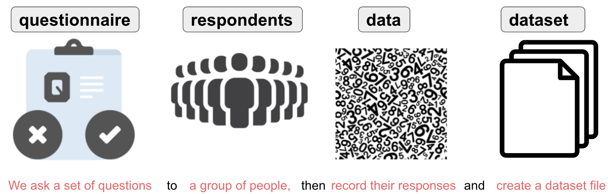
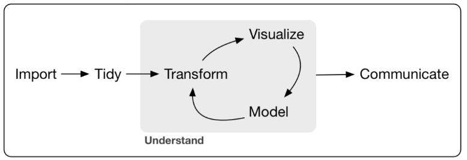
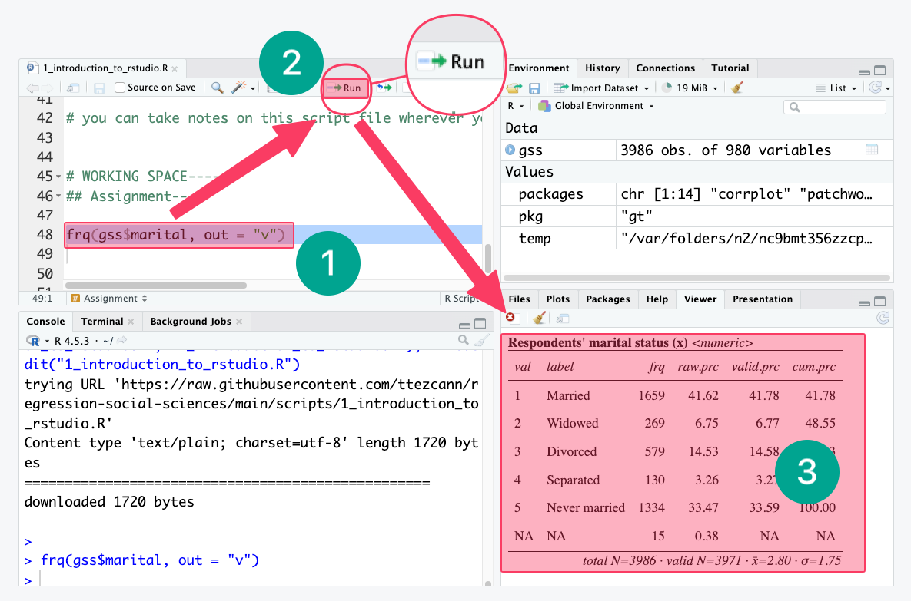
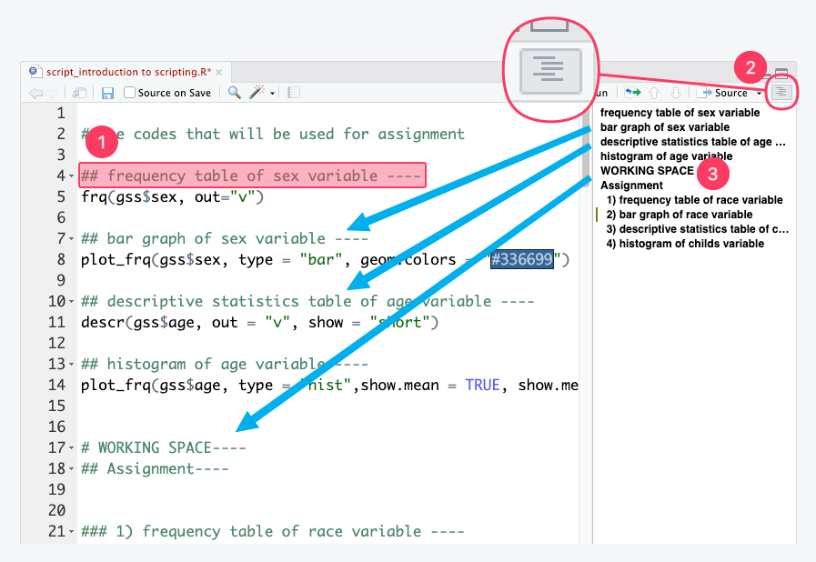
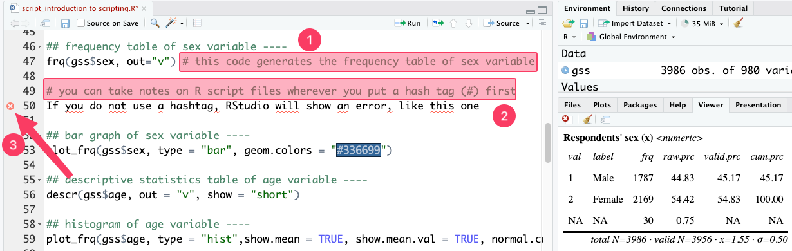
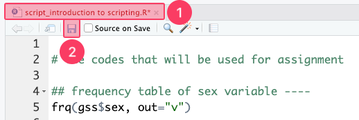
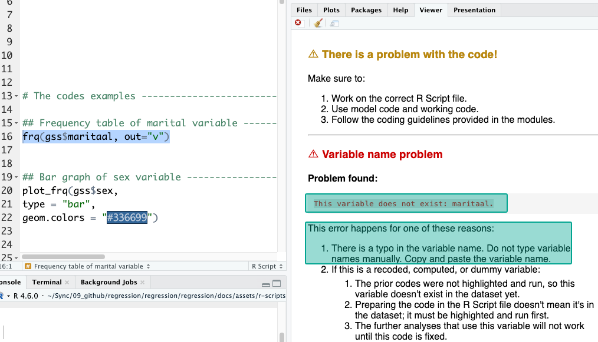
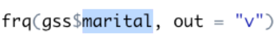
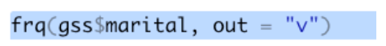
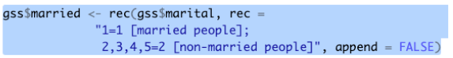

# Module items  { data-readaloud-exclude }
## R Script file code { data-readaloud-exclude }
- :lucide-clipboard-copy: [[Copy the code]] below ➜ Paste into [[RStudio console]] ➜ Hit ++enter++  
    - ```r
    source(url("https://raw.githubusercontent.com/ttezcann/ssric-reg/refs/heads/main/docs/assets/attachments/data/0-packages-data.R")); 
    (function(f="02-intro-scripting.R"){if(!file.exists(f)){download.file("https://raw.githubusercontent.com/ttezcann/ssric-reg/refs/heads/main/docs/assets/attachments/modules/02.-introduction-to-data-and-scripting/02-intro-scripting.R",f,mode="wb");file.edit(f)}else{download.file("https://raw.githubusercontent.com/ttezcann/ssric-reg/refs/heads/main/docs/assets/attachments/modules/02.-introduction-to-data-and-scripting/02-intro-scripting.R",gsub(".R","-original.R",f),mode="wb");file.edit(gsub(".R","-original.R",f))}})()
    ```
        - When this R script file opens in a new tab, [[Save R script file|save your previous R script file(s)]], and 
            - Close the previous tabs (R Script files), which you can find later in the [[files tab]].

## Lab assignment  { data-readaloud-exclude }
[Keyboard shortcuts and scripting :lucide-download:](https://github.com/ttezcann/ssric-reg/raw/refs/heads/main/docs/assets/attachments/modules/02.-introduction-to-data-and-scripting/02-keyboard-shortcuts-scripting.docx){ .md-button .md-button--primary }

### Sample lab assignment { data-readaloud-exclude }
[Sample: Keyboard shortcuts and scripting :lucide-download:](https://github.com/ttezcann/ssric-reg/raw/refs/heads/main/docs/assets/attachments/modules/02.-introduction-to-data-and-scripting/02.1-sample-keyboard-shortcuts-scripting.docx){ .md-button .md-button--primary }

## Suggested reading  { data-readaloud-exclude }
<div class="grid cards" markdown>
- :lucide-book-open:  
Sturgis, Patrick, and Rebekah Luff. 2021. “The Demise of the Survey? A Research Note on Trends in the Use of Survey Data in the Social Sciences, 1939 to 2015.” International Journal of Social Research Methodology 24(6):691–96. doi:10.1080/13645579.2020.1844896
</div>

<!-- slide-break -->
## Learning outcomes
1. Define the key terminologies of survey (questionnaire, respondents, data, and dataset)
2. Define the key terminologies of data (question wording, variable name, variable label, value, value label, response category)
3. Learn what data science is and how it works
4. Learn scripting and using R script files
5. Differentiate between model code and working code to correctly edit variables within R scripts
6. Apply keyboard and mouse shortcuts
<!-- slide-break -->
# [[Terminologies]] 
## [[Survey terminology]]
- 
- 
<!-- slide-break -->
    - [[Questionnaire]]: A set of written **questions** used for collecting information from respondents.
    - [[Respondents]]: Individuals who respond to the questions in a questionnaire.
    - [[Data]]: The information collected from respondents. The numbers to be analyzed. 
    - [[Dataset]]: The information collected from respondents. The numbers to be analyzed.
<!-- slide-break -->
## [[Data terminology]]
- 
<!-- slide-break -->
    - The information above are provided in the [Variables in GSS](../resources/variables-in-gss.md) lab resources page. We'll be using this page for all modules.
        - 
            - [[Question wording|ref]]: The exact text of a question as it appears in the questionnaire.
            - [[Variable name|ref]]: Unique words assigned to each question. We use variable names in data analysis software.
            - [[Variable label|ref]]: Explains what the question is about. We use variable labels in our interpretations.
            - [[Value|ref]]: Numbers such as 1, 2, 3, etc., that appear in the dataset representing specific responses.
            - [[Value label|ref]]: What those values (numbers) mean, e.g., 1: yes, 2: no, etc.
            - [[Response category|ref]]: The combination of values and their corresponding value labels.
<!-- slide-break -->
# What is data science?
- Data science is a discipline that allows you to turn raw data into understanding, insight, and knowledge. Here is how data science works:
    - 
        1. **Importing data** means that you take data stored in a file and load it into a data frame in R.
        2.  **Tidying** your data means each column is a variable, and each row is an observation.
        3.  **Transformation** includes narrowing in on observations of interest.
        4.  **Visualization** will show you things that you did not expect.
        5.  **Models** are a mathematical or computational tool.
        6.  **Communicating** your results to others.
<!-- slide-break -->
# [[Using R script files]]
- We will follow certain workflows when it comes to using R script files.
    - An [[R script file]] is simply **a text file** containing a set of **codes** and **notes**. The script can be saved and used later to re-execute the saved codes. The script can also be edited so you can execute a modified version of the codes.
        1. **Reproducibility**: The ability to re-create a past analysis.
        2. **Automation**: The ability to rapidly re-create an analysis when data changes.
        3. **Communication**: Code is just text, so it is easy to communicate.
<!-- slide-break -->
## [[Highlighting and running]]
- {width="700"}
    - As R script files are simply text files, we need to highlight the codes and run. Without highlighting and running, the codes will not work.
        1. We highlight the codes 
        2. And, click “Run” 
        3. Clicking “Run” generates the analysis (a frequency table for this example)
<!-- slide-break -->
## [[Outline view|ref]]
- 
    - The R script files in the modules use comments as headings and subheadings to introduce the type of analysis; we always read these before running the code.
        1. Following these headings, `----` is used so that the heading levels are displayed with appropriate indentations in the [[outline view]].
        2. Click on the menu icon to open the outline view.
            1. Keyboard shortcut: &nbsp; :fontawesome-brands-windows: ++ctrl+shift+o++
            2. Keyboard shortcut: &nbsp; :fontawesome-brands-apple: ++command+shift+o++
        3. Click on the headings in the outline view to see them in the R script file.
<!-- slide-break -->
## [[Commenting]]
- 
    - Commenting on R script files is important to help you remember exactly what you did and why you made specific choices when you revisit the file months or years later.
    - A well-annotated R script file allows your colleagues (or your future self) to easily understand, trace, and recreate your analytical step.
        1. To write a comment, type the **hashtag symbol (#)** followed by your text. 
        2. R is programmed to completely ignore any text that comes after a hashtag on a given line.
            1. Because R does not have a built-in feature for large blocks of text, you must place a `#` at the beginning of every single line if your comment spans multiple lines.
        3. When an hashtag is not used, R gets confused and shows an error.
            1. Look at the red cross on **line 50**. When there is a red cross on the left side of the line number, there is something wrong with our codes.
<!-- slide-break -->
## [[Save R script file|ref]]
- {width="700"}
    - Regularly saving R script files is another step.
        1. When we make any changes, the font of the file name will be red with an asterisk (*).
        2. To save the R script file, click “Save.”
            1. The R script file name in black means no changes have been made or saved.
        3. After saving we can close these R script files, which we can find later under the [[files tab]].
<!-- slide-break -->
## [[Working space|ref]]
- 
    - **Working space** is the designated section at the bottom of the R script where we will edit codes for assignments.
        1. For easy navigation click [[outline view]] to see the headings and subheadings. Click "working space." 
            1. Alternatively, scroll down on the R script file.
        2. The codes for assignments will be put under the “working space." 
            1. We do not edit or change anything on R script files except under "working space." 
            2. Anything above the “working space” is teaching material.
<!-- slide-break -->
## [[Pasting variable names]]
- Pasting variable names is one of the most important workflow steps. It is very common to miswrite codes, forget commas, etc. 
    - Therefore, we only change the variable names inside the codes.
    - We **NEVER** type variable names or codes. We **ALWAYS**:
        - **Copy** &nbsp; :fontawesome-brands-windows: ++ctrl+c++ &nbsp;/&nbsp;  :fontawesome-brands-apple: ++command+c++ the variable names (from the modules page and assignments), and 
        - **Paste** &nbsp; :fontawesome-brands-windows: ++ctrl+v++ &nbsp;/&nbsp;  :fontawesome-brands-apple: ++command+v++ into our codes.
<!-- slide-break -->
- See what happens if we do not paste, but type the variable names:
    - {width="800" }
        - There is no variable called “maritaal”, but “marital.” 
            - RStudio warns us that "This variable does not exist: maritaal." 
            - We copy and paste variable names to avoid this possibility.
<!-- slide-break -->
## [[How to work with codes]]?
 - We never type the codes or variables inside the codes. Instead, we use model code and working code by copying-pasting:
    - **(1) [[Model code | ref]]:** 
        - Model code is a template that shows the correct code structure without being tied to a specific variable; it shows where to paste the variable name, `variable_here`. It is a code that serves as a reference and is never edited directly.
            - ```r linenums="1"
            frq(gss$variable_here, out = "v")
            ```
    - **(2) [[Working code | ref]]:** 
        - Working code is a copy of the model code edited to include an actual variable from the dataset. Here we replaced `variable_here` part with `sex`. 
            - ```r linenums="1"
            frq(gss$sex, out = "v")
            ```
<!-- slide-break -->
    - **The workflow:**
        1. Imagine we need a frequency table for the `sex` variable.
        2. Find the frequency table model code from the module page, and copy ([[Search]] `frequency table model code`).
        3. Paste it under the “[[working space]]” of the R script file. 
            1. Hit ++enter++ and add a blank line. 
            2. Paste the model code again. 
        4. The first code is the model code, and the second code is the working code that we will edit. We will replace `variable_here` part with `sex`. 
            - ```r linenums="1"  hl_lines="2 4"
            # WORKING SPACE-------
            frq(gss$variable_here, out = "v")

            frq(gss$variable_here, out = "v")
            ```
        5. Copy `sex` and paste to replace it with `variable_here`. [[Highlighting and running]] the working code (line 4) will generate the output. If our working code doesn't work, we compare it to the model code to troubleshoot. Maybe we accidentally deleted the comma.
            - ```r linenums="1"  hl_lines="2 4"
            # WORKING SPACE-------
            frq(gss$variable_here, out = "v")

            frq(gss$sex, out = "v")
            ```
<!-- slide-break -->
## [[Find this working code in the R script file|ref]]
- 
    - The code on the module pages and in the R script files is identical.
        - Right after each code explanation, the module page will say: 
            - "*Find this working code in the R script file*."
                - All the working code are above the [[working space]].
    - Then, open that module’s R script file in RStudio Cloud, and use [[outline view]].
        - [[Highlighting and running]] the working code will generate the exact output shown on the module page.
            - Do this for each working code in the modules pages to learn coding.
<!-- slide-break -->
# [[Keyboard shortcuts]]
 - The most frequently used keyboard shortcuts are copy-paste-undo. 
    - Do not use mouse right click for these functions.

        === ":fontawesome-brands-windows: Windows"
            **Copy**: &nbsp;++ctrl+c++  
            **Paste**: &nbsp;++ctrl+v++  
            **Undo**: &nbsp;++ctrl+z++  

        === ":fontawesome-brands-apple: macOS"
            **Copy**: &nbsp;++command+c++  
            **Paste**: &nbsp;++command+v++  
            **Undo**: &nbsp;++command+z++  
<!-- slide-break -->
## [[Hand and finger positions]]
- When using the keyboard shortcuts, do not use both hands. The ideal hand and finger positions are shown below:

    === ":fontawesome-brands-windows: Windows"
        1. Little finger is on ++ctrl++  and index or middle finger on letters:  ++c++&nbsp;- ++v++&nbsp;- ++z++&nbsp;
        2. Do not use both hands. Your other hand should be on the mouse (or trackpad).  
            - 

    === ":fontawesome-brands-apple: macOS"
        3. Thumb finger is on ++cmd++  and index or middle finger on letters:  ++c++&nbsp;- ++v++&nbsp;- ++z++&nbsp;  
        4. Do not use both hands. Your other hand should be on the mouse (or trackpad).  
            - 
<!-- slide-break -->
## [[Mouse shortcuts]]
- When it comes to copying, pasting, or replacing variables or codes, we use the following mouse/trackpad shortcuts:
    - Do not highlight the existing variable name to replace it with a new variable. 
        - :fontawesome-solid-computer-mouse::fontawesome-solid-computer-mouse: **DOUBLE CLICK** on it with your mouse/trackpad.
            - 
    - **[Single line]** Do not highlight all the line to copy or run the code. 
        - :fontawesome-solid-computer-mouse::fontawesome-solid-computer-mouse::fontawesome-solid-computer-mouse: **TRIPLE CLICK** with your mouse (click three times *really* fast).
            - 
    - **[Multiple lines]** Highlight with your mouse, carefully.
        - 
<!-- slide-end -->
