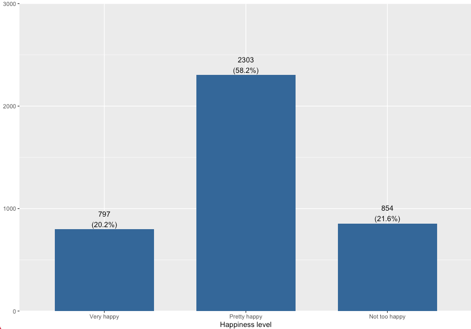
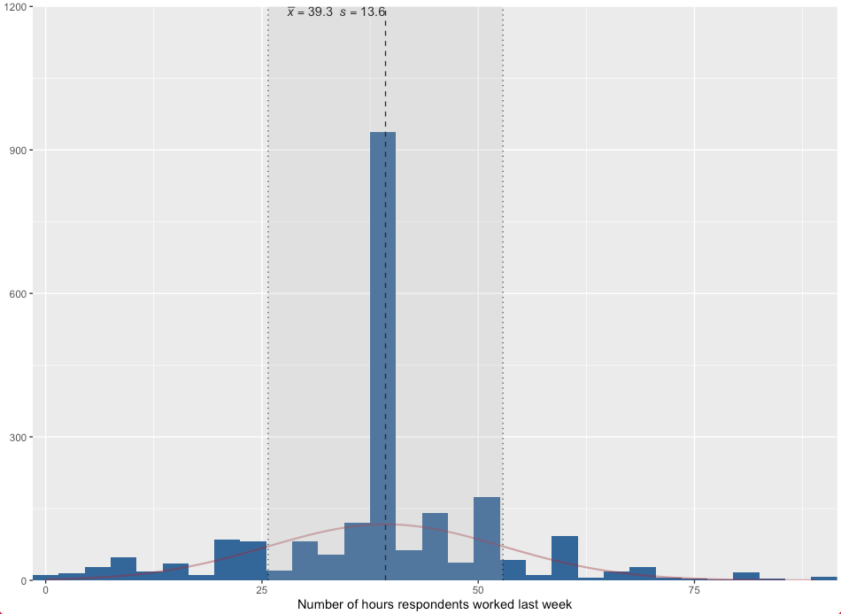

# Module items  { data-readaloud-exclude }
## R Script file code { data-readaloud-exclude }
- :lucide-clipboard-copy: [[Copy the code]] below ➜ Paste into [[RStudio console]] ➜ Hit ++enter++ 
    - ```r
    source(url("https://raw.githubusercontent.com/ttezcann/ssric-reg/refs/heads/main/docs/assets/attachments/data/0-packages-data.R")); 
    (function(f="03-descriptive.R"){if(!file.exists(f)){download.file("https://raw.githubusercontent.com/ttezcann/ssric-reg/refs/heads/main/docs/assets/attachments/modules/03.-descriptive-statistics/03-descriptive.R",f,mode="wb");file.edit(f)}else{download.file("https://raw.githubusercontent.com/ttezcann/ssric-reg/refs/heads/main/docs/assets/attachments/modules/03.-descriptive-statistics/03-descriptive.R",gsub(".R","-original.R",f),mode="wb");file.edit(gsub(".R","-original.R",f))}})()
    ```
        - When this R script file opens in a new tab, [[Save R script file|save your previous R script file(s)]], and 
            - Close the previous tabs (R Script files), which you can find later in the [[Files tab]].

## Lab assignment  { data-readaloud-exclude }
[Descriptive statistics :lucide-download:](https://github.com/ttezcann/ssric-reg/raw/refs/heads/main/docs/assets/attachments/modules/03.-descriptive-statistics/03-descriptive-statistics.docx){ .md-button .md-button--primary }

### Sample lab assignment  { data-readaloud-exclude }
[Sample: Descriptive statistics :lucide-download:](https://github.com/ttezcann/ssric-reg/raw/refs/heads/main/docs/assets/attachments/modules/03.-descriptive-statistics/03.1-sample-descriptive-statistics.docx){ .md-button .md-button--primary }

## Suggested reading  { data-readaloud-exclude }
<div class="grid cards" markdown>
- :lucide-book-open:  
Fisher, Murray J., and Andrea P. Marshall. 2009. “Understanding Descriptive Statistics.” Australian Critical Care 22(2):93–97. doi: 10.1016/j.aucc.2008.11.003.
</div>

<!-- slide-break -->
## Learning outcomes
1. Differentiate between categorical (binary, nominal, ordinal) and continuous variables based on their response categories
2. Learn how to generate and interpret a frequency table and a bar graph for a categorical variable
3. Learn how to generate and interpret a descriptive table and a histogram for a continuous variable
4. Learn how to generate and interpret a bar graph for a categorical variable and a histogram for a continuous variable
5. Practice model codes and working codes structure
<!-- slide-break -->
# What is [[variable]]?
- A variable is any characteristics, number, or quantity that can be measured or counted.
    - It represents any piece of information we know about our subjects (e.g., individuals).
<!-- slide-break -->
## [[Content of the variable]]
- Based on the content of the variable, what it asks, there are two types of variables:
    1. **[[Demographic variables]]**
        - Questions about respondents’ demographics are called demographic variables or control variables, such as education, age, gender, income, race/ethnicity.
    2. **[[Contextual variables]]**
        - Questions about respondents’ attitudes, beliefs, or behaviors, are called contextual variables, such as happiness, environmental attitudes, friendship networks, social trust.
<!-- slide-break -->
## [[Types of the variable]]
- Based on the way it is asked and the nature of it; 
    - There are two main types of the variables, which are important for data analysis. 
        - They could be:
            1. **Categorical**, or 
            2. **Continuous**.
                - We need to know what kind of variable we're analyzing, because analysis techniques are different for each.
<!-- slide-break -->
### [[Categorical]] variables
- Categorical variables take on values that are labels. 
    - Variables are categorical when respondents are provided responses to choose from.
- Values are **NOT** real numbers.
    - In the response categories below, `(3) no` is not triple of `(1) yes`.
        - !!! info "Categorical variable"
            - **Do you like coffee?**  
                1. Yes  
                2. Not much  
                3. No  
    - Depending on the response categories, such as `(1) yes, (2) not much, (3) no`, there are three different categorical variables, described as below.
<!-- slide-break -->
#### [[Binary]] variables
- Binary variables include two responses. 
    - Examples include true-or-false and yes-or-no questions.
        - !!! info "Binary variable"
            **Are you satisfied with your current job?**  
            **(1)** yes  
            **(2)** no  
<!-- slide-break -->
#### [[Nominal]] variables
- Nominal variables have more than two responses to choose from.
    - One more response category makes a binary variable a nominal.
        - !!! info "Nominal variable"
            **What is your job status?**  
            **(1)** working full time  
            **(2)** working part time  
            **(3)** unemployed
<!-- slide-break -->
#### [[Ordinal]] variables
- Ordinal variables have responses that can be put in a logical and hierarchical order. 
    - Values are rank ordered.
        - For example, below there's a logical order from `(1) not satisfied at all `to `(5)very satisfied` 
    - The differences between the responses are unknown or inconsistent. 
        - For example, `(2) not satisfied` is not double of `(1) not satisfied at all`.
    - We do not treat the values of categorical variables as real numbers.
        - !!! info "Ordinal variable"
            **How satisfied are with your current job?**  
            **(1)** not satisfied at all  
            **(2)** not satisfied  
            **(3)** more or less  
            **(4)** satisfied  
            **(5)** very satisfied  
<!-- slide-break -->
### [[Continuous]] variables
- Continuous variable values represent real numbers.
    - When respondents are NOT provided options to choose from.
    - Here, the age of 20 is double of the age of 40, so it is continuous.
        - !!! info "Continuous variables"
            - **What is your age?**  
                - 20, 40, 48, 80  
            - **What is your income?**  
                - $10,000, $30,000, $48,500  
            - **How many years of schooling did you complete?**  
                - 10, 15, 17, 20  
<!-- slide-break -->
# Determining variable type exercise
- Determining the type of variable is important because different analysis techniques are used depending on the variable type.
    - Some questions from different surveys will be shown.
    - We will determine if they are;
        - **Categorical** (If so, **binary**, **nominal**, or **ordinal**)
        - **Continuous**

<!-- slide-break -->
- ??? abstract "1. Youth Participatory Politics Survey Project"
    - *"I am interested in political issues. Do you..."*  
        - | 1 | 2 | 3 | 4 |
          |:---:|:---:|:---:|:---:|
          | Strongly disagree | Disagree |  Agree | Strongly agree |
            - ??? tip "Show the answer"
                - **Categorical (Ordinal)**:  
                    - The responses can be put in a logical, hierarchical order: from strongly disagree to strongly agree.
                    - We do not treat these as real numbers.
<!-- slide-break -->
- ??? abstract "2. American Health Values Survey"
    - *"During the last 5 years do you think your health in general has gotten better, gotten worse or stayed about the same?"*
        - | 1 | 2 | 3 |
          |:---:|:---:|:---:|
          | Better | Worse |  Stayed about the same |
            - ??? tip "Show the answer"
                - Categorical (Nominal)  
                    - There are more than two categories, so it is not binary.  
                    - These three answers do not form a clear rank-ordered scale. "Better" and "worse" point in opposite directions, and "stayed about the same" is not naturally in the middle of a single ordered ladder the way "disagree → agree" is.
<!-- slide-break -->
- ??? abstract "3. European Social Survey"
    - *"And at what age, approximately, would you say men reach old age?"* Type in age ... 
        - ??? tip "Show the answer"
            - **Continuous**:  
                - Respondents are not given options to choose from; they type in a value.
                - Age is a real number. For example, 70 is not a label; it has meaningful numeric relationships (e.g., 35 is half of 70).
<!-- slide-break -->
- ??? abstract "4. Latino National Survey"
    - *"Now I want to ask you about a particular child. Think about your child who had the most recent birthday and was enrolled in school last year. For the following questions please focus on this child."* Is this child enrolled in public or private school?
        - | Value | Label |
          | :--- | :--- |
          | 1 | Yes |
          | 2 | No |
            - ??? tip "Show the answer"
                - **Categorical (Binary)**:
                    - Respondents choose from two fixed responses
                    - Two response categories makes this binary, which is a type of categorical variable.
<!-- slide-break -->
- ??? abstract "5. National Surveys on Energy and the Environment"
    - *"How likely is it that weather in the US is influenced by global warming?"*
        - | 1 | 2 | 3 | 4 |
          |:---:|:---:|:---:|:---:|
          | Very likely| Somewhat likely |  Not likely | Not likely at all|
            - ??? tip "Show the answer"
                - **Categorical (Ordinal)**:
                    - The answers can be put in a logical order from most likely to least likely.
                    - We do not treat these as real numbers.
<!-- slide-break -->
- ??? abstract "6. Latino Second Generation Study"
    - *"What is the highest level of school your father has completed?"*
        - | Value | Label |
          | :--- | :--- |
          | 1 | No formal education |
          | 2 | 1st, 2nd, 3rd, or 4th grade |
          | 3 | 5th or 6th grade |
          | 4 | 7th or 8th grade |
          | 5 | 9th grade |
          | 6 | 10th grade |
          | 7 | 11th grade |
          | 8 | 12th grade NO DIPLOMA |
          | 9 | HIGH SCHOOL GRADUATE - high school DIPLOMA or the equivalent (GED) |
          | 10 | Some college, no degree |
          | 11 | Associate degree |
          | 12 | Bachelor's degree |
          | 13 | Master's degree |
          | 14 | Professional or Doctorate degree |
            - ??? tip "Show the answer"
                - **Categorical (Ordinal)**:
                    - The categories can be put in a logical, hierarchical order from lowest to highest education.
                    - Values are rank ordered, but they are not equal real numbers: (8) 12th grade no diploma is not eight times (1) No formal education.
<!-- slide-break -->
- ??? abstract "7. National Survey on Drug Use and Health"
    - *"About how many days out of 365 in the past 12 months were you totally unable to go to school or work or carry out your normal activities"*  
    Number of days ... 
        - ??? tip "Show the answer"
            - **Continuous**:
                - Respondents express their responses in a number of days; they are not picking from a fixed set of labels.
                - The value is a real number: 10 days is half of 20 days, and counts can be added and compared meaningfully as numbers.
<!-- slide-break -->
- ??? abstract "8. New Family Structures Study"
    - *"Thinking about your main job (for pay), which of the following sectors best describes your job?"*  
        - | 1 | 2 | 3 | 4 | 5 |
          |:---:|:---:|:---:|:---:|:---:|
          | Private sector | Federal government |  State or Local government | Non-profit sector | Self-employed |
            - ??? tip "Show the answer"
                - **Categorical (Nominal)**:
                    - Respondents choose from more than two fixed categories
                    - These sectors cannot be put in a single logical rank order: private sector is not "more" or "less" than federal government in the way "satisfied" is more than "not satisfied."
<!-- slide-break -->
- ??? abstract "9. Police-Public Contact Survey"
    - *"In the past 12 months, have you been involved in a traffic accident in which the police came to the scene?"*
        - | 1 | 2 |
          |:---:|:---:|
          | Yes | No |
            - ??? tip "Show the answer"
                - **Categorical (Binary)**:
                    - Respondents choose from two responses: yes or no.
<!-- slide-break -->
- ??? abstract "10. Well-Being and Basic Needs Survey, United States"
    - *"The following questions ask about you and your household. Are you now..."*
        - | 1 | 2 | 3 | 4 | 5 |
          |:---:|:---:|:---:|:---:|:---:|
          | Married | Widowed | Divorced | Separated | Never married |
            - ??? tip "Show the answer"
                - **Categorical (Nominal)**:
                    - Respondents choose from more than two fixed categories.
                    - Marital statuses are distinct labels. There is no single hierarchical order that ranks all five in the same way an agreement scale does. (Widowed is not "more" than divorced in a consistent numeric sense.)
<!-- slide-break -->
# [[Summary statistics]]
- Summary statistics is used to obtain quick summaries of variables.
    - For [[categorical]] variables, we use:
        - [[Frequency table]]
        - [[Bar graph]]
    - For [[continuous]] variables, we use:
        - [[Descriptive table]]
        - [[Histogram graph]]
<!-- slide-break -->
## [[Frequency table]]
- Frequency table is used to create a table showing the count and percentage for a single [[categorical]] variable.
    - The “Frequencies” (`frq`) code counts up how many times a response of a variable appears and calculates the percentage.
    - **Happiness level (Variable label)**
        - | value | value label   | frq  | raw.prc | valid.prc | cum.prc |
        |-------|---------------|------|---------|-----------|---------|
        | 1     | Very happy    | 797  | 19.99   | 20.16     | 20.16   |
        | 2     | Pretty happy  | 2303 | 57.78   | 58.24     | 78.40   |
        | 3     | Not too happy | 854  | 21.42   | 21.60     | 100.00  |
        | NA    | NA            | 32   | 0.80    | NA        | NA      |
<!-- slide-break -->
### Find the variable in Variables in GSS page
1. We will create a frequency table for the `finalter` variable, then interpret it.
2. We want to make sure that `finalter` is a categorical variable. 
3. [[Search]] the variable name in [Variables in GSS](../resources/variables-in-gss.md) page. We see that this is a [[nominal]], so a [[categorical]] variable.
    - | Variable name | Variable label | Variable type | Question wording and response categories |
    |---|---|---|---|
    | `finalter` | Perceived change in financial situation | Nominal | During the last few years, has your financial situation been getting better, worse, or has it stayed the same?<br><br>*(1: Better; 2: Worse; 3: Stayed same)* | 
<!-- slide-break -->
### [[Frequency table]] #code
- **[[Model code]]**
    - ```r linenums="1"  hl_lines="1"
    frq(gss$variable_here, out = "v")
    ```
- **[[Working code]]**
    - ```r linenums="1"  hl_lines="1"
    frq(gss$finalter, out = "v")
    ```
        - **Line 1:** We put `finalter` here ➜ `variable_here`.
            - [[Find this working code in the R script file]]. 
                - [[Highlighting and running]] this code will generate the output below (which will appear in the [[viewer tab]] of RStudio).
<!-- slide-break -->
### [[Frequency table]] #output
- **Perceived change in financial situation (Variable label)**
    - | value | value label | frq  | raw.prc | ==valid.prc== | cum.prc |
    |-------|-------------|------|---------|---------------|---------|
    | 1     | Better      | 1175 | 29.48   | **29.70**     | 29.70   |
    | 2     | Worse       | 1258 | 31.56   | **31.80**     | 61.50   |
    | 3     | Stayed same | 1523 | 38.21   | **38.50**     | 100.00  |
    | NA    | NA          | 30   | 0.75    | NA            | NA      |
<!-- slide-break -->
### [[Frequency table]] #interpretation
- !!! note "Frequency table interpretation sample"
    The **perceived change in financial situation** *variable* shows that **29.70%** of the respondents think their financial situation has **gotten better**; **31.80%** of the respondents think their financial situation has **gotten worse**; and **38.50% **of the respondents think their financial situation has **stayed same** during the last few years.
- !!! quote "Frequency table interpretation template"
    The **[[variable label]]** *variable* shows that **xx.xx%** of the respondents are / have / feel / think / said / reported **[[value label]] 1**, **xx.xx%** of the respondents are / have / feel / think said / reported **value label 2**, **xx.xx%** of the respondents are / have / feel / think / said / reported **value label 3**... 
- !!! success "Interpretation explanation"
    - After the [[variable label]], we add the word of "*variable*" in your interpretation: 
        - "The Perceived change in financial situation *variable* shows that..."
    - Depending on the variable, we need to tweak some parts of the interpretation. 
        - For example, "15.4% of the respondents are/have/feel/think/said/reported" etc.
    - We always interpret the valid percentage column **(valid.prc)** as it excludes the missing data (NA), showing 30 respondents who did not respond to this question.
<!-- slide-break -->
## [[Bar graph]]
- A bar graph is a visual representation of [[frequency table]]. 
    - It provides the same information as frequency table. The interpretation is same as frequency table interpretation.
        - {width="700"}
<!-- slide-break -->
### Find the variable in Variables in GSS page
1. We will create a bar graph for the `satjob` variable, then interpret it.
2. We want to make sure that `satjob` is a categorical variable.
3. [[Search]] the variable name, `satjob`, in [Variables in GSS](../resources/variables-in-gss.md) page. We see that this is a [[ordinal]], so a [[categorical]] variable.
    - | Variable name | Variable label | Variable type | Question wording and response categories |
      |---|---|---|---|
      | `satjob`| Level of work satisfaction | Ordinal | On the whole, how satisfied are you with the work you do?<br><br>*(1: Very satisfied; 2: Moderately satisfied; 3: A little dissatisfied; 4: Very dissatisfied)* | 
<!-- slide-break -->
### [[Bar graph]] #code
- **[[Model code]]**
    - ```r linenums="1"  hl_lines="1 2 3"
    plot_frq(gss$variable_here,
    type = "bar",
    geom.colors = "#336699")
    ```
- **[[Working code]]**
    - ```r linenums="1"  hl_lines="1 2 3"
    plot_frq(gss$satjob,
    type = "bar", 
    geom.colors = "#336699")
    ```
        - **Line 1:** We put `satjob` here ➜ `variable_here`. 
            - [[Find this working code in the R script file]]. 
                - [[Highlighting and running]] this code will generate the output below (which will appear in the [[plots tab]] of RStudio).
        - **Line 2:** Instead of `bar`, we can use other arguments, such as `density`, `box` or `line`.
        - **Line 3:** We can change the bar color here. Replace the hex color code ➜ `"#336699"`
            - !!! tip "Finding colors"
                - Browse and copy hex color codes at [https://coolors.co/palettes/trending](https://coolors.co/palettes/trending)
<!-- slide-break -->
### [[Bar graph]] #output
- {width="700"}
<!-- slide-break -->
### [[Bar graph]] #interpretation
- !!! note "Bar graph interpretation sample"
    The **level of work satisfaction** *variable* shows that **41.8%** of the respondents are **very satisfied**; **42.7%** of the respondents are **moderately satisfied**; **10.6%** of the respondents are a **little dissatisfied**, and **5%** of the respondents are **very dissatisfied** with the work they do.
- !!! quote "Bar graph interpretation template"
    The **[[variable label]]** *variable* shows that **xx.xx%** of the respondents are / have / feel / think / said / reported **[[value label]] 1**, **xx.xx%** of the respondents are / have / feel / think said / reported **value label 2**, **xx.xx%** of the respondents are / have / feel / think / said / reported **value label 3**... 
- !!! success "Interpretation explanation"
    - After the **variable label**, we add the word of "*variable*" in your interpretation: 
        - "The level of work satisfaction *variable* shows that..."
    - Depending on the variable, we need to tweak some parts of the interpretation. 
        - For example, "15.4% of the respondents are/have/feel/think/said/reported" etc.
    - Bar graphs already show the valid percentage **(valid.prc)**.
<!-- slide-break -->
## [[Descriptive table]]
- Descriptive table is used to create a table showing the mean and standard deviation for a single [[continuous]] variable.
    - The “Descriptives” (`descr`) code is used to determine:
        - **[[Mean]]**: 
            - The arithmetic average of a distribution, calculated by summing all observed values and dividing by the number of observations.
        - **[[Standard deviation]] (sd)**: 
            - A measure of dispersion that quantifies the average distance of individual observations from the mean. 
                - A smaller standard deviation indicates that values are concentrated near the mean, while a larger standard deviation reflects greater variability across observations.
    - | variable | variable label                               | n    | NA.prc | mean  | sd    |
      |:---------|:---------------------------------------------|------|--------|-------|-------|
      | hrs1     | Number of hours respondents worked last week | 2201 | 44.78  | 39.29 | 13.57 |
<!-- slide-break -->
### Find the variable in Variables in GSS page
1. We will create a descriptive table for the `educ` variable, then interpret it.
2. We want to make sure that `educ` is a continuous variable. We check this information in the [Variables in GSS](../resources/variables-in-gss.md) page.
3. [[Search]] the variable name, `educ`, in [Variables in GSS](../resources/variables-in-gss.md) page.  We see that this is a [[continuous]] variable.
    - | Variable name | Variable label | Variable type | Question wording and response categories |
    |---|---|---|---|
    | `educ` | Respondents' education in years | Continuous | What is the highest year of school you completed?<br><br>*(Min: 0, Max: 20)* |
<!-- slide-break -->
### [[Descriptive table]] #code
- **[[Model code]]**
    - ```r linenums="1"  hl_lines="1"
    descr(gss$variable_here, out = "v", show = "short")
    ```
- **[[Working code]]**
    - ```r linenums="1"  hl_lines="1 2 3"
    descr(gss$educ, out = "v", show = "short") 
    ```
        - **Line 1:** We put `educ` here ➜ `variable_here`. 
            - [[Find this working code in the R script file]]. 
                - [[Highlighting and running]] this code will generate the output below (which will appear in the [[viewer tab]] of RStudio).  
<!-- slide-break -->
### [[Descriptive table]] #output
- | variable | variable label                  | n    | NA.prc | ==mean== | ==sd== |
  |:---------|:--------------------------------|------|--------|----------|--------|
  | educ     | Respondents' education in years | 3952 | 0.85   | 14.24    | 2.92   |
<!-- slide-break -->
### [[Descriptive table]] #interpretation
- !!! note "Descriptive table interpretation sample"
    The **respondents' education in years** *variable* shows that **the average years of education that respondents received** is **14.42**, with standard deviation **2.92**.
- !!! quote "Descriptive table interpretation template"
    The **[[variable label]]** *variable* shows the average **[[variable label]]** of the respondents is [**mean**], with standard deviation [**sd**].
- !!! success "Interpretation explanation"
    - After the **variable label**, we add the word of "*variable*" in your interpretation: 
        - "The respondents' education in years *variable* shows that..."
    - Depending on the variable, we need to tweak some parts of the interpretation. 
        - For example, "the average years of education is...", "the average weeks of working is..." etc.
    - We use the mean (**mean column**) and standard deviation (**sd column**) in our interpretation.
<!-- slide-break -->
## [[Histogram graph]]
- Histogram graph is used to create a figure showing the mean and standard deviation for a single [[continuous]] variable. 
    - It provides the same information as descriptive table. 
        - {width="700"}
<!-- slide-break -->
### Find the variable in Variables in GSS page
1. We will create a histogram graph for the `age` variable, then interpret it.
2. We want to make sure that `age` is a continuous variable.
3. [[Search]] the variable name, `age`, in [Variables in GSS](../resources/variables-in-gss.md) page. We see that this is a [[continuous]] variable.
    - | Variable name | Variable label | Variable type | Question wording and response categories |
    |---|---|---|---|
    | `age` | Respondents' age | Continuous | What is your age?<br><br>*(Min: 18, Max: 89)* |
<!-- slide-break -->
### [[Histogram graph]] #code
- **[[Model code]]**
    - ```r linenums="1"   hl_lines="1 3"
    plot_frq(gss$variable_here, 
    type = "hist", normal.curve = T, show.mean = T, show.sd = T,
    geom.colors = "#336699", normal.curve.color = "#9b2226")
    ```
- **[[Working code]]**
    - ```r linenums="1"   hl_lines="1 3"
    plot_frq(gss$age, 
    type = "hist", normal.curve = T, show.mean = T, show.sd = T,
    geom.colors = "#336699", normal.curve.color = "#9b2226")
    ```
        - **Line 1:** We put `age` here ➜ `variable_here`. 
            - [[Find this working code in the R script file]]. 
                - [[Highlighting and running]] this code will generate the output below (which will appear in the [[plots tab]] of RStudio).
        - **Line 3:** We can change the bar and curve color here separately. Replace the hex color code for bar ➜ `"#336699".` Replace the hex color code for curve ➜ `"#9b2226"` 
            - !!! tip "Finding colors"
                Browse and copy hex color codes at [https://coolors.co/palettes/trending](https://coolors.co/palettes/trending)
<!-- slide-break -->
### [[Histogram graph]] #output
- {width="700"}
<!-- slide-break -->
### [[Histogram graph]] #interpretation
- !!! note "Histogram graph interpretation sample"
    The **respondents' age** *variable* shows that the **average age of the respondents** is **49**, with standard deviation **17.7**.
- !!! quote "Histogram graph interpretation template"
    The **[[variable label]]** *variable* shows that the average **[[variable label]]** of the respondents is [**mean**], with standard deviation [**sd**].
- !!! success "Interpretation explanation"
    - After the **variable label**, we add the word of "*variable*" in your interpretation: 
        - "The respondents' age *variable* shows that..."
    - Depending on the variable, we need to tweak some parts of the interpretation. 
        - For example, "the average age of the respondents is...", "the average weeks of working is..." etc.
    - We use the mean and standard deviation in our interpretation. 
        - The mean is indicated by **x̄**, the standard deviation is indicated by ***s*** (at the very top of the histogram graph)
<!-- slide-end -->