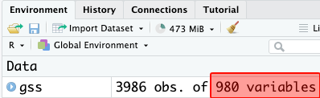
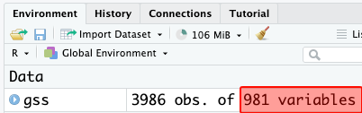
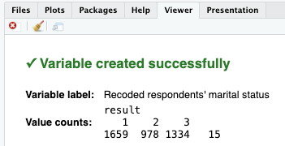
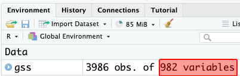
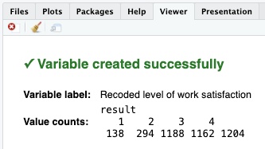
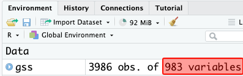
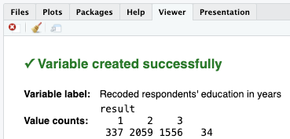
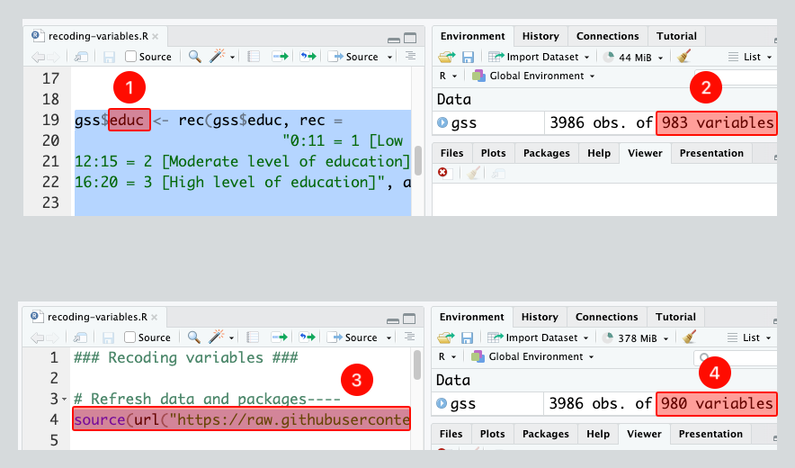

# Module items  { data-readaloud-exclude }
## R Script file code { data-readaloud-exclude }
- :lucide-clipboard-copy: [[Copy the code]] below ➜ Paste into [[RStudio console]] ➜ Hit ++enter++  
    - ```r
    source(url("https://raw.githubusercontent.com/ttezcann/ssric-reg/refs/heads/main/docs/assets/attachments/data/0-packages-data.R")); 
    (function(f="04-recoding.R"){if(!file.exists(f)){download.file("https://raw.githubusercontent.com/ttezcann/ssric-reg/refs/heads/main/docs/assets/attachments/modules/04.-recoding-variables/04-recoding.R",f,mode="wb");file.edit(f)}else{download.file("https://raw.githubusercontent.com/ttezcann/ssric-reg/refs/heads/main/docs/assets/attachments/modules/04.-recoding-variables/04-recoding.R",gsub(".R","-original.R",f),mode="wb");file.edit(gsub(".R","-original.R",f))}})()
    ```
        - When this R script file opens in a new tab, [[Save R script file|save your previous R script file(s)]], and 
            - Close the previous tabs (R Script files), which you can find later in the [[Files tab]].

## Lab assignment  { data-readaloud-exclude }
[Recoding :lucide-download:](https://github.com/ttezcann/ssric-reg/raw/refs/heads/main/docs/assets/attachments/modules/04.-recoding-variables/04-recoding.docx){ .md-button .md-button--primary }

### Sample lab assignment  { data-readaloud-exclude }
[Sample: Recoding :lucide-download:](https://github.com/ttezcann/ssric-reg/raw/refs/heads/main/docs/assets/attachments/modules/04.-recoding-variables/04.1-sample-recoding.docx){ .md-button .md-button--primary }

## Suggested reading  { data-readaloud-exclude }
<div class="grid cards" markdown>
- :lucide-book-open:  
Van Tubergen, Frank. 2006. “Occupational Status of Immigrants in Cross-National Perspective: A Multilevel Analysis of Seventeen Western Societies.” Pp. 147–71 in Immigration and the Transformation of Europe, edited by C. A. Parsons and T. M. Smeeding. Cambridge University Press. (Specifically, "Dependent and independent variables" ps. 153-155)
</div>

<!-- slide-break -->
## Learning outcomes
1. Describe the purpose of recoding variables in data analysis
2. Differentiate the reasons for recoding: 
    1. Merging values
    2. Reversing values
    3. Transforming continuous variables into groups
3. Diagnose and troubleshoot common recoding issues
<!-- slide-break -->
# [[Recoding]] definition
- It is rare that we use variables as they are in our analyses.
    - Instead, we often customize the values of variables for our needs.
- Recoding means creating a new variable using the values of an original variable.
    - After recoding (creating a new variable), the data will include one more variable.
<!-- slide-break -->
# [[Reasons for recoding]]
- There are three reasons for recoding:
    1. [[Merging values]] 
    2. [[Reversing values]]
    3. [[Transforming continuous variables into groups]]
<!-- slide-break -->
## [[Merging values]]
- For our analysis, we may want to merge the values of variables and create a new variable.
- Merging values is for [[categorical]] variables.
    - Take `marital` variable in GSS. 
- [[Search]] the variable name, `marital`, in [Variables in GSS](../resources/variables-in-gss.md) page.
    - | Variable name | Variable label | Variable type | Question wording and response categories |
      |---|---|---|---|
      | `marital`| Respondents' marital status | Nominal | Are you currently — married, widowed, divorced, separated, or have you never been married?<br><br>*(1: Married; 2: Widowed; 3: Divorced; 4: Separated; 5: Never married)* |
<!-- slide-break -->
- For our analysis, imagine we are interested in the income level of `1: married`, `2: formerly in union`, and `3: never married` respondents.
    - Then, we will merge values and create a new variable by recoding.
        - !!! info "Merging values: `marital` → `maritalgroups`"
            - **1**: married ➜ 1: married
            - **2**: widowed, **3**: divorced, **4**: separated ➜ **2**: formerly in union
            - **5**: never married ➜ **3**: never married
<!-- slide-break -->
- After recoding the original `marital` variable, which has 5 responses, our dataset will include one more variable called `maritalgroups` with 3 responses.
    - | respondent id | marital           | maritalgroups
      |---------------|-------------------|----------------------
        | 1             | 1 (married)       | 1 (married)
        | 2             | 2 (widowed)       | 2 (formerly in union)
        | 3             | 3 (divorced)      | 2 (formerly in union)
        | 4             | 5 (never married) | 3 (never married)
        | 5             | 4 (separated)     | 2 (formerly in union)
<!-- slide-break -->
- We need to inform RStudio about which numbers should be replaced with which numbers in our recoded (new) variable.
    - We use comma (,) to merge the values of categorical variables in the code:
        - !!! info "Merging values: `marital` → `maritalgroups`"
            - ==**1**==: married ➜ ==**1**==: married - ==**1 = 1**==
            - ==**2**==: widowed, ==**3**==: divorced, ==**4**==: separated ➜ ==**2**==: formerly in union - ==**2, 3, 4 = 2**==
            - ==**5**==: never married ➜ ==**3**==: never married - ==**5 = 3**==
<!-- slide-break -->
### [[Merging values]] - coding steps
1. Before recoding `marital` variable by merging values, note that we have **980 variables** in total. 
    1. After recoding, there will be **981 variables**. Remember: recoding is for creating a new variable.
        - {width="500"}
<!-- slide-break -->
2. **[[Merging values]] #code structure**
    - **[[Model code]]**
        - ```r linenums="1"  hl_lines="1 2 3 4 5 6"
        gss$new_variable_here <-
        rec(gss$original_variable_here, rec =
        "number1, number2 = 1 [label1]; 
        number3, number4= 2 [label2];
        number5, number6= 3 [label3]",
        var.label = "Recoded variable label")
        ```
    - **[[Working code]]**
        - ```r linenums="1"  hl_lines="1 2 3 4 5 6"
        gss$maritalgroups <- 
        rec(gss$marital, rec = 
        "1 = 1 [Married]; 
        2, 3, 4 = 2 [Formerly in union];
        5 = 3 [Never married]",
        var.label = "Recoded respondents' marital status")
        ```
            - **Line 1:** We put the new variable name for the new recoded variable here, `maritalgroups`. 
                - We’ll type this name. No space, no special characters. Add “groups”, “reversed”, or “recoded” at the end of the original variable name or type anything that you will remember what this variable is.
            - **Line 2:** We put the original variable we want to recode here, `marital`. The new variable will be created based on the original variable's values.
            - **Lines 3-4-5** We merge values in these lines. "[...]" are the new labels for the new values. These will appear on our outputs:
                - [married], [formerly in union] and [never married]
            - **Line 6:** We write this new variable's variable label here "`Recoded respondents' marital status`".
                - [[Find this working code in the R script file]].
                    - [[Highlighting and running]] this code will create a new variable, `maritalgroups`, and will be added to GSS dataset.
<!-- slide-break -->
3. After running the code above, GSS dataset will include **one more variable** as we have just created the `maritalgroups` variable.
    - {width="500"}
        - If codes are correct, the [[viewer tab]] will provide confirmation:
            - {width="500"}
<!-- slide-break -->
4.  **[[Frequency table]] #code for the original variable (marital)**
    - **[[Model code]]**
        - ```r linenums="1"  hl_lines="1"
        frq(gss$variable_here, out = "v")
        ```
    - **[[Working code]]**
        - ```r linenums="1"  hl_lines="1"
        frq(gss$marital, out = "v")
        ```
            - **Line 1:** We put `marital` here ➜ `variable_here`. 
                - [[Find this working code in the R script file]]. 
                    - [[Highlighting and running]] this code will generate the output below (which will appear in the [[viewer tab]] of RStudio).
<!-- slide-break -->
5. **[[Frequency table]] #output for the original variable (marital)**
    - **Respondents' marital status (Variable label)**
        - | value | value label   | frq  | raw.prc | ==valid.prc== | cum.prc |
          |-------|---------------|------|---------|---------------|---------|
          | 1     | Married       | 1659 | 41.62   | 41.78         | 41.78   |
          | 2     | Widowed       | 269  | 6.75    | 6.77          | 48.55   |
          | 3     | Divorced      | 579  | 14.53   | 14.58         | 63.13   |
          | 4     | Separated     | 130  | 3.26    | 3.27          | 66.41   |
          | 5     | Never married | 1334 | 33.47   | 33.59         | 100.00  |
          | NA    | NA            | 15   | 0.38    | NA            | NA      |
<!-- slide-break -->
6. **[[Frequency table]] #interpretation for the original variable (marital)**
    - !!! note "Frequency table interpretation sample"
        The respondents' marital status *variable* shows that 41.78% of the respondents are married; 6.77% of the respondents are widowed; 14.58% of the respondents are divorced; 3.27% of the respondents are separated; and 33.59% of the respondents are never married.
    - !!! quote "Frequency table interpretation template"
        The **[[variable label]]** *variable* shows that **xx.xx%** of the respondents are / have / feel / think / said / reported **[[value label]] 1**, **xx.xx%** of the respondents are / have / feel / said / reported **value label 2**, **xx.xx%** of the respondents are / have / feel / said / reported **value label 3**...
    - !!! success "Interpretation explanation"
        - After the **variable label**, we add the word of "*variable*" in your interpretation: 
            - "The respondents' marital status *variable* shows that..."
        - Depending on the variable, we need to tweak some parts of the interpretation. 
            - For example, "15.4% of the respondents are/have/feel/think/said/reported" etc.
        - We always interpret the valid percentage column **(valid.prc)** as it excludes the missing data (NA), showing 15 respondents who did not respond to this question.
<!-- slide-break -->
7. **[[Frequency table for recoded variable]] #code (maritalgroups)**
    - **[[Model code]]**
        - ```r linenums="1"  hl_lines="1"
        frq(gss$variable_here, out = "v")
        ```
    - **[[Working code]]**
        - ```r linenums="1"  hl_lines="1"
        frq(gss$maritalgroups, out = "v")
        ```
            - **Line 1:** We put `maritalgroups` here ➜ `variable_here`. 
                - [[Find this working code in the R script file]]. 
                    - [[Highlighting and running]] this code will generate the output below (which will appear in the [[viewer tab]] of RStudio).
<!-- slide-break -->
8. **[[Frequency table for recoded variable]] #output (`maritalgroups`)**
    - **Recoded respondents' marital status (Variable label)**
        - | value | value label     | frq  | raw.prc | ==valid.prc== | cum.prc |
          |-----|---------------------|------|---------|-----------|---------|
          | 1   | Married             | 1659 | 41.62   | 41.78     | 41.78   |
          | 2   | Formerly in union   | 978  | 24.54   | 24.63     | 66.41   |
          | 3   | Never married       | 1334 | 33.47   | 33.59     | 100.00  |
          | NA  | NA                  | 15   | 0.38    | NA        | NA      |
<!-- slide-break -->
9. **[[Frequency table for recoded variable]] #interpretation (maritalgroups)**
    - !!! note "Frequency table for recoded variables interpretation sample"
        The **recoded** **respondents' marital status** *variable* shows that **41.78%** of the respondents are **married**; **24.63%** of the respondents are **formerly in union**; and **33.59%** of the **respondents are never married**.
    - !!! quote "Frequency table for recoded variables interpretation template"
        The **recoded [[variable label]]** *variable* shows that **xx.xx%** of the respondents are / have / feel / think / said / reported **value label 1**, **xx.xx%** of the respondents are / have / feel / said / reported **value label 2**, xx.xx% of the respondents are / have / feel / said / reported v**alue label 3**....
    - !!! success "Interpretation explanation"
        - Before the **variable label**, we add the word of "**recoded**".
        - After the **variable label**, we add the word of "*variable*" in your interpretation: 
            - "The recoded respondents' marital status *variable* shows that..."
        - Depending on the variable, we need to tweak some parts of the interpretation. 
            - For example, "15.4% of the respondents are/have/feel/think/said/reported" etc.
        - We always interpret the valid percentage column **(valid.prc)** as it excludes the missing data (NA), showing 15 respondents who did not respond to this question.
<!-- slide-break -->
## [[Reversing values]]
- For some variables, reversing their values is necessary to ensure that higher values represent higher levels of what they measure.
- Reversing values is for [[ordinal]] variables. Take `satjob` variable in GSS.
- [[Search]] the variable name, `satjob`, in [Variables in GSS](../resources/variables-in-gss.md) page.
    - | Variable name | Variable label | Variable type | Question wording and response categories |
      |---|---|---|---|
      | `satjob`| Level of work satisfaction | Ordinal, RECODE | On the whole, how satisfied are you with the work you do?<br><br>*(1: Very satisfied; 2: Moderately satisfied; 3: A little dissatisfied; 4: Very dissatisfied)* |
<!-- slide-break -->
- Imagine **respondent A**, who are very dissatisfied with their work and responded with 4 (Very dissatisfied), and **respondent B**, who always are very satisfied and responded with 1 (Very satisfied).
    - If we use this variable as is in our analysis, the work satisfaction score for **respondent A** will be higher than **respondent B**. It should be the opposite.
        - Then, we reverse the values and create a new variable by recoding.
            - !!! info "Reversing values: `satjob` → `satjobreversed`"
                - **1**: Very satisfied ➜ **4**: Very satisfied
                - **2**: Moderately satisfied ➜ **3**: Moderately satisfied
                - **3**: A little dissatisfied ➜ **2**: A little dissatisfied
                - **4**: Very dissatisfied ➜ **1**: Very dissatisfied
<!-- slide-break -->
- After recoding the original `satjob` variable, which has 4 responses, our dataset will include one more variable called satjobreversed with 4 responses.
    - The only difference between these two variables is that the responses are reversed, so higher numbers indicate higher levels of work satisfaction.
        - | respondent id | satjob | satjobreversed |
        |---|---|---|
        | 1 | 1 (Very satisfied) | 4 (Very satisfied) |
        | 2 | 2 (Moderately satisfied) | 3 (Moderately satisfied) |
        | 3 | 4 (Very dissatisfied ) | 1 (Very dissatisfied ) |
        | 4 | 3 (A little dissatisfied) | 2 (A little dissatisfied) |
        | 5 | 2 (Moderately satisfied) | 3 (Moderately satisfied) |
<!-- slide-break -->
- We need to inform RStudio about which numbers should be replaced with which numbers in our new variable (the recoded variable).
    - We simply reverse the values, **NO** merging, so **NO comma (,)**.
    - We use the equals sign (=) to reverse the values of ordinal variables in the code:
        - !!! info "Reversing values: `satjob` → `satjobreversed`"
            - **==1==**: Very satisfied ➜ ==**4**==: Very satisfied - **==1 = 4==**
            - **==2==**: Moderately satisfied ➜ **==3==**: Moderately satisfied - **==2 = 3==**
            - **==3==**: A little dissatisfied ➜ **==2==**: A little dissatisfied - **==3 = 2==**
            - **==4==**: Very dissatisfied ➜ **==1==**: Very dissatisfied - **==4 = 1==**
<!-- slide-break -->
### [[Reversing values]] - coding steps
1. Before recoding `marital` variable by reversing values, note that we have **981 variables** in total. Original **980 variables + 1 variable** we created above, `maritalgroups`.
    - {width="500"}
<!-- slide-break -->
2. **[[Reversing values]] #code structure:**
    - **[[Model code]]**
        - ```r linenums="1"  hl_lines="1 2 3 4 5 6 7"
        gss$new_variable_here <-
        rec(gss$original_variable_here, rec =
        "1 = 4 [label1]; 
        2 = 3 [label2];
        3 = 2 [label3];
        4 = 1 [label4]",
        var.label = "Recoded variable label")
        ```
    - **[[Working code]]**
        - ```r linenums="1"  hl_lines="1 2 3 4 5 6 7"
        gss$satjobreversed <- 
        rec(gss$satjob, rec = 
        "1 = 4 [Very satisfied]; 
        2 = 3 [Moderately satisfied];
        3 = 2 [A little dissatisfied];
        4 = 1 [Very dissatisfied]",
        var.label = "Recoded level of work satisfaction")
        ```
            - **Line 1:** We put the new variable name for the new recoded variable here, `satjobreversed`.
            - **Line 2:** We put the original variable we want to recode here, `satjob`.
            - **Lines 3-4-5-6** We reverse values in these lines. "[...]" are the new labels for the new values. These will appear on our outputs.
            - **Line 7:** We write this new variable's variable label here "`Recoded level of work satisfaction`"
                - [[Find this working code in the R script file]]. 
                    - [[Highlighting and running]] this code will create one more variable, `satjobreversed`, and will be added to GSS dataset.
<!-- slide-break -->
3.  After running the code above, GSS dataset will include **one more variable** as we have just created the `satjobreversed` variable.
    - {width="500"}
        - If codes are correct, the [[viewer tab]] will provide confirmation:
            - {width="500"}
<!-- slide-break -->
4.  **[[Frequency table]] #code for the original variable (satjob)**
    - **[[Model code]]**
        - ```r linenums="1"  hl_lines="1"
        frq(gss$variable_here, out = "v")
        ```
    - **[[Working code]]**
        - ```r linenums="1"  hl_lines="1"
        frq(gss$satjob, out = "v")
        ```
            - **Line 1:** We put `satjob` here ➜ `variable_here`. 
                - [[Find this working code in the R script file]]. 
                    - [[Highlighting and running]] this code will generate the output below (which will appear in the [[viewer tab]] of RStudio).
<!-- slide-break -->
5. **[[Frequency table]] #output for the original variable (satjob)**
    - **Level of work satisfaction (Variable label)**
        - | value | value label                   | frq  | raw.prc | ==valid.prc== | cum.prc |
          |-----|-------------------------|------|---------|-----------|---------|
          | 1   | Very satisfied          | 1162 | 29.15   | 41.77     | 41.77   |
          | 2   | Moderately satisfied    | 1188 | 29.80   | 42.70     | 84.47   |
          | 3   | A little dissatisfied   | 294  | 7.38    | 10.57     | 95.04   |
          | 4   | Very dissatisfied       | 138  | 3.46    | 4.96      | 100.00  |
          | NA  | NA                      | 1204 | 30.21   | NA        | NA      |
<!-- slide-break -->
6. **[[Frequency table]] #interpretation for the original variable (satjob)**
    - !!! note "Frequency table interpretation sample"
        The **level of work satisfaction** *variable* shows that **41.77%** of the respondents are **very satisfied**; **42.70%** of the respondents are **moderately satisfied**; **10.57%** of the respondents are a **little dissatisfied**; and **4.96%** of the respondents are **very dissatisfied** with the work they do.
    - !!! quote "Frequency table interpretation template"
        The **[[variable label]]** *variable* shows that **xx.xx%** of the respondents are / have / feel / think / said / reported **[[value label]] 1**, **xx.xx%** of the respondents are / have / feel / said / reported **value label 2**, **xx.xx%** of the respondents are / have / feel / said / reported **value label 3**....
    - !!! success "Interpretation explanation"
        - After the [[variable label]], we add the word of "*variable*" in your interpretation: 
            - "The level of work satisfaction *variable* shows that..."
        - Depending on the variable, we need to tweak some parts of the interpretation. 
            - For example, "15.4% of the respondents are/have/feel/think/said/reported" etc.
        - We always interpret the valid percentage column **(valid.prc)** as it excludes the missing data (NA), showing 1204 respondents who did not respond to this question.
<!-- slide-break -->
7. **[[Frequency table for recoded variable]] #code (satjobreversed)**
    - **[[Model code]]**
        - ```r linenums="1"  hl_lines="1"
        frq(gss$variable_here, out = "v")
        ```
    - **[[Working code]]**
        - ```r linenums="1"  hl_lines="1"
        frq(gss$satjobreversed, out = "v")
        ```
            - **Line 1:** We put `satjobreversed` here ➜ `variable_here`. 
                - [[Find this working code in the R script file]]. 
                    - [[Highlighting and running]] this code will generate the output below (which will appear in the [[viewer tab]] of RStudio).
<!-- slide-break -->
8. **[[Frequency table for recoded variable]] #output (satjobreversed)**
    - **Recoded level of work satisfaction (Variable label)**
        - | value | value label                   | frq  | raw.prc | ==valid.prc== | cum.prc |
          |-----|-------------------------|------|---------|-----------|---------|
          | 1   | Very dissatisfied       | 138  | 3.46    | 4.96      | 4.96    |
          | 2   | A little dissatisfied   | 294  | 7.38    | 10.57     | 15.53   |
          | 3   | Moderately satisfied    | 1188 | 29.80   | 42.70     | 58.23   |
          | 4   | Very satisfied          | 1162 | 29.15   | 41.77     | 100.00  |
          | NA  | NA                      | 1204 | 30.21   | NA        | NA      |
<!-- slide-break -->
9. **[[Frequency table for recoded variable]] #interpretation (satjobreversed)**
    - !!! note "Recoded frequency table interpretation sample"
        The **recoded** **level of work satisfaction** *variable* shows that **4.96%** of the respondents are **very dissatisfied**; **10.57%** of the respondents are **a little dissatisfied**; **42.70%** of the respondents are **moderately satisfied**; and **41.77%** of the respondents **are very satisfied** with the work they do.
    - !!! quote "Frequency table for recoded variables interpretation template"
        The **recoded [[variable label]]** *variable* shows that **xx.xx%** of the respondents are / have / feel / think / said / reported **[[value label]] 1**, **xx.xx%** of the respondents are / have / feel / said / reported **value label 2**, **xx.xx%** of the respondents are / have / feel / said / reported **value label 3**....
    - !!! success "Interpretation explanation"
        - Before the **variable label**, we add the word of "**recoded**".
        - After the **variable label**, we add the word of "*variable*" in your interpretation: 
            - "The recoded level of work satisfaction *variable* shows that..."
        - Depending on the variable, we need to tweak some parts of the interpretation. 
            - For example, "15.4% of the respondents are/have/feel/think/said/reported" etc.
        - We always interpret the valid percentage column **(valid.prc)** as it excludes the missing data (NA), showing 1204 respondents who did not respond to this question.
<!-- slide-break -->
## [[Transforming continuous variables into groups]]
- For our analysis, we may want to recode [[continuous]] variables and create [[categorical]] groups for various reasons. 
    - This is also, in a way, merging the values.
    - Take `educ` variable in GSS.
- [[Search]] the variable name, `educ`, in [Variables in GSS](../resources/variables-in-gss.md) page.
    - | Variable name | Variable label | Variable type | Question wording and response categories |
      |---|---|---|---|
      | `educ` | Respondents' education in years | Continuous | What is the highest year of school you completed? |
<!-- slide-break -->
- The responses are from 0 (no schooling) to 20 (20 years of schooling). All the numbers from 0 to 20 are real numbers (continuous variable).
    - For our analysis, imagine we’re interested in the income level of respondents with **(1) Low level of education**, **(2) Moderate level of education**, and **(3) High level of education**.
        - Then, we will merge some values and create a new variable by recoding. 1, 2, 3 are not real numbers (categorical variable).
            - !!! info "Transforming values: `educ` → `educgroups`"
                - **1**, **2**,  **3**,  **4**,  **5**,  **6**,  **7**,  **8**,  **9**,  **10** ➜ **1**: Low level of education
                - **11**, **12**,  **13**,  **14**,  **15** ➜ **2**: Moderate level of education
                - **16**, **17**,  **18**,  **19**,  **20** ➜ **3**: High level of education
<!-- slide-break -->
- After recoding the continuous `educ` variable, which originally had 21 responses (from 0 to 20 years of schooling), our dataset will include one more variable called `educgroups` with 3 responses.
    - While `educ` is a continuous variable, `educgroups` is a categorical variable.
        - | respondent id | educ | educgroups |
          |---|---|---|
          | 1 | 16 | 3 (High level of education) |
          | 2 | 3 | 1 (Low level of education) |
          | 3 | 4 | 1 (Low level of education) |
          | 4 | 13 | 2 (Moderate level of education) |
          | 5 | 20 | 3 (High level of education) |
<!-- slide-break -->
- We need to inform RStudio about which numbers should be replaced with which numbers in our new variable (the recoded variable). 
    - We use **colon (:)** to merge responses of continuous variables:
        - !!! info "Reversing values: `educ` → `educgroups`"
            - **0 : 11** = **1** [meaning: From 0 years of education to 11 years of education = **1** (Low level of education)]
            - **12 : 15** = **2** [meaning: From 12 years of education to 15 years of education = **2** (Moderate level of education)]
            - **16 : 20** = **3** [meaning: From 16 years of education to 20 years of education = **3** (High level of education)]
<!-- slide-break -->
### [[Transforming continuous variables into groups]] - coding steps
1. Before recoding `educ` variable by transforming continuous variables into groups, note that we have **982 variables** in total. Original 980 variables + `maritalgroups` and `satjobreversed`.
    - {width="500"}

<!-- slide-break -->
2. **[[Transforming continuous variables into groups]] #code structure:**
    - **[[Model code]]**
        - ```r linenums="1"  hl_lines="1 2 3 4 5 6"
        gss$new_variable_here <-
        rec(gss$original_variable_here, rec = 
        "number(from) : number(to) = 1 [Label1]; 
        number(from) : number(to) = 2 [Label2];
        number(from) : number(to) = 3 [Label3]",
        var.label =  "Recoded variable label" 
        ```
    - **[[Working code]]**
        - ```r linenums="1"  hl_lines="1 2 3 4 5 6"
        gss$educgroups <- 
        rec(gss$educ, rec =
        "0 : 11 = 1 [Low level of education]; 
        12 : 15 = 2 [Moderate level of education];
        16 : 20 = 3 [High level of education]",
        var.label = "Recoded respondents' education in years")
        ```
            - **Line 1:** We put the new variable name for the new recoded variable here, `educgroups`.
            - **Line 2:** We put the original variable we want to recode here, `educ`.
            - **Lines 3-4-5** We merge values in lines 3, 4, and 5, using colon (:). "[...]" are the new labels for the new values. These will appear on our outputs.
                - [Low level of education], [Moderate level of education], and [High level of education].
            - **Line 6:** We write this new variable's variable label here "`Recoded respondents' education in years`".
                - [[Find this working code in the R script file]]. 
                    - [[Highlighting and running]] this code will create one more variable, `educgroups`, and will be added to GSS dataset.
<!-- slide-break -->
3.  After highlighting and running the code above, GSS dataset will include **one more variable** as we have just created the `educgroups` variable.
    - {width="500"}
        - If codes are correct, the [[viewer tab]] will provide confirmation:
            - {width="500"}
<!-- slide-break -->
4. **[[Descriptive table]] #code for the original variable (educ)**
    - **[[Model code]]**
        - ```r linenums="1"  hl_lines="1"
        descr(gss$variable_here, out = "v", show = "short")
        ```
    - **[[Working code]]**
        - ```r linenums="1"  hl_lines="1 2 3"
        descr(gss$educ, out = "v", show = "short") 
        ```
            - **Line 1:** We put `educ` here ➜ `variable_here`. 
                - [[Find this working code in the R script file]].
                    - [[Highlighting and running]] this code will generate the output below (which will appear in the [[viewer tab]] of RStudio).
<!-- slide-break -->
5. **[[Descriptive table]] #output for the original variable (educ)**
    - **Basic descriptive statistics**
        - | variable | variable label                  | n    | NA.prc | ==mean== | ==sd== |
          |:---------|:--------------------------------|------|--------|----------|--------|
          | educ     | Respondents' education in years | 3952 | 0.85   | 14.24    | 2.92   |
<!-- slide-break -->
6. **[[Descriptive table]] #interpretation for the original variable (educ)** 
    - !!! note "Descriptive table interpretation sample"
        The **respondents' education in years** *variable* shows that **the average years of education that respondents received** is **14.42**, with standard deviation **2.92**.
    - !!! quote "Descriptive table interpretation template"
        The **[variable label]** *variable* shows the average [variable label] of the respondents is [**mean**], with standard deviation [**SD**].
    - !!! success "Interpretation explanation"
        - After the [[variable label]], we add the word of "*variable*" in your interpretation: 
            - "The respondents' education in years *variable* shows that..."
        - Depending on the variable, we need to tweak some parts of the interpretation. 
            - For example, "the average years of education is...", "the average weeks of working is..." etc.
        - We use the mean (mean column) and standard deviation (sd column) in our interpretation.
<!-- slide-break -->
7. **[[Frequency table for recoded variable]] #code (educgroups)**
    - **Model code**
        - ```r linenums="1"  hl_lines="1"
        frq(gss$variable_here, out = "v")
        ```
    - **Working code**
        - ```r linenums="1"  hl_lines="1"
        frq(gss$educgroups, out = "v")
        ```
            - **Line 1:** We put `educgroups` here ➜ `variable_here`. 
                - [[Find this working code in the R script file]]. 
                    - [[Highlighting and running]] this code will generate the output below (which will appear in the [[viewer tab]] of RStudio).
<!-- slide-break -->
8. **[[Frequency table for recoded variable]] #output (educgroups)**
    - **Recoded respondents' education in years (Variable label)**
        - | value | value label                | frq  | raw.prc | ==valid.prc== | cum.prc |
          |-----|------------------------------|------|---------|-----------|---------|
          | 1   | Low level of education       | 337  | 8.45    | 8.53      | 8.53    |
          | 2   | Moderate level of education  | 2059 | 51.66   | 52.10     | 60.63   |
          | 3   | High level of education      | 1556 | 39.04   | 39.37     | 100.00  |
          | NA  | NA                           | 34   | 0.85    | NA        | NA      |
<!-- slide-break -->
9. **[[Frequency table for recoded variable]] #interpretation (educgroups)**
    - !!! note "Frequency table for recoded variables interpretation sample"
        The **recoded** **respondents' education in years** *variable* shows that **8.53%** of the respondents have **low level of education**; **52.10%** of the respondents have **moderate level of education**; and **39.37%** of the respondents have **high level of education**.
    - !!! quote "Frequency table for recoded variables interpretation template"
        The **recoded [[variable label]]** *variable* shows that **xx.xx%** of the respondents are / have / feel / think / said / reported **[[value label]] 1**, **xx.xx%** of the respondents are / have / feel / said / reported **value label 2**, **xx.xx%** of the respondents are / have / feel / said / reported **value label 3**....
    - !!! success "Interpretation explanation"
        - Before the **variable label**, we add the word of "**recoded**".
        - After the **variable label**, we add the word of "*variable*" in your interpretation: 
            - "The recoded respondents' education in years *variable* shows that..."
        - Depending on the variable, we need to tweak some parts of the interpretation. 
            - For example, "15.4% of the respondents are/have/feel/think/said/reported" etc.
        - We always interpret the valid percentage column **(valid.prc)** as it excludes the missing data (NA), showing 34 respondents who did not respond to this question.
<!-- slide-break -->
# How to work with recoding codes
## Step (1): Determine what kind of recoding you need
- [[Merging values]] (categorical to categorical),
    - For example: We have merged the values of `marital` and created `maritalgroups`.
- [[Reversing values]] (categorical to categorical),
    - For example: We have reversed the values of `satjob` and created `satjobreversed`.
- [[Transforming continuous variables into groups]] (continuous to categorical),
    - For example: We have transformed the values of `educ` (continuous variable) and created `educgroups`
<!-- slide-break -->
## Step (2): Determine how many values you will need in your recoded (new) variable
- We needed 3 values for `maritalgroups`,
- We needed 5 values for `satjobreversed`, 
- We needed 3 values for `educgroups`.
<!-- slide-break -->
## Step (3): Find [[recoding model codes]] section
- At the very bottom of this page, there are recoding model codes with every type of recoding and every kind of value possibility.
<!-- slide-break -->
# [[Common recoding issues and troubleshooting]]
## [[Different recoding codes for different variables]]
- Recoding a categorical variable and a continuous variable requires slightly different codes.
    - ```r linenums="1" hl_lines="4 10"
    gss$maritalgroups <- 
    rec(gss$marital, rec =
    "1 = 1 [Married];
    2, 3, 4 = 2 [Formerly in union];
    5 = 3 [Never married]",
    var.label = "Recoded respondents' marital status")

    gss$educgroups <- 
    rec(gss$educ, rec =
    "0 : 11 = 1 [Low level of education];
    12 : 15 = 2 [Moderate level of education]; 
    16 : 20 = 3 [High level of education]",
    var.label = "Recoded respondents' education in years")
    ```
        - **Line 4:** Check line 4. For categorical variables, we use **comma (,)** between the values for merging. In the line 4, comma means “merge 2, 3, and 4.” 
        - **Line 10:** Check line 10. For continuous variables, we use **colon (:)** between the values. In the line 10, colon means “merge all numbers between 0 and 11.”
            - !!! warning "Troubleshooting"
                - We need to check the "variable type" column of the variable (in "Variables in GSS page") we recode.
                    - If we recode a categorical variable, we use **comma (,)** between the values for merging.
                    - If we recode a continuous variable, we use **colon (:)** between the values.
<!-- slide-break -->
## [[Use the recoded (new) variable in analyses]]
- When we want to display, for example, the frequency table of a recoded (new) variable, we must use the recoded (new) variable’s name in the frequency code. 
    - This is because, for our analysis, the original variable is no longer relevant. We recoded the original variable and created a new one for our analysis needs.
        - ```r linenums="1" hl_lines="1 3"
        frq(gss$marital, out = "v")

        frq(gss$maritalgroups, out = "v")
        ```
            - **Line 1:** Wrong!
            - **Line 3:** Correct!
                - !!! warning "Troubleshooting"
                    - After the recoding process, use the recoded (new) variable in analyses. Make sure you do not use the original variable name in analyses.
<!-- slide-break -->
## [[Recoded variables are always categorical]]
- When we recode a continuous variable, the new (recoded) variable is no longer continuous.
- It becomes **CATEGORICAL** because we have merged the real numbers, and they no longer remain as real numbers.
    - Therefore, for example, we use the [[frequency table]] code see the frequency distribution.
        - ```r linenums="1" hl_lines="1 3"
        descr(gss$educgroups, out = "v", show = "short")

        frq(gss$educgroups, out = "v")
        ```
            - **Line 1:** Wrong!
            - **Line 3:** Correct!
                - !!! warning "Troubleshooting"
                    - Recoded variables are always categorical. Therefore, they should be treated categorical in every analyses they are used.
<!-- slide-break -->
## [[Use a model code]]
- We will likely make mistakes:
    - If we type manually and do not use a [[model code]] and do not compare it with our [[working code]]. The code below has two issues: 
    - Check line 3. A semicolon (;) is missing at the end. RStudio showed this error: `Error: ?Syntax error in argument "18:29=130:45=2[Middle"`
        - Imagine, there was a semicolon at the end of line 3. This time, line 4 lacks of a bracket. This is a much more problematic error, because RStudio will still create `agegroups` and when we run a frequency table code, the table will show `-Inf` and `2[Middle` labels.
            - ```r linenums="1" hl_lines="3 4 5"
            gss$agegroups <-
            rec(gss$age, rec =
            "18 : 29 = 1 [Young]
            30 : 45 = 2 [Middle; 
            46 : 60 = 3 [Middle-old]; 
            61 : 89 = 4 [Old]",
            var.label = "Recoded respondents' age")

            frq(gss$agegroups, out = "v") 
            ```
                - **Line 3:** A semicolon is missing at the end. RStudio showed this error: `Error: ?Syntax error in argument "18:29=130:45=2[Middle"`
                - **Line 4:** Imagine, there was a semicolon (;) at the end of line 3. This time, line 4 lacks of a bracket. This is a much more problematic error, because RStudio will still create `agegroups` and when we run a frequency table code, the table will show `-Inf` and `2[Middle` labels.
<!-- slide-break -->
    - | value        | value label | frq  | raw.prc | valid.prc | cum.prc
        |--------------|-------------|------|---------|-----------|--------
        | ==-Inf==     |             | 127  | 3.19    | 3.19      | 3.19
        | 1            |             | 606  | 15.20   | 15.20     | 18.39
        | ==2[Middle== |             | 1196 | 30.01   | 30.01     | 48.39
        | 3            |             | 874  | 21.93   | 21.93     | 70.32
        | 4            |             | 1183 | 29.68   | 29.68     | 100.00
        | NA           | NA          | 0    | 0.00    | NA        | NA |
        - !!! warning "Troubleshooting"
            - In this page, there are recoding model codes for both categorical and continuous variables, with every kind of value possibility. See [Recoding model codes](#recoding-model-codes).
            - Determine what kind of recoding you need ([merging](#merging-values-model-codes), [reversing](#reversing-values-model-codes), or [transforming continuous variables into groups](#transforming-continuous-variables-into-groups-model-codes))
            - Determine how many values you will need in your recoded (new variables).
<!-- slide-break -->
## [[Refresh GSS data if variables are misplaced]]
- If variables are misplaced in the codes and have overwritten the original values, we have to have original GSS data again, because we lost the values of the original variable and we need a fresh data.
    - From time to time, we may accidentally change the values of original variables (especially when we recode variables). 
    - When this happens, we go to the very top of the R script file, and highlight and run the "Refresh data and packages" code. If we created new variables previously, we will need to run those codes under our working space again in order since this will be a fresh data.
        1. Imagine, we accidentally place the original variable, `educ`, whose values we want to change, in the first part of the code. We did run the code and the values of the `educ` variable is now lost. 
        2. Note that in addition to 980 original variables, we have created 3 more variables so far, which adds up to 983 variables in total.
        3. We need to go to the top of the R script file, and highlight and run the "Refresh data and packages" code. That line is there for this exact reason. We normally do not run that code in our sessions.
        4. Note that now we have 980 variables. The 3 variables we created are gone. We will run the codes under our working space again in order since this is a new, fresh data.
<!-- slide-break -->
- {width="500"}
    - !!! warning "Troubleshooting"
        - Mistakes happen. For example, we could put the new variable name into the wrong part of the code. When this happens, the values of the original variable are lost.
            - Therefore, we should highlight and run the "Refresh data and packages" code.
            - We should run each code again before the wrong code, because they are also lost.
<!-- slide-break -->
## [[Run the recoding codes to create a new variable]]
- Let’s say we want to recode an existing variable and therefore create a new variable. Then we want to create a frequency table of the new (recoded) variable.
- Preparing the recoding code does not mean we created a new variable. We need to run the recoding code so the frequency code can work. They need to be run in order.
    - For example, the `frq(gss$maritalgroups, out = "v")` code didn’t work below, and it yielded an `This variable does not exist: maritalgroups` error. 
    - Even though the recoding code that generates the `maritalgroups` variable exists, we didn’t highlight and run it, so the data doesn’t actually include `maritalgroups` yet.
<!-- slide-break -->
- 
<!-- slide-break -->
- Below, it works because:
    1. We did highlight and run the recoding code, and
    2. We did highlight and run the frequency code. They need to be run in order. Alternatively, we could highlight both and run.
        - 
            - !!! warning "Troubleshooting"
                - Always run the recoding codes before running the frequency codes, or any other codes including the new (recoded) variable.
                    - If we do not remember if we did run it before, we run it again.
<!-- slide-end -->
# [[Recoding model codes]]  { data-readaloud-exclude }
## Merging values model codes
!!! info "Reminder: merging values"
    - Use these model codes only as a starting point.
    - Replace every placeholder before running the code.
    - The number in each heading means the number of values in the **new recoded variable**.
        - Example: “code with 3 values” means the new variable will have 3 values: `1`, `2`, and `3`.
        - It does **not** mean each line must contain the same number of original values.
    - Each line maps one or more original values **(before =)** to one new value **(after =)**.
        - Use a **comma (,)** when several original values should become one new value.
            - A line with no comma means that original value maps to a new value on its own.
                - One original value → one new value: `number1 = 1 [label1]`
                - Two original values → one new value: `number1, number2 = 1 [label1]`
                - Three original values → one new value: `number1, number2, number3 = 1 [label1]`
                    - Example: `2, 3, 4 = 2 [Formerly in union]` means original values `2`, `3`, and `4` will become new value `2` with the label `[Formerly in union]`.
            - **The number of values on each line depends entirely on the variable and how it should be recoded; not model codes.**
### [[Merging values]] #code with 2 values
- ```r linenums="1"
gss$new_variable_here <-
rec(gss$original_variable_here, rec =
"number1, number2 = 1 [label1]; 
number3, number4 = 2 [label2]",
var.label = "Recoded variable label")
```
### [[Merging values]] #code with 3 values
- ```r linenums="1" 
gss$new_variable_here <-
rec(gss$original_variable_here, rec =
"number1, number2 = 1 [label1]; 
number3, number4 = 2 [label2];
number5, number6 = 3 [label3]",
var.label = "Recoded variable label")
```
### [[Merging values]] #code with 4 values
- ```r linenums="1"
gss$new_variable_here <-
rec(gss$original_variable_here, rec =
"number1, number2 = 1 [label1]; 
number3, number4 = 2 [label2];
number5, number6 = 3 [label3];
number7, number8 = 4 [label4]",
var.label = "Recoded variable label") 
```
### [[Merging values]] #code with 5 values
- ```r linenums="1"
gss$new_variable_here <-
rec(gss$original_variable_here, rec =
"number1, number2 = 1 [label1]; 
number3, number4 = 2 [label2];
number5, number6 = 3 [label3];
number7, number8 = 4 [label4];
number9, number10 = 5 [label5]",
var.label = "Recoded variable label") 
```
### [[Merging values]] #code with 6 values
- ```r linenums="1"
gss$new_variable_here <-
rec(gss$original_variable_here, rec =
"number1, number2 = 1 [label1]; 
number3, number4 = 2 [label2];
number5, number6 = 3 [label3];
number7, number8 = 4 [label4];
number9, number10 = 5 [label5];
number11, number12 = 6 [label6]",
var.label = "Recoded variable label") 
```
### [[Merging values]] #code with 7 values
- ```r linenums="1"
gss$new_variable_here <-
rec(gss$original_variable_here, rec =
"number1, number2 = 1 [label1]; 
number3, number4 = 2 [label2];
number5, number6 = 3 [label3];
number7, number8 = 4 [label4];
number9, number10 = 5 [label5];
number11, number12 = 6 [label6];
number13, number14 = 7 [label7]",
var.label = "Recoded variable label") 
```
## Reversing values model codes
!!! info "Reminder: reversing values"
    - Use these model codes only as a starting point.
    - Replace every placeholder except numbers, such as `1 = 3 `.
    - The number in each heading means the number of values in the **new recoded variable**.
        - Example: “code with 3 values” means the new variable will have 3 values: `1`, `2`, and `3`.
    - Each line maps one original value **(before =)** to one new reversed value **(after =)**.
    - Do **not** use a comma `,` for reversing values.
        - Each original value should have its own line.
            - One original value → one reversed value: `1 = 3 [label1]`
            - One original value → one reversed value: `2 = 2 [label2]`
            - One original value → one reversed value: `3 = 1 [label3]`
                - Example: `1 = 5 [Excellent]` means original value `1` will become new value `5` with the label `[Excellent]`.
    - **For reversing values, the order changes, but each original value stays on its own line.**
### [[Reversing values]] #code with 2 values
- ```r linenums="1"
gss$new_variable_here <-
rec(gss$original_variable_here, rec =
"1 = 2 [label1]; 
2 = 1 [label2]",
var.label = "Recoded variable label")
```
### [[Reversing values]] #code with 3 values
- ```r linenums="1" 
gss$new_variable_here <- 
rec(gss$original_variable_here, rec =
"1 = 3 [label1];
2 = 2 [label2]; 
3 = 1 [label3]",
var.label = "Recoded variable label")
```
### [[Reversing values]] #code with 4 values
- ```r linenums="1"
gss$new_variable_here <- 
rec(gss$original_variable_here, rec =
"1 = 4 [label1]; 
2 = 3 [label2];
3 = 2 [label3];
4 = 1 [label4]",
var.label = "Recoded variable label")
```
### [[Reversing values]] #code with 5 values
- ```r linenums="1"
gss$new_variable_here <-
rec(gss$original_variable_here, rec =
"1 = 5 [label1]; 
2 = 4 [label2];
3 = 3 [label3];
4 = 2 [label4];
5 = 1 [label5]",
var.label = "Recoded variable label")
```
### [[Reversing values]] #code with 6 values
- ```r linenums="1"
gss$new_variable_here <-
rec(gss$original_variable_here, rec =
"1 = 6 [label1]; 
2 = 5 [label2];
3 = 4 [label3];
4 = 3 [label4];
5 = 2 [label5];
6 = 1 [label6]",
var.label = "Recoded variable label")
```
### [[Reversing values]] #code with 7 values
- ```r linenums="1"
gss$new_variable_here <-
rec(gss$original_variable_here, rec =
"1 = 7 [label1]; 
2 = 6 [label2];
3 = 5 [label3];
4 = 4 [label4];
5 = 3 [label5];
6 = 2 [label6];
7 = 1 [label7]",
var.label = "Recoded variable label")
```
## Transforming continuous variables into groups model codes
!!! info "Reminder: transforming continuous variables into groups"
    - Use these model codes only as a starting point.
    - Replace every placeholder before running the code.
    - The number in each heading means the number of values in the **new recoded variable**.
        - Example: “code with 3 values” means the new variable will have 3 values: `1`, `2`, and `3`.
        - It does **not** mean each line must contain the same number of original values.
    - Each line maps a range of original values **(before =)** to one new value **(after =)**.
        - Use a **colon (:)** when a range of original values should become one new value.
            - A range means all values from the first number to the last number.
                - One range → one new value: `number(from) : number(to) = 1 [label1]`
                - Another range → another new value: `number(from) : number(to) = 2 [label2]`
                - Another range → another new value: `number(from) : number(to) = 3 [label3]`
                    - Example: `0 : 4 = 1 [Less than 4 hours]` means original values from `0` to `4` will become new value `1` with the label `[Less than 4 hours]`.
            - **The range on each line depends entirely on the variable and how it should be recoded; not model codes.**
### [[Transforming continuous variables into groups]] #code with 2 values
- ```r linenums="1"
gss$new_variable_here <-
rec(gss$original_variable_here, rec =
"number(from) : number(to) = 1 [Label1]; 
number(from) : number(to) = 2 [Label2]",
var.label = "Recoded variable label")
```
### [[Transforming continuous variables into groups]] #code with 3 values
- ```r linenums="1"
gss$new_variable_here <-
rec(gss$original_variable_here, rec =
"number(from) : number(to) = 1 [Label1]; 
number(from) : number(to) = 2 [Label2];
number(from) : number(to) = 3 [Label3]",
var.label = "Recoded variable label")
```
### [[Transforming continuous variables into groups]] #code with 4 values
- ```r linenums="1"
gss$new_variable_here <-
rec(gss$original_variable_here, rec =
"number(from) : number(to) = 1 [Label1]; 
number(from) : number(to) = 2 [Label2];
number(from) : number(to) = 3 [Label3];
number(from) : number(to) = 4 [Label4]",
var.label = "Recoded variable label")
```
### [[Transforming continuous variables into groups]] #code with 5 values
- ```r linenums="1"
gss$new_variable_here <-
rec(gss$original_variable_here, rec =
"number(from) : number(to) = 1 [Label1]; 
number(from) : number(to) = 2 [Label2];
number(from) : number(to) = 3 [Label3];
number(from) : number(to) = 4 [Label4];
number(from) : number(to) = 5 [Label5]",
var.label = "Recoded variable label")
```
### [[Transforming continuous variables into groups]] #code with 6 values
- ```r linenums="1"
gss$new_variable_here <- 
rec(gss$original_variable_here, rec =
"number(from) : number(to) = 1 [Label1]; 
number(from) : number(to) = 2 [Label2];
number(from) : number(to) = 3 [Label3];
number(from) : number(to) = 4 [Label4];
number(from) : number(to) = 5 [Label5];
number(from) : number(to) = 6 [Label6]",
var.label = "Recoded variable label")
```
### [[Transforming continuous variables into groups]] #code with 7 values
- ```r linenums="1"
gss$new_variable_here <-
rec(gss$original_variable_here, rec =
"number(from) : number(to) = 1 [Label1]; 
number(from) : number(to) = 2 [Label2];
number(from) : number(to) = 3 [Label3];
number(from) : number(to) = 4 [Label4];
number(from) : number(to) = 5 [Label5];
number(from) : number(to) = 6 [Label6];
number(from) : number(to) = 7 [Label7]",
var.label = "Recoded variable label")
```