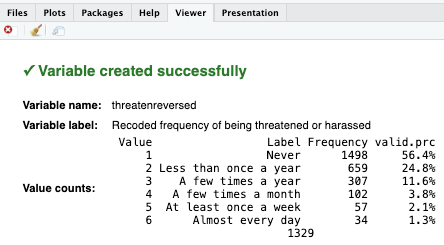
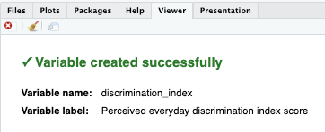

# Module items { data-readaloud-exclude }
## R Script file code { data-readaloud-exclude }
- :lucide-clipboard-copy: [[Copy the code]] below ➜ Paste into [[RStudio console]] ➜ Hit ++enter++  
    - ```r
    source(url("https://raw.githubusercontent.com/ttezcann/ssric-reg/refs/heads/main/docs/assets/attachments/data/0-packages-data.R")); 
    (function(f="05-computing.R"){if(!file.exists(f)){download.file("https://raw.githubusercontent.com/ttezcann/ssric-reg/refs/heads/main/docs/assets/attachments/modules/05.-computing-variables/05-computing.R",f,mode="wb");file.edit(f)}else{download.file("https://raw.githubusercontent.com/ttezcann/ssric-reg/refs/heads/main/docs/assets/attachments/modules/05.-computing-variables/05-computing.R",gsub(".R","-original.R",f),mode="wb");file.edit(gsub(".R","-original.R",f))}})()
    ```
        - When this R script file opens in a new tab, [[Save R script file|save your previous R script file(s)]], and 
            - Close the previous tabs (R Script files), which you can find later in the [[Files tab]].

## Lab assignment { data-readaloud-exclude }
[Computing :lucide-download:](https://github.com/ttezcann/ssric-reg/raw/refs/heads/main/docs/assets/attachments/modules/05.-computing-variables/05-computing.docx){ .md-button .md-button--primary }

### Sample lab assignment { data-readaloud-exclude }
[Sample: Computing :lucide-download:](https://github.com/ttezcann/ssric-reg/raw/refs/heads/main/docs/assets/attachments/modules/05.-computing-variables/05.1-sample-computing.docx){ .md-button .md-button--primary }

## Suggested reading { data-readaloud-exclude }
<div class="grid cards" markdown>
- :lucide-book-open:  
Spector, Paul. 1992. “Introduction.” Pp. 2–10 in Summated rating scale construction. Sage.
</div>

<!-- slide-break -->
## Learning outcomes
1. Describe the purpose of computing index variables in data analysis
2. Identify variables that are conceptually related to construct a single index
3. Calculate an index variable from multiple variables
4. Diagnose and troubleshoot common computing issues
<!-- slide-break -->
# Computing definition
- [[Computing]] means creating a new variable based on existing information (from other variables) in our dataset.
    - Such as the dataset we use include year of birth, but we need age of the respondents for our analysis. Then we could extract the year of data collection from the year of birth.
        - | Year of birth| Age |
        |---|---|
        | 1950 | 76 |
        | 1982 | 44 |
        | 1990 | 36 |
        | 1967 | 57 |
<!-- slide-break -->
# Index variables
- We mostly use [[computing]] to create an [[index variable]].
    - An index is an accumulation of scores from a variety of individual variables.
    - It is difficult to measure social issues with simply one variable (question).
    - Instead, we can use several different variables (questions) that deal with the social issue and create an index of the included variables.
<!-- slide-break -->
## Example index variable
- Below is the index questions of Brief Perceived Ethnic Discrimination Questionnaire-Community Version (Brief PEDQ-CV) by Brondolo et. al. (2006).
- There are 17 questions in this survey. Note that the response set is categorical (ordinal) ranging from (1) never to (5) always.
    - A respondent's percieved ethnic discrimination index score is calculated as **2.94** out of **5**, which is the maximum score one can get.
        - The index score is calculated as follows: 
            - The **mean** of Q1, Q2, Q3, Q4, Q5, Q6, Q7, Q8, Q9, Q10, Q11, Q12, Q13, Q14, Q15, Q16, Q17. 
                - [Click here to test it out :material-download:](https://github.com/ttezcann/ssric-reg/raw/refs/heads/main/docs/assets/attachments/modules/05.-computing-variables/05-computing-sample-index.xlsx){ .md-button .md-button--primary }
<!-- slide-break -->
        - ??? note "The perceived ethnic discrimination questions (Click to expand)"
            - | Questions | Answers |
              |---|---:|
              | **[1: Never; 2: Rarely; 3: Occasionally; 4: Frequently; 5: Always]** |  |
              | 1. Have you been treated unfairly by teachers, principals, or other staff at school? | 2 |
              | 2. Have others thought you couldn’t do things or handle a job? | 3 |
              | 3. Have others threatened to hurt you (ex: said they would hit you)? | 4 |
              | 4. Have others actually hurt you or tried to hurt you (ex: kicked or hit you)? | 2 |
              | 5. Have policeman or security officers been unfair to you? | 4 |
              | 6. Have others threatened to damage your property? | 2 |
              | 7. Have others actually damaged your property? | 1 |
              | 8. Have others made you feel like an outsider who doesn’t fit in because of your dress, speech, or other characteristics related to your ethnicity? | 5 |
              | 9. Have you been treated unfairly by co-workers or classmates? | 4 |
              | 10. Have others hinted that you are dishonest or can’t be trusted? | 3 |
              | 11. Have people been nice to your face, but said bad things about you behind your back? | 2 |
              | 12. Have people who speak a different language made you feel like an outsider? | 4 |
              | 13. Have others ignored you or not paid attention to you? | 3 |
              | 14. Has your boss or supervisor been unfair to you? | 2 |
              | 15. Have others hinted that you must not be clean | 4 |
              | 16. Have people not trusted you? | 3 |
              | 17. Has it been hinted that you must be lazy? | 2 |
              | **Total Discrimination Index Score (out of 5)**    | **2.94** |
<!-- slide-break -->
# GSS example: Index of everyday discrimination
- In GSS dataset, there are five variables related to everyday discrimination, but for this example, we'll use three of them.
    - [[Search]] the variable names, `disrspct`, `poorserv`, and `threaten` in [Variables in GSS](../resources/variables-in-gss.md) page.
- Using these variables, we will calculate GSS respondents' everyday discrimination index scores.
    - | Variable name | Variable label | Variable type | Question wording and response categories |
      |---|---|---|---|
      | `disrspct` | Frequency of being treated with less courtesy or respect | Ordinal ✅ RECODE, COMPUTE-A | In your day-to-day life how often have any of the following things happened to you? You are treated with less courtesy or respect than other people.<br><br>*(1: Almost every day; 2: At least once a week; 3: A few times a month; 4: A few times a year; 5: Less than once a year; 6: Never)* |
      | `poorserv` | Frequency of receiving poorer service at restaurants or stores | Ordinal ✅ RECODE, COMPUTE-A | In your day-to-day life how often have any of the following things happened to you? You receive poorer service than other people at restaurants or stores.<br><br>*(1: Almost every day; 2: At least once a week; 3: A few times a month; 4: A few times a year; 5: Less than once a year; 6: Never)* |
      | `threaten` | Frequency of being threatened or harassed | Ordinal ✅ RECODE COMPUTE-A | In your day-to-day life how often have any of the following things happened to you? You are threatened or harassed.<br><br>*(1: Almost every day; 2: At least once a week; 3: A few times a month; 4: A few times a year; 5: Less than once a year; 6: Never)* |
<!-- slide-break -->
- In the Brief Perceived Ethnic Discrimination Questionnaire questionnaire: 
    - The response category is: **1:** Never; **2:** Rarely; **3:** Occasionally; **4:** Frequently; **5:** Always, so from 1 to 5, the ethnic discrimination increases. 
    - However, in GSS and in many other datasets, this is not always the case.
    - Check the response categories of the variables we use: **1:** Almost every day; **2:** At least once a week; **3:** A few times a month; **4:** A few times a year; **5:** Less than once a year; **6:** Never.
        - From 1 to 7, the perceived everyday discrimination **decreases**. Variables are coded so high value (7) indicates low level of perceived discrimination. It must be the opposite. 
            - By [[recoding]] and specifically, by [[reversing values]] we need to fix this. We'll highlight and run these lines. We'll have three mode variables in our dataset, `disrspctreversed`, `poorservreversed` and `threatenreversed`.
<!-- slide-break -->
## [[Reversing values]] #code, if necessary
- **[[Working code]]**
    - ```r linenums="1" hl_lines="1 2 3 4 5 6 7 8 9"
    gss$disrspctreversed <- 
    rec(gss$disrspct, rec = 
    "1 = 6 [Almost every day]; 
    2 = 5 [At least once a week];
    3 = 4 [A few times a month];
    4 = 3 [A few times a year];
    5 = 2 [Less than once a year];
    6 = 1 [Never]",
    var.label = "Recoded frequency of being treated with less courtesy or respect")

    gss$poorservreversed <- 
    rec(gss$poorserv, rec = 
    "1 = 6 [Almost every day]; 
    2 = 5 [At least once a week];
    3 = 4 [A few times a month];
    4 = 3 [A few times a year];
    5 = 2 [Less than once a year];
    6 = 1 [Never]",
    var.label = "Recoded frequency of receiving poorer service at restaurants or stores")

    gss$threatenreversed <- 
    rec(gss$threaten, rec = 
    "1 = 6 [Almost every day]; 
    2 = 5 [At least once a week];
    3 = 4 [A few times a month];
    4 = 3 [A few times a year];
    5 = 2 [Less than once a year];
    6 = 1 [Never]",
    var.label = "Recoded frequency of being threatened or harassed")
    ```
<!-- slide-break -->
        - **Line 1:** We put the new variable name for the new recoded variable here, `disrspctreversed`.
        - **Line 2:** We put the original variable we want to recode here, `disrspct`.
        - **Lines 3-4-5-6-7-8** We reverse values in these lines. "[...]" are the new labels for the new values. These will appear on our outputs.
        - **Line 9:** We write this new variable's variable label here "`Recoded frequency of being treated with less courtesy or respect`"
            - [[Find this working code in the R script file]].
                - [[Highlighting and running]] these code will create three more variables in our dataset, `disrspctreversed`, `poorservreversed` and `threatenreversed`.
                    - If codes are correct, the [[viewer tab]] will provide confirmation, such as:
                        - {width="500"}
<!-- slide-break -->
## [[Index variable]] #code
- **[[Model code]]**
    - ```r linenums="1" hl_lines="1 2 3"
    gss$new_index_variable_here <- structure(rowMeans(
    gss[, c("variable1_here", "variable2_here", "variable3_here")]),
    label = "Variable label of the index variable")
    ```
-  **[[Working code]]**
    - ```r linenums="1" hl_lines="1 2 3"
    gss$discrimination_index <- structure(rowMeans(
    gss[, c("disrspctreversed", "poorservreversed", "threatenreversed")]),
    label = "Perceived everyday discrimination index score")
    ```
        - **Line 1:** We put `discrimination_index` here ➜ `new_index_variable_here`.
        - **Line 2:** We put the variable names that we want to compute, separated by comma. `disrspctreversed` here ➜ `variable1_here`; `poorservreversed` here ➜ `variable2_here`; `threatenreversed` here ➜ `variable3_here`.
        - **Line 3:** We write this new variable's variable label here "`Perceived everyday discrimination index score`".
            - [[Find this working code in the R script file]].
                - [[Highlighting and running]] this code will create one more variable, `discrimination_index`.
                    - !!! info "The index variable is continuous"
                        - Note that while both original variables, `disrspct`, `poorserv`, `threaten` and new recoded variables, `disrspctreversed`, `poorservreversed`, `threatenreversed`, are [[categorical]] (ordinal), the index variable, `discrimination_index` is [[continuous]].
<!-- slide-break -->
## [[Descriptive table]] #code
- **[[Model code]]**
    - ```r linenums="1" hl_lines="1"
    descr(gss$new_index_variable_here, out = "v", show = "short")
    ```
- **[[Working code]]**
    - ```r linenums="1" hl_lines="1"
    descr(gss$discrimination_index, out = "v", show = "short")
    ```
        - **Line 1:** We put `discrimination_index` here ➜ `new_index_variable_here`.
            - [[Find this working code in the R script file]].
                - [[Highlighting and running]] this code will generate the output below (which will appear in the viewer part of RStudio).
                - If codes are correct, the [[viewer tab]] will provide confirmation, such as:
                     - {width="500"}
<!-- slide-break -->
## [[Descriptive table]] #output
- | variable             | variable label                                | n    | NA.prc | ==mean== | ==sd== |
  |:---------------------|:----------------------------------------------|------|--------|----------|--------|
  | discrimination_index | Perceived everyday discrimination index score | 2631 | 33.99  | 2.33     | 1.05   |
<!-- slide-break -->
## [[Descriptive table for index variable]] #interpretation
- !!! note "Descriptive table for index interpretation sample"
    The **perceived everyday discrimination index score** of the respondents is **2.33** out of **6**, with standard deviation **1.05**.
- !!! quote "Descriptive table for index interpretation template"
    The **[[variable label]]** of the respondents is **mean** out of **possible maximum score**, with standard deviation **sd**.
- !!! success "Interpretation explanation"
    - After the mean (mean column), we add "out of **possible maximum score**":
        - **2.33** out of **6**, 
        - **1.68** out of **3**, etc.
    - We use the mean (mean column) and standard deviation (sd column) in our interpretation.
<!-- slide-break -->
## Overview
- If our dataset only included the variables we worked on, our dataset would look like below. 
- For example, the first respondent's `discrimination_index` score is **4.67** out of 6.
    - That respondent's values are:
        - `disrspctreversed`: **5** [At least once a week], 
        - `poorservreversed`: **3** [A few times a year], 
        - `threatenreversed`: **6** [Almost every day].
            - **4.67**  is the average of those three values ➜ (5+3+6)/3
<!-- slide-break -->
    - | id | disrspct | poorserv | threaten | disrspctreversed | poorservreversed | threatenreversed | discrimination_index |
      |:---:|:---:|:---:|:---:|:---:|:---:|:---:|:---:|
      | 1 | 2 | 4 | 1 | 5 | 3 | 6 | 4.67 |
      | 2 | 5 | 3 | 2 | 2 | 4 | 5 | 3.67 |
      | 3 | 1 | 2 | 5 | 6 | 5 | 2 | 4.33 |
      | 4 | 3 | 1 | 4 | 4 | 6 | 3 | 4.33 |
      | 5 | 4 | 5 | 3 | 3 | 2 | 4 | 3.00 |
<!-- slide-break -->
# [[Common computing issues and troubleshooting]]
## [[Use the new (recoded) variables in computing code]]
- Sometimes we mistakenly use the original variables in computing code. We recoded and created new variables for the original variables, because they were not usable for our analysis.
    - ```r linenums="1" hl_lines="2 5"
    gss$discrimination_index <- structure(rowMeans(
    gss[, c("disrspct", "disrspct", "threaten")]),
    label = "Perceived everyday discrimination index score")

    gss$discrimination_index <- structure(rowMeans(
    gss[, c("disrspctreversed", "disrspctreversed", "threatenreversed")]),
    label = "Perceived everyday discrimination index score")
    ```
        - **Line 2:** Wrong!
        - **Line 5:** Correct!
            - !!! warning "Troubleshooting"
                - When creating a computed variable and if the original variables need to be recoded, then we make sure to use the new (recoded) variable names in the computation code. 
                    - For such analyses, the original variables were not useful. That's why they were recoded.
<!-- slide-break -->
## [[Computed variables are always continuous]]
- When we compute variables and create an index, the new (computed) variable is [[continuous]].
    - It becomes continuous because we have created a score, and we treat it as a real number.
    - Therefore, we use the [[descriptive table]] code to see the mean and standard deviation.
        - ```r linenums="1" hl_lines="1 3"
        frq(gss$discrimination_index, out = "v")

        descr(gss$discrimination_index, out = "v", show = "short")
        ```
            - **Line 1:** Wrong!
            - **Line 3:** Correct!
                - !!! warning "Troubleshooting"
                    - Computed variables are always continuous. Therefore, they should be treated continuous in further analyses.
<!-- slide-break -->
## [[Run the computing codes to create a new variable]]
- **(1)** Let’s say we want to compute a variable and therefore create a new variable. Then we want to create a descriptive table of the new (recoded) variable.
    - Preparing the computing code does not mean we computed a new variable. 
        - We need to highlight and run the computing code (and also recoding codes) so the descriptive table code can work. They need to be run in order.
    - For example, below, the `gss$discrimination_index <- structure(rowMeans,...` code didn’t work, and it yielded an **“These variables do not exist: disrspctreversed, poorservreversed, threatenreversed”** error.
        - Even though the computing code that generates the `discrimination_index` variable exists, that code is just a text; we didn’t highlight and run it, so the data doesn’t include `discrimination_index` yet.
<!-- slide-break -->
    - 
<!-- slide-break -->
- **(2)** Below, it works because we did highlight and run both the recoding codes, computing code, and the descriptive statistics table code. They need to be run in order.
    - 
<!-- slide-break -->
        - !!! warning "Troubleshooting" 
            - If the computing requires prior recoding; 
                - Run the recoding codes before the computing code, and then,
                - Run the computing code before the descriptive statistics table code.
                    - If you do not remember if you did run recoding and computing codes before, run them again.
<!-- slide-end -->