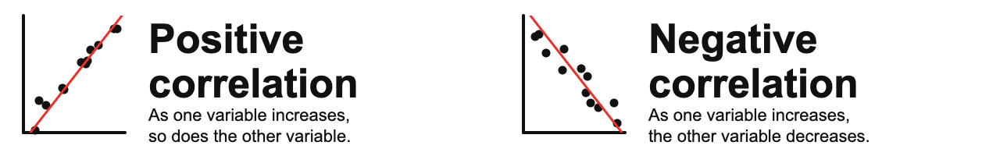
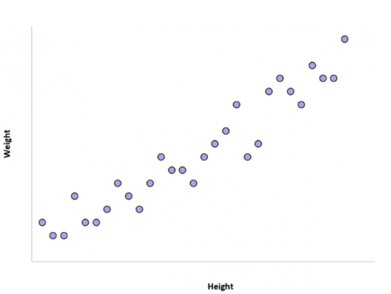
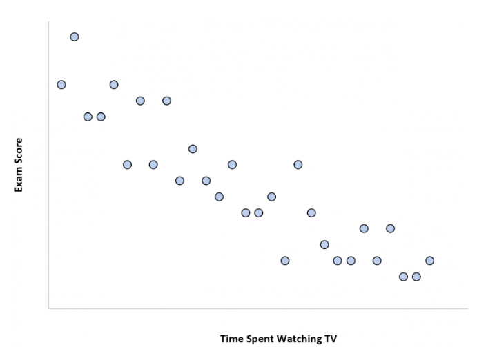
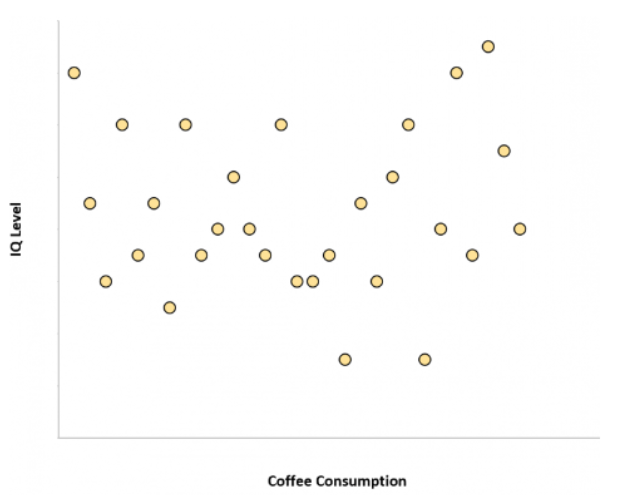
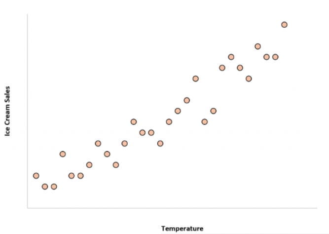
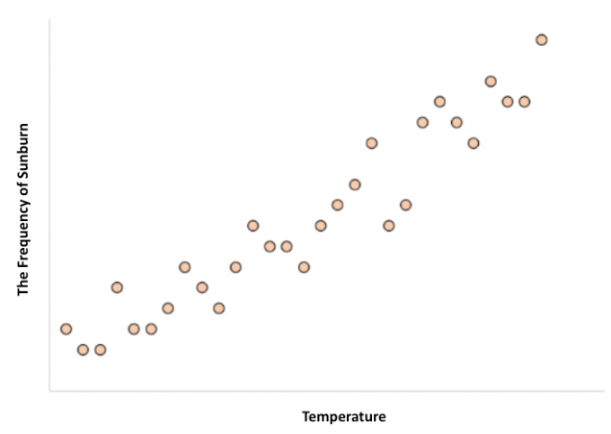
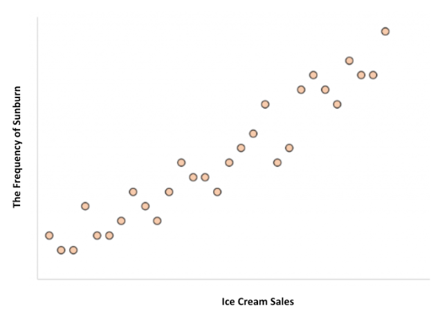

# Module items  { data-readaloud-exclude }
## R Script file code { data-readaloud-exclude }
- :lucide-clipboard-copy: [[Copy the code]] below ➜ Paste into [[RStudio console]] ➜ Hit ++enter++
    - ```r
    source(url("https://raw.githubusercontent.com/ttezcann/ssric-reg/refs/heads/main/docs/assets/attachments/data/0-packages-data.R")); 
    (function(f="10-correlation.R"){if(!file.exists(f)){download.file("https://raw.githubusercontent.com/ttezcann/ssric-reg/refs/heads/main/docs/assets/attachments/modules/10.-correlation-analysis/10-correlation.R",f,mode="wb");file.edit(f)}else{download.file("https://raw.githubusercontent.com/ttezcann/ssric-reg/refs/heads/main/docs/assets/attachments/modules/10.-correlation-analysis/10-correlation.R",gsub(".R","-original.R",f),mode="wb");file.edit(gsub(".R","-original.R",f))}})()
    ```
        - When this R script file opens in a new tab, [[Save R script file|save your previous R script file(s)]], and 
            - Close the previous tabs (R Script files), which you can find later in the [[Files tab]].

## Lab assignment { data-readaloud-exclude }
[Correlation :lucide-download:](https://github.com/ttezcann/ssric-reg/raw/refs/heads/main/docs/assets/attachments/modules/10.-correlation-analysis/10-correlation.docx){ .md-button .md-button--primary }

### Sample lab assignment  { data-readaloud-exclude }
[Sample: Correlation :lucide-download:](https://github.com/ttezcann/ssric-reg/raw/refs/heads/main/docs/assets/attachments/modules/10.-correlation-analysis/10.1-sample-correlation.docx){ .md-button .md-button--primary }

## Suggested reading  { data-readaloud-exclude }
<div class="grid cards" markdown>
- :lucide-book-open:  
Weinstein, Jay A. 2010. “Correlation Description and Induction in Comparative Sociology.” Pp. 297–324 in Applying social statistics: An introduction to quantitative reasoning in sociology. Lanham: Rowman & Littlefield.
</div>

<!-- slide-break -->
## Learning outcomes 
1. Learn the basic terms and concepts related to the correlation analysis
2. Define the purpose of bivariate and multivariate correlation analysis
3. Learn how to generate:
    1. Bivariate correlation analysis (two variables):
        1. Correlation table
        2. Scatterplot graph
    2. Multivariate correlation analysis (more than two variables)
        1. Correlation table matrix
        2. Scatterplot graph matrix
4. Learn how to interpret p-value to determine whether a correlation is statistically significant
5. Learn how to interpret r-value to determine the direction and strength of a relationship between two continuous variables
<!-- slide-break -->
# [[Correlation analysis]] specifics
- Correlation analysis:
    - Examines the relationship between continuous variables.
    - Correlation is not causation: it does not show a causal relationship.
    - Correlation yields two values:
        - [[p-value]], showing the significance of the relationship, and 
        - [[r-value]], showing the strength and direction of the relationship. 
            - r-value (correlation coefficient) is between minus one and plus one (-1 and +1).
<!-- slide-break -->
## [[Significance of correlation]] (with [[p-value]])
- Using the p-value, we determine if the correlation is:
    1. **[[Nonsignificant correlation]]**: When the p-value is greater than 0.05 (p > 0.05), it's a nonsignificant correlation. This means that there's no meaningful relationship between two continuous variables; such as height and education.
        1. {width="600"}
    2. **[[Significant correlation]]**: When the p-value is than 0.05 (p < 0.05), it's a significant correlation. This means that there's a meaningful relationship between two continuous variables; such as height and weight.
        - If we have a significant correlation, we continue with checking the r-value to see the direction and strength of correlation.
<!-- slide-break -->
## [[Direction of correlation]] (with [[r-value]])
- Using r-value, we determine the direction of correlation. If the p-value is less than 0.05 (p < 0.05); and
    - If the r-value is positive (such as `r=0.250`), then, there's a:
        - [[Positive correlation]]: As one variable increases, so does the other variable.
    - If the r-value is negative (such as `r= - 0.250`), then, there's a:
        - [[Negative correlation]]: As one variable increases, the other variable decreases.
            - {width="900"}
<!-- slide-break -->
## [[Strength of correlation]] (with [[r-value]])
- Using r-value, we determine the strength of correlation.
    - r-value = less than |0.3| ➜ [[weak correlation]]
    - r-value = higher than |0.3| and less than |0.5| ➜ [[moderate correlation]]
    - r-value = greater than |0.5| ➜  [[strong correlation]]
        - {width="900"}
    - !!! info "The r-value is an absolute number. That means;"
        - r= **-.673** is stronger than **r= .567** (negative .637 r-value is stronger than positive .567 r-value)
        - r= **-.432** is stronger than **r= .322** (negative .432 r-value is stronger than positive .322 r-value)
        - **r= .567** is stronger than **r= -.322** (negative .567 r-value is stronger than negative -.322 r-value)
<!-- slide-break -->
# Guessing correlation type exercise
- !!! abstract "1. Height and weight"
    - Is there a correlation between height and weight? If yes, positive or negative?
        - ??? tip "Show the answer"
            - The correlation between the height of an individual and their weight tends to be positive. 
            - In other words, individuals who are taller also tend to weigh more.
                - {width="500"}
<!-- slide-break -->
- !!! abstract "2. Time spent watching TV and exam scores"
    - Is there a correlation between time spent watching TV and exam scores? If yes, positive or negative?
        - ??? tip "Show the answer"
            - The more time a student spends watching TV, the lower their exam scores tend to be.
            - Time spent watching TV and the variable exam score have a negative correlation. As time spent watching TV increases, exam scores decrease.
                - {width="500"}
<!-- slide-break -->
- !!! abstract "3. Coffee consumption and intelligence"
    - Is there a correlation between coffee consumption and intelligence? If yes, positive or negative?
        - ??? tip "Show the answer"
            - The amount of coffee that individuals consume and their IQ level are unrelated. 
            - In other words, knowing how much coffee an individual drinks doesn’t give us an idea of what their IQ level might be.
                - {width="500"}
<!-- slide-break -->
- !!! abstract "4. Temperature and ice cream sales"
    - Is there a correlation between temperature and ice cream sales? If yes, positive or negative?
        - ??? tip "Show the answer"
            - The correlation between the temperature and total ice cream sales is positive. 
            - In other words, when it’s hotter outside the total ice cream sales of companies tends to be higher since more people buy ice cream when it’s hot out.
                - {width="500"}
<!-- slide-break -->
- !!! abstract "5. temperature and frequency of sunburn"
    - Is there a correlation between temperature and frequency of sunburn? If yes, positive or negative?
        - ??? tip "Show the answer"
            - The correlation between the temperature and the frequency of sunburn is positive. 
            - In other words, when it’s hotter outside the frequency of sunburn is more likely.
                - {width="500"}
<!-- slide-break -->
- !!! abstract "6. frequency of sunburn and ice cream sales"
    - Is there a correlation between the frequency of sunburn and ice cream sales? If yes, positive or negative?
        - ??? tip "Show the answer"
            - The correlation between the frequency of sunburn and total ice cream sales is positive. 
            - HOWEVER, ice cream consumption does not cause sunburns or getting a sunburn doesn’t make someone eat more ice cream.
            - Both of these variables, ice cream consumption and sunburn frequency, are higher when it’s hotter outside.
                - {width="400"}
<!-- slide-break -->
# [[Confounding variable]]
- A third variable, **"temperature"**, that affects both variables, **"frequency of sunburn"** and **"ice cream sales"**. 
    - If one is not careful, it can make it appear that there is a correlation between two variables that are actually both independently being influenced by this third variable, **"temperature"**.
        - {width="400"}
    - **Other confounding variable examples**:
        - Number of schools in a city and number of crimes in a city
            - **Confounding Variable:** City population
        - Shoe size and reading ability in children
            - **Confounding Variable:** Age of the child
        - Outdoor exercise frequency and vitamin D levels
            - **Confounding Variable:** Sunlight exposure
<!-- slide-break -->
# [[Bivariate correlation]]
- Shows the relationship between two continuous variables in a table-graph format:
    - [[Correlation table]] shows this relationship in a table format:
        - Reports the correlation coefficient (r-value) and statistical significance (p-value).
    - [[Scatterplot graph]] shows this relationship in a graph format:
        - In addition to the r-value and p-value, displays the shape of the relationship.
<!-- slide-break -->
## GSS Example 1: Significant and negative correlation
### The relationship between educ and tvhours
- We may wonder if there's a correlation between the respondents' education in years (`educ`) and television screen time in hours (`tvhours`).
    - Here we do not propose any kind of cause-and-effect.
        - ```mermaid
        flowchart LR
        subgraph F["Continuous variable"]
            A[Respondents' education in years]
        end

        subgraph O["Continuous variable"]
            B[Television screen time in hours]
        end

        A <==>|May have a relationship| B
        ```
<!-- slide-break -->
### Find the variables in Variables in GSS page
1. We want to make sure that `educ` and `tvhours` are continuous variables.
2. [[Search]] these variable names in [Variables in GSS](../resources/variables-in-gss.md) page.
    - | Variable name | Variable label | Variable type | Question wording and response categories |
      |---|---|---|---|
      | `educ` | Respondents' education in years | Continuous | What is the highest year of school you completed?<br><br>*(Min: 0, Max: 20)*  |
      | `tvhours` | Television screen time in hours | Continuous  | On the average day, how many hours do you personally watch television? <br><br>*(Min: 0, Max: 24)* |
<!-- slide-break -->
### [[Correlation table]] #code
- **[[Model code]]**
    - ```r linenums="1" hl_lines="1"
    tab_corr (gss[c("variable1_here", "variable2_here")],
    p.numeric = T, triangle="lower")
    ```
- **[[Working code]]**
    - ```r linenums="1" hl_lines="1"
    tab_corr (gss[c("educ", "tvhours")],
    p.numeric = T, triangle="lower")
    ```
        - **Line 1**: We put `educ` here ➜ `variable1_here` and `tvhours` here ➜ `variable2_here`.
            - The order of the variables doesn't matter.
            - Make sure there's no space after the variable name, such as "educ ".
            - [[Find this working code in the R script file]].
                - [[Highlighting and running]] this code will generate the output below (which will appear in the [[viewer tab]] of RStudio).
<!-- slide-break -->
### [[Correlation table]] #output
- |                                   | *Respondents' education in years* | *Television screen time in hours* |
  |:----------------------------------|:---------------------------------:|:---------------------------------:|
  | *Respondents' education in years* |                                   |                                   |
  | *Television screen time in hours* |    r = -0.163<br>==p = <0.001***==|                                   |
<!-- slide-break -->
### [[Scatterplot graph]] #code
- **[[Model code]]**
    - ```r linenums="1" hl_lines="1"
    scatterplot(gss, "variable1_here", "variable2_here")
    ```
- **[[Working code]]**
    - ```r linenums="1"  hl_lines="21"
    scatterplot(gss, "educ", "tvhours")
    ```
        - **Line 1**: We put `educ` here ➜ `variable1_here` and `tvhours` here ➜ `variable2_here`. 
            - The order of the variables doesn't matter. 
            - Make sure there's no space after the variable name, such as "tvhours ".
            - [[Find this working code in the R script file]].
                - [[Highlighting and running]] this code will generate the output below (which will appear in the [[plots tab]] of RStudio).
<!-- slide-break -->
### [[Scatterplot graph]] #output
- {width="700"}
<!-- slide-break -->
### [[Correlation table]] and [[scatterplot graph]] #interpretation
- !!! note "Significant (p < 0.05) and weak (r < |0.3|) correlation interpretation sample"
    There is a significant correlation between **respondents' education in years** and **television screen time in hours** since the p-value is less than .05. 
    
    This correlation is negative and weak since the r-value is **-0.163** (less than |0.3|).
    
    This means that as **respondents' education in years** increases **television screen time in hours** decreases, and vice versa.
- !!! quote "Significant (p < 0.05) and weak (r < |0.3|) correlation interpretation template"
    There is a significant correlation between **[[variable label]] 1** and **variable label 2** since the p-value is less than .05. 
    
    This correlation is negative and weak since the r-value is **-0.xxx** (less than |0.3|).
    
    **OR** This correlation is negative and moderate since the r-value is **-0.xxx** (between |0.3| and |0.5|).

    **OR** This correlation is negative and strong since the r-value is **-0.xxx** (higher than |0.5|).
    
    This means that as **[[variable label]] 1**  increases **[[variable label]] 2**  decreases, and vice versa.

- !!! success "Interpretation explanation"
    - We first check the **[[p-value]]**. 
        - If it's greater than 0.05, it's a nonsignificant correlation and we do not interpret the r-value. If it's less than 0.05, it's a significant correlation. 
            - This analysis yields a [[significant correlation]] since the p-value < 0.05.
    - If it's a significant correlation, then we check the **[[r-value]]**.
        - Check the direction of the correlation: if there's a minus (-), it's a negative correlation; if there's no minus, it's a positive correlation. 
            - This analysis yields a [[negative correlation]], `-0.163`.
        - Check the strength of the correlation. `-0.163` is less than |0.3|, so this is a [[weak correlation]].
            - Remember, r-values are absolute numbers. It wouldn't matter if it is `-0.163` or `0.163`, it's still weak correlation.
<!-- slide-break -->
## GSS Example 2: Significant and positive correlation
### The relationship between masei10 and pasei10
- We may wonder if there's a correlation between the respondents' mothers' socio-economic index score (`masei10`) and fathers' socio-economic index score (`pasei10`).
    - Here we do not propose any kind of cause-and-effect.
        - ```mermaid
        flowchart LR
        subgraph F["Continuous variable"]
            A[Mothers' SES]
        end

        subgraph O["Continuous variable"]
            B[Fathers' SES]
        end

        A <==>|May have a relationship| B
        ```
<!-- slide-break -->
### Find the variables in Variables in GSS page
1. We want to make sure that `masei10` and `pasei10` are continuous variables.
2. [[Search]] the variable names, `masei10` and `pasei10`, in [Variables in GSS](../resources/variables-in-gss.md) page.
    - | Variable name | Variable label | Variable type | Question wording and response categories |
      |---|---|---|---|
      | `masei10` | Respondents' mothers' socio-economic index score | Continuous | Respondent's mother's socio-economic index score (calculated)<br><br>*(Min: 9, Max: 92.8)* |
      | `pasei10`  | Respondents' fathers' socio-economic index score | Continuous | Respondent's father's socio-economic index score (calculated)<br><br>*(Min: 9, Max: 93.7)* |
<!-- slide-break -->
### [[Correlation table]] #code
- **[[Model code]]**
    - ```r linenums="1" hl_lines="1"
    tab_corr (gss[c("variable1_here", "variable2_here")],
    p.numeric = T, triangle="lower")
    ```
- **[[Working code]]**
    - ```r linenums="1" hl_lines="1"
    tab_corr (gss[c("masei10", "pasei10")],
    p.numeric = T, triangle="lower")
    ```
        - **Line 1**: We put `masei10` here ➜ `variable1_here` and `pasei10` here ➜ `variable2_here`. 
            - The order of the variables doesn't matter.
            - [[Find this working code in the R script file]].
                - [[Highlighting and running]] this code will generate the output below (which will appear in the [[plots tab]] of RStudio).
<!-- slide-break -->
### [[Correlation table]] #output
- |                                                    | *Respondents' mothers' socio-economic index score* | *Respondents' fathers' socio-economic index score* |
  |:---------------------------------------------------|:--------------------------------------------------:|:--------------------------------------------------:|
  | *Respondents' mothers' socio-economic index score* |                                                    |                                                    |
  | *Respondents' fathers' socio-economic index score* |           r = 0.364<br>==p = 0.001***==            |                                                    |
<!-- slide-break -->
### [[Scatterplot graph]]  #code
- **[[Model code]]**
    - ```r linenums="1"  hl_lines="1"
    scatterplot(gss, "variable1_here", "variable2_here")
    ```
- **[[Working code]]**
    - ```r linenums="1" hl_lines="1"
    scatterplot(gss, "masei10", "pasei10")
    ```
        - **Line 1**: We put `masei10` here ➜ `variable1_here` and `pasei10` here ➜ `variable2_here`. 
            - The order of the variables doesn't matter. 
            - [[Find this working code in the R script file]].
                - [[Highlighting and running]] this code will generate the output below (which will appear in the [[plots tab]] of RStudio).
<!-- slide-break -->
### [[Scatterplot graph]] #output
- {width="700"}
<!-- slide-break -->
### [[Correlation table]] and [[scatterplot graph]] #interpretation
- !!! note "Significant (p < 0.05) and moderate (|0.3| < | r | < |0.5|) correlation interpretation sample"
    There is a significant correlation between **respondents' mothers' socio-economic index score** and **respondents' mothers' socio-economic index score** since the p-value is less than .05. 
    
    This correlation is positive and moderate since the r-value is **0.364** (|0.3| < | r | < |0.5|).
    
    This means that **respondents' mothers' socio-economic index score** and **respondents' mothers' socio-economic index score** increase and decrease together.
- !!! quote "Significant (p < 0.05) and moderate (|0.3| < | r | < |0.5|) correlation interpretation template"
    There is a significant correlation between **[[variable label]] 1** and **variable label 2** since the p-value is less than 0.05. 
    
    This correlation is positive and moderate since the r-value is **0.xxx** (|0.3| < | r | < |0.5|).
    
    **OR** This correlation is positive and weak since the r-value is **-0.xxx** (less than |0.3|).

    **OR** This correlation is positive and strong since the r-value is **-0.xxx** (higher than |0.5|).
    
    This means that **variable label 1** and **variable label 2** increase and decrease together.
- !!! success "Interpretation explanation"
    - We first check the **[[p-value]]**. 
        - If it's greater than 0.05, it's a nonsignificant correlation and we do not interpret the r-value. If it's less than 0.05, it's a significant correlation. 
            - This analysis yields a [[significant correlation]] since the p-value < 0.05.
    - If it's a significant correlation, then we check the **[[r-value]]**.
        - Check the direction of the correlation: if there's a minus (-), it's a negative correlation; if there's no minus, it's a positive correlation. 
            - This analysis yields a [[positive correlation]], `0.364`.
        - Check the strength of the correlation. `0.364` is between |0.3| and |0.5|, so this is a [[moderate correlation]]. 
            - Remember, r-values are absolute numbers. It wouldn't matter if it is `0.364` or `-0.3643`, it's still moderate correlation.
<!-- slide-break -->
## Example 3: Nonsignificant correlation
### The relationship between hrs1 and sibs
- We may wonder if there's a correlation between the number of hours respondents worked last week (`hrs1`) and the number of brothers and sisters respondents have (`sibs`).
    - Here we do not propose any kind of cause-and-effect.
        - ```mermaid
        flowchart LR
        subgraph F["Continuous variable"]
            A[Hours worked last week]
        end

        subgraph O["Continuous variable"]
            B[# of brothers and sisters]
        end

        A <==>|May have a relationship| B
        ```
<!-- slide-break -->
### Find the variables in Variables in GSS page
1. We want to make sure that `hrs1` and `sibs` are continuous variables.
2. [[Search]] the variable names, `hrs1` and `sibs`, in [Variables in GSS](../resources/variables-in-gss.md) page.
    - | Variable name | Variable label | Variable type | Question wording and response categories |
      |---|---|---|---|
      | `hrs1` | Number of hours respondents worked last week | Continuous | How many hours did you work last week, at all jobs? |
      | `sibs` | Number of brothers and sisters respondents have | Continuous | How many brothers and sisters do you have? |
<!-- slide-break -->
### [[Correlation table]] #code
- **[[Model code]]**
    - ```r linenums="1"  hl_lines="1"
    tab_corr (gss[c("variable1_here", "variable2_here")],
    p.numeric = T, triangle="lower")
    ```
- **[[Working code]]**
    - ```r linenums="1"  hl_lines="1"
    tab_corr (gss[c("hrs1", "sibs")], 
    p.numeric = T, triangle="lower")
    ```
        - **Line 1**: We put `hrs1` here ➜ `variable1_here` and `sibs` here ➜ `variable2_here`. 
            - The order of the variables doesn't matter. 
            - Make sure there's no space after the variable name, such as "sibs ".
            - Highlighting and running this code will generate the output below.
<!-- slide-break -->
### [[Correlation table]] #output
- |                                                   | *Number of hours respondents worked last week* | *Number of brothers and sisters respondents have* |
  |:--------------------------------------------------|:----------------------------------------------:|:-------------------------------------------------:|
  | *Number of hours respondents worked last week*    |                                                |                                                   |
  | *Number of brothers and sisters respondents have* |            r = -0.039<br>==p = 0.068==         |                                                   |
<!-- slide-break -->
### [[Scatterplot graph]]  #code
- **[[Model code]]**
    - ```r linenums="1"  hl_lines="1"
    scatterplot(gss, "variable1_here", "variable2_here")
    ```
- **[[Working code]]**
    - ```r linenums="1" hl_lines="1"
    scatterplot(gss, "hrs1", "sibs")
    ```
    - **Line 1**: We put `hrs1` here ➜ `variable1_here` and `sibs` here ➜ `variable2_here`. 
        - The order of the variables doesn't matter. 
        - [[Find this working code in the R script file]].
            - [[Highlighting and running]] this code will generate the output below (which will appear in the [[plots tab]] of RStudio).
<!-- slide-break -->
### [[Scatterplot graph]] #output
- {width="700"}
<!-- slide-break -->
### [[Correlation table]] and [[scatterplot graph]] #interpretation
- !!! note "Nonsignificant correlation interpretation sample"
    There is a no significant correlation between the **number of hours respondents worked last week** and the **number of brothers and sisters respondents have** since the p-value is greater than .05. 
            
    This means that the **number of hours respondents worked last week** and the **number of brothers and sisters respondents have** are not related.
- !!! quote "Nonsignificant correlation interpretation template"
    There is a no significant correlation between **[[variable label]] 1** and **variable label 2** since the p-value is greater than .05. 
    
    This means that **variable label 1**  and **variable label 2**  are not related.
- !!! success "Interpretation explanation"
    - We first check the **[[p-value]]**. If it's greater than 0.05, it's a nonsignificant correlation and we do not interpret the **[[r-value]]**. 
        - This analysis yields a [[nonsignificant correlation]] since the p-value > 0.05.
<!-- slide-break -->
# [[Multivariate correlation]]
- Shows the relationships among multiple (more than two) continuous variables in a table-graph format.
    - [[Correlation table matrix]] shows these relationships in a table format:
        - Reports the correlation coefficients (r-value) and statistical significance (p-value).
    - [[Scatterplot graph matrix]] shows these relationships in a graph format:
        - In addition to the r-value and p-value, displays the shape of the relationship.
<!-- slide-break -->
## GSS Example 1: Correlation table matrix
### Find the variables in Variables in GSS page
- We'll use all the variables we have used so far in the previous sections.
    - | Variable name | Variable label | Variable type | Question wording and response categories |
      |---|---|---|---|
      | `educ` | Respondents' education in years | Continuous | What is the highest year of school you completed? |
      | `tvhours` | Television screen time in hours | Continuous  | On the average day, how many hours do you personally watch television? |
      | `masei10` | Respondents' mothers' socio-economic index score | Continuous | Respondent's mother's socio-economic index score (calculated)<br><br>*(Min: 0; Max: 100)* |
      | `pasei10` | Respondents' fathers' socio-economic index score | Continuous | Respondent's father's socio-economic index score (calculated)<br>*(Min: 0; Max: 100)* |
      | `hrs1` | Number of hours respondents worked last week | Continuous | How many hours did you work last week, at all jobs? |
      | `sibs` | Number of brothers and sisters respondents have | Continuous | How many brothers and sisters do you have? |
<!-- slide-break -->
### [[Correlation table matrix]] #code
- **[[Model code]]**
    - ```r linenums="1"  hl_lines="1"
    tab_corr (gss[, c("variable1_here", "variable2_here", "variable3_here", "variable4_here", "variable5_here", "variable6_here")],  
    p.numeric = T, triangle="lower", na.deletion = "pairwise")
    ```
- **[[Working code]]**
    - ```r linenums="1"  hl_lines="1"
    tab_corr (gss[, c("educ", "tvhours", "masei10", "pasei10", "hrs1", "sibs")], 
    p.numeric = T, triangle="lower", na.deletion = "pairwise")
    ```
    - **Line 1**: We put the previous variables here ➜ `variable1_here` and `variable2_here` and so on. 
        - [[Find this working code in the R script file]].
            - [[Highlighting and running]] this code will generate the output below (which will appear in the [[viewer tab]] of RStudio).
<!-- slide-break -->
### [[Correlation table matrix]] #output
- |  | Respondents' education | TV screen time | Mothers' SES | Fathers' SES | Hours worked last week | Number of siblings |
  |---|:---:|:---:|:---:|:---:|:---:|:---:|
  | Respondents' education |  |  |  |  |  |  |
  | TV screen time | r = -0.163<br>*p* = 0.001*** |  |  |  |  |  |
  | Mothers' SES  | r = 0.287<br>*p* = 0.001*** | r = -0.125<br>*p* = 0.001*** |  |  |  |  |
  | Fathers' SES  | r = 0.353<br>*p* = 0.001*** | r = -0.123<br>*p* = 0.001*** | r = 0.364<br>*p* = 0.001*** |  |  |  |
  | Hours worked last week | r = 0.026<br>*p* = 0.226 | r = -0.029<br>*p* = 0.265 | r = 0.034<br>*p* = 0.170 | r = -0.024<br>*p* = 0.338 |  |  |
  | Number of siblings  | r = -0.208<br>*p* = 0.001*** | r = 0.104<br>*p* = 0.001*** | r = -0.221<br>*p* = 0.001*** | r = -0.187<br>*p* = 0.001*** | r = -0.039<br>*p* = 0.068 |  |
<!-- slide-break -->
### [[Scatterplot graph matrix]] #code
- **[[Model code]]**
    - ```r linenums="1" hl_lines="1"
    scatterplot_matrix <- gss[, c("variable1_here", "variable2_here", "variable3_here", "variable4_here", "variable5_here", "variable6_here")]
    pairs_panels_pval(scatterplot_matrix, color = "#15616d")
    ```
- **[[Working code]]**
    - ```r linenums="1" hl_lines="1"
    scatterplot_matrix <- gss[, c("educ", "tvhours", "masei10", "pasei10", "hrs1", "sibs")]
    pairs_panels_pval(scatterplot_matrix, color = "#15616d")
    ```
        - **Line 1**:  We put the previous variables here ➜ `variable1_here` and `variable2_here` and so on. 
        - [[Find this working code in the R script file]].
            - [[Highlighting and running]] this code will generate the output below (which will appear in the [[plots tab]] of RStudio).
<!-- slide-break -->
### [[Scatterplot graph matrix]] #output
- ![A scatterplot matrix showing correlations among six variables: educ, tvhours, masei10, pasei10, hrs1, and sibs. The diagonal displays histograms for each variable. The upper-right triangle shows r-values and p-values for each variable pair. The lower-left triangle shows scatterplots. Annotations highlight how to locate two variables of interest (tvhours and hrs1): find their histograms on the diagonal (1), their correlation in the upper-right intersection (2, r=-0.029, p=0.265), and their scatterplot in the lower-left intersection (3).](../assets/attachments/modules/10.-correlation-analysis/scatterplot-matrix.png)
<!-- slide-break -->
    1. **Start with the diagonal**: 
        1. Find your two variables of interest: here, for example, `tvhours` and `educ`. 
        1. The diagonal cells (in red) show each variable's distribution as a histogram.
    1. **Look upper-right**: 
        1. The upper-right cell (in purple) at the intersection of your two variables reports the correlation coefficient (r-value) and statistical significance (p-value). Here, r=-0.029, p=0.265.
    1. **Look lower-left**: 
        1. The lower-left cell (in blue) at the same intersection shows the scatterplot.
<!-- slide-break -->
### [[Correlation table matrix]] and [[scatterplot graph matrix]] #interpretation
- !!! note "Nonsignificant correlation interpretation sample"
    There is a no significant correlation between the **television screen time in hours** and the **number of hours respondents worked last week** since the p-value is greater than .05. 
            
    This means that the **television screen time in hours** and the **number of hours respondents worked last week** are not related.
- !!! quote "Nonsignificant correlation interpretation template"
    There is a no significant correlation between **[[variable label]] 1** and **variable label 2** since the p-value is greater than .05. 
    
    This means that **variable label 1** and **variable label 2** are not related.

- !!! success "Interpretation explanation"
    - We first check the **[[p-value]]**. If it's greater than 0.05, it's a nonsignificant correlation and we do not interpret the **[[r-value]]**. 
        - This analysis yields a [[nonsignificant correlation]] since the p-value > 0.05.
<!-- slide-end -->