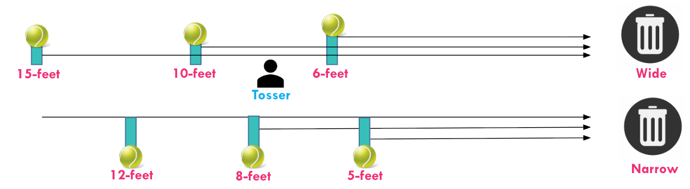

# Module items  { data-readaloud-exclude }
## R Script file code { data-readaloud-exclude }
- :lucide-clipboard-copy: [[Copy the code]] below ➜ Paste into [[RStudio console]] ➜ Hit ++enter++  
    - ```r
    source(url("https://raw.githubusercontent.com/ttezcann/ssric-reg/refs/heads/main/docs/assets/attachments/data/0-packages-data-trashball.R"));
    (function(f="14-modeling-exercises.R"){if(!file.exists(f)){download.file("https://raw.githubusercontent.com/ttezcann/ssric-reg/refs/heads/main/docs/assets/attachments/modules/14.-modeling-exercises/14-modeling-exercises.R",f,mode="wb");file.edit(f)}else{download.file("https://raw.githubusercontent.com/ttezcann/ssric-reg/refs/heads/main/docs/assets/attachments/modules/14.-modeling-exercises/14-modeling-exercises.R",gsub(".R","-original.R",f),mode="wb");file.edit(gsub(".R","-original.R",f))}})()
    ```
        - When this R script file opens in a new tab, [[Save R script file|save your previous R script file(s)]], and 
            - Close the previous tabs (R Script files), which you can find later in the [[Files tab]].

## Lab assignment  { data-readaloud-exclude }
[Modeling exercises :lucide-download:](https://github.com/ttezcann/ssric-reg/raw/refs/heads/main/docs/assets/attachments/modules/14.-modeling-exercises/14-modeling-exercises.docx){ .md-button .md-button--primary }

### Sample lab assignment  { data-readaloud-exclude }
[Sample: Modeling exercises :lucide-download:](https://github.com/ttezcann/ssric-reg/raw/refs/heads/main/docs/assets/attachments/modules/14.-modeling-exercises/14.1-sample-modeling-exercises.docx){ .md-button .md-button--primary }

## Suggested reading  { data-readaloud-exclude }
<div class="grid cards" markdown>
- :lucide-book-open:  
Sperandei, Sandro. 2014. “Understanding Logistic Regression Analysis.” Biochemia Medica 24(1):12–18. doi:10.11613/BM.2014.003
</div>

<!-- slide-break -->
## Learning outcomes
1. Apply logistic regression to a different dataset
<!-- slide-break -->
# The content of the module
- We will use the dataset created during in-person classes in previous semesters.
- 189 students tossed a ball into a trash can from various distances.
- Those 189 students also filled out a survey with information (both relevant and irrelevant) to predict targeting trash can.
<!-- slide-break -->
# Trashball: Logistic regression classroom activity
- 
    - The activity involved students attempting to toss a ball into a trash can from various distances.
    - Students targeted the wide trash can from 6, 10, 15-feet away and the narrow trash can from 5, 8, 12-feet away.
<!-- slide-break -->
# Recorded data and survey
- | Variable name | Variable label | Variable type | Question wording and response categories | Comparison category |
  |---|---|---|---|---|
  | `success` | Hitting the target | Binary-Dummy | Recorded data:<br><br>*(1: Success; 0: No success)*  |  |
  | `distance` | Distance from the trash can| Continuous | Recorded data:<br><br>*(Min: 5, Max: 15 feet)*  |  |
  | `narrow` | Tossing a ball to a narrow trash can| Binary-Dummy  | Recorded data:<br><br>*(1: Tossing a ball to a narrow trash can; 0: Tossing a ball to a wide trash can )*  | Tossing a ball to a wide trash can |
  | `sleep` | Having at least seven hours sleep | Binary-Dummy  | Did you sleep at least 7 hours last night? <br><br>*(1: Yes; 0: No)*  |Having less than seven hours sleep|
  | `hungry` | Hunger level |  Ordinal ✅  | How hungry are you right now? <br><br>*(1: Not hungry at all;  2: Slightly hungry, 3: Moderately hungry, 4: Very hungry; 5: Extremely hungry)*  ||
  | `physicallyactive` | The level of physical activity|  Ordinal ✅  | How physically active are you on a regular basis? <br><br>*(1: Not at all;  2: Slightly active;  3: Moderately active;  4: Very active; 5: Extremely active)*  ||
  | `regularsports` | Playing sports regularly |  Binary-Dummy   | Do you play any sports regularly? <br><br>*(1: Yes; 0: No)*  |Not playing sports regularly|
  | `physicallycoordinated` | The level of physical coordination|  Ordinal ✅  | Do you consider yourself physically coordinated?<br><br>*(1: Not at all; 2: Slightly; 3: Moderately; 4: Very; 5: Extremely)*  ||
  | `competitive` | The level of competitiveness|  Ordinal ✅  | How competitive do you consider yourself to be?<br><br>*(1: Not at all; 2: Slightly; 3: Moderately; 4: Very; 5: Extremely)*  ||
  | `outgoing` | The level of outgoingness |  Ordinal ✅  | Would you describe yourself as outgoing?<br><br>*(1: Not at all, 2: Slightly; 3: Moderately; 4: Very; 5: Extremely)*  ||
  | `nervous` | The level of nervousness  |  Ordinal ✅  | How nervous do you generally feel in new situations? <br><br>*(1: Not at all; 2: Slightly; 3: Moderately; 4: Very; 5: Extremely)* ||
  | `confidence` | The level of confidence|  Ordinal ✅  | How confident do you feel in general, day-to-day? <br><br>*(1: Not confident at all; 2: Slightly confident; 3: Moderately confident; 4: Very confident; 5: Extremely confident)*  |
    - !!! success "Binary variables are already dummy"
        Binary variables, `success`, `distance`, `narrow`, `sleep`, and `regularsports`, are already recorded as dummy variable, **1-0**.
<!-- slide-break -->
- In this analysis, we propose a cause-and-effect relationship in which these factor variables may affect (increase or decrease) the odds of hitting the target.
    - ```mermaid
    flowchart LR
        subgraph C0[Continuous factor variable]
            direction BT
            C01[Distance from the trash can]
            C02[Physical coordination]
        end

        subgraph D0[Dummy factor variables]
            subgraph I0[Narrow]
                direction TB
                I1[Narrow trash can]
                I2[Wide trash can]
            end

            subgraph M0[Playing sports regularly]
                direction TB
                M1[1: Yes]
                M2[0: No]
            end
        end

        subgraph O0[Dummy outcome variable]
            E[Success<br><br>1: Hitting <br><br> 0: Not hitting]
        end

        C01 -.->|May affect| E
        C02 -.->|May affect| E
        I0 -.->|May affect| E
        M0 -.->|May affect| E
    ```
<!-- slide-break -->
## [[Logistic regression]] #code
- **[[Model code]]**
    - ```r linenums="1"  hl_lines="1 2"
    model1 <- glm(dummy_outcome_here ~ factor1_here + factor2_here + factor3_here, data = trashball, family = binomial(link="logit"))
    tab_model(model1, show.std = T, show.ci = F, collapse.se = T)
    ```
- **[[Working code]]**
    - ```r linenums="1"  hl_lines="1 2"
    model1 <- glm(success ~ distance + narrow + physicallycoordinated + regularsports, data = trashball, family = binomial(link="logit"))
    tab_model(model1, show.std = T, show.ci = F, collapse.se = T)
    ```
        - **Line 1:**  We  put `success` here ➜ `outcome_here`; `distance` here ➜ `factor1_here`; `narrow` here ➜ `factor2_here`; `physicallycoordinated` here ➜ `factor3_here`; `regularsports` here ➜ `factor4_here`.
            - Outcome variable variable first; then, factor variables separated by plus (+).
        - **Line 2:** Check the first argument: `model1`. If this is model1, then we should use model1 here
            - This needs to be `model1`, otherwise this code won't work.
            - Note that the data argument is different since we use a different dataset: `data = trashball`.
                - [[Find this working code in the R script file]].
                    - [[Highlighting and running]] this code will generate the output below (which will appear in the [[viewer tab]] of RStudio).
<!-- slide-break -->
## [[Logistic regression]] #output
- **Hitting the target**
    - | Factors                              |    Odds Ratios     |    std. OR     |      p       |
      |--------------------------------------|:------------------:|:--------------:|:------------:|
      | (Intercept)                          | 278.29<br>(336.53) | 0.64<br>(0.18) | **0.001***** |
      | Distance from the trash can          |   0.37<br>(0.06)   | 0.03<br>(0.02) | **0.001***** |
      | Tossing a ball to a narrow trash can |   0.10<br>(0.06)   | 0.32<br>(0.09) | **0.001***** |
      | The level of physical coordination   |   1.48<br>(0.41)   | 1.57<br>(0.50) |    0.156     |
      | Playing sports regularly             |  13.70<br>(11.49)  | 3.27<br>(1.24) | **0.002****  |
      | Observations                         |        189         |                |              |
      | R² Tjur                              |       0.645        |                |              |
<!-- slide-break -->
## [[Logistic regression]] with dummy variables #interpretation
- !!! note "Logistic regression with dummy variables interpretation sample" 
    - **First section: The significance levels**  
        - Distance from the trash can, tossing a ball to a narrow trash can, and playing sports regularly are statistically significant factors of hitting the target since the p values are less than 0.05. The level of physical coordination is not a statistically significant factor of hitting the target since the p value is greater than 0.05.
    - **Second section: The explanation of odd ratios**   
        - A foot increase in distance from the trash can decreases the odds of hitting the target by 2.70 times.
        - Tossing a ball to a narrow trash can decreases the odds of hitting the target  by 9.82 times compared to tossing a ball to a wide trash can.
        - Playing sports regularly increases the odds of hitting the target by 13.70 times compared to not playing sports regularly.
    - **Third section: The explanation of standardized odd ratios**   
        - The strongest factor of hitting the target is distance from the trash can (std. OR=33.33), followed by playing sports regularly (std. OR=3.27), and tossing a ball to a narrow trash can (std. OR=3.12).
    - **Fourth section: The explanation of Tjur R-squared**   
         - The Tjur R-squared value indicates that 64.5% of the variation in hitting the target can be explained by distance from the trash can, tossing a ball to a narrow trash can, and playing sports regularly.
<!-- slide-break -->
- !!! quote "Logistic regression with dummy variables interpretation template"
    - **First section: The significance levels**  
        - **[[Variable label]]** of significant **[[factor variable]] 1**, **variable label** of significant **factor variable 2**, **variable label** of significant **factor variable 3**...  are statistically significant factors of **variable label** of **[[outcome variable]]** since the p values are less than 0.05. [If any]: variable label of significant factor variable 4, variable label of significant factor variable 5... is(are) not statistically significant factor(s) of variable label of outcome variable since the p value(s) is(are) greater than 0.05.
    - **Second section: The explanation of odd ratios**   
        - A **[unit/day/score,year,dollar *(unit of analysis of continuous factor variable1)*]** increase in **variable label** of significant continuous **factor variable 1** increases/decreases the odds of **variable label** of **outcome variable** by **odd ratio + times**. 
        - **variable label** of **included dummy variable 1** increases/decreases the odds of **variable label** of **outcome variable** by **odd ratio + times** compared to **omitted dummy variable 1**.
        - **variable label** of **included dummy variable 2** increases/decreases the odds of **variable label** of **outcome variable** by **odd ratio + times** compared to **omitted dummy variable 2**.
    - **Third section: The explanation of standardized odd ratios**   
          - The strongest factor of **variable label** of **outcome variable** is the variable label of first strongest factor variable **(std. OR=0.xx)**, followed by variable label of second strongest factor variable **(std. OR=0.xx)**, and variable label of third strongest factor variable **(std. OR=0.xx)**...
    - **Fourth section: The explanation of Tjur R-squared**   
        - The **[[Tjur R-squared]]** value indicates that **Tjur R-squared value** of the variation in **variable label** of **outcome variable** can be explained by **variable label** of significant **factor variable 1**, **variable label** of significant **factor variable2**, **variable label** of significant **factor variable3**...
<!-- slide-break -->
- !!! success "Interpretation explanation"
    - **First section: The significance levels**  
        - Mention which variables **variable labels** are statistically significant, and which variables are statistically nonsignificant (if any). Variables with at least one asterisk (*) are statistically significant.  
    - **Second section: The explanation of coefficients**  
        - Mention how significant factor variables increase or decrease the value of the outcome variable, using "Coefficients" (Coeff. column). 
        - When reporting the coefficients of continuos variables, ensure that the sentence includes the unit of analysis (one unit, a day, a score, a year, a dollar, etc.) of both the factor variables and the outcome variable. 
        - When reporting the coefficients of dummy variables, ensure that the sentence includes omitted - comparison category.
            - **Note:** Do not mention nonsignificant variables here.
    - **Third section: The explanation of standardized coefficients**  
        - Mention the strongest factor variables of the outcome variable using the "Standardized coefficients" (Std. Coeff. column) in order. Only mention the statistically significant ones. "Standardized coefficient" is an absolute number, which means -.56 is stronger than .45.
            - **Note:** Do not mention nonsignificant variables here.
    - **Fourth section: The explanation of adjusted R-squared**  
        - Report the Tjur R-squared value as a percentage with the statistically significant variables.
            - **Note:** Do not mention nonsignificant variables here.
<!-- slide-end -->