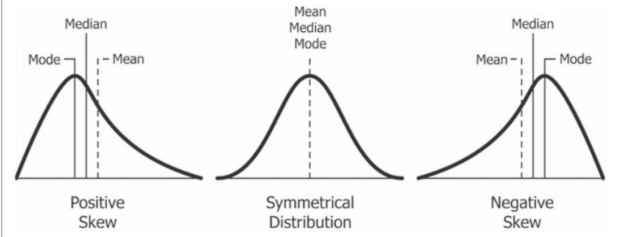
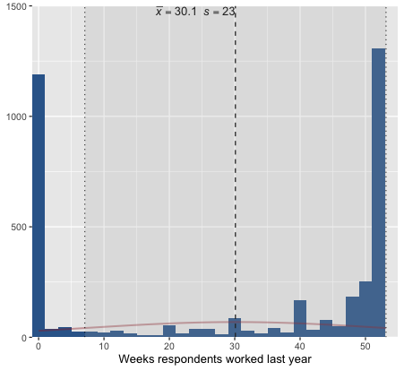
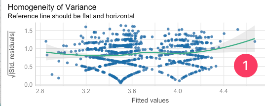
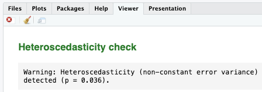
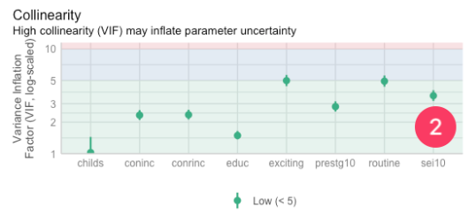
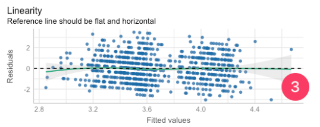
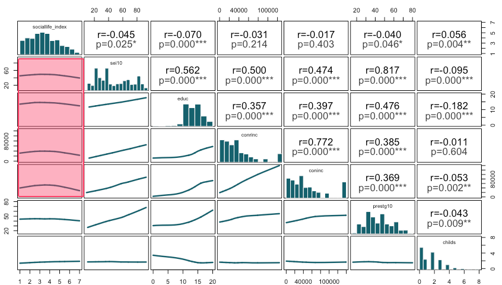
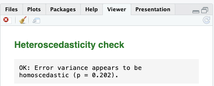

# Module items { data-readaloud-exclude }
## R Script file code { data-readaloud-exclude }
- :lucide-clipboard-copy: [[Copy the code]] below ➜ Paste into [[RStudio console]] ➜ Hit ++enter++  
    - ```r
    source(url("https://raw.githubusercontent.com/ttezcann/ssric-reg/refs/heads/main/docs/assets/attachments/data/0-packages-data.R")); 
    (function(f="15-regression-assumptions-diagnostics.R"){if(!file.exists(f)){download.file("https://raw.githubusercontent.com/ttezcann/ssric-reg/refs/heads/main/docs/assets/attachments/modules/15.-regression-assumptions-diagnostics/15-regression-assumptions-diagnostics.R",f,mode="wb");file.edit(f)}else{download.file("https://raw.githubusercontent.com/ttezcann/ssric-reg/refs/heads/main/docs/assets/attachments/modules/15.-regression-assumptions-diagnostics/15-regression-assumptions-diagnostics.R",gsub(".R","-original.R",f),mode="wb");file.edit(gsub(".R","-original.R",f))}})()
    ```
        - When this R script file opens in a new tab, [[Save R script file|save your previous R script file(s)]], and 
            - Close the previous tabs (R Script files), which you can find later in the [[Files tab]].

## Lab assignment  { data-readaloud-exclude }
[Regression analysis assumptions and diagnostics :lucide-download:](https://github.com/ttezcann/ssric-reg/raw/refs/heads/main/docs/assets/attachments/modules/15.-regression-assumptions-diagnostics/15-regression-assumptions-diagnostics.docx){ .md-button .md-button--primary }

### Sample lab assignment  { data-readaloud-exclude }
In this assignment, you will run the exact same codes provided in the R script file without making any changes. Therefore, there’s no sample lab assignment file.

## Suggested reading  { data-readaloud-exclude }
<div class="grid cards" markdown>
- :lucide-book-open:  
Hernán, Miguel A., John Hsu, and Brian Healy. 2019. “A Second Chance to Get Causal Inference Right: A Classification of Data Science Tasks.” Chance 32(1):42–49. doi:10.1080/09332480.2019.1579578
</div>

<!-- slide-break -->
## Learning outcomes
1. Learn the five key assumptions of regression analysis
    1. Identify the issues posed by homoscedasticity and heteroscedasticity
    2. Identify the issues posed by multicollinearity
    3. Identify the issues posed by curvilinear relationships
    4. Identify the issues posed by non-normally distributed variables
    5. Identify the issues posed by the lack of 10% minimum threshold
2. Learn the diagnostic tools:
    1. Performance package
    2. Scatterplot matrix
3. Revise a regression model that violates assumptions and compare model diagnostics before and after revision
<!-- slide-break -->
# [[Linear regression assumptions]] - Overview
- **Assumption 1:**
    - Enough sample size for each category of the dummy variables; 
        - For larger sample sizes (>1,000 people), such as GSS, ensure that the least frequent category of any variable employed (whether outcome or factor) constitutes at least 10% of the sample.
- **Assumption 2:**
    - The continuous variables used should display approximately normal distribution; 
        - Most people's values should be clustered around the middle, not at the very high or very low ends.
- **Assumption 3:**
    - There needs to be a linear relationship between outcome variable and continuous factor variables;
        - This means avoiding a curvilinear relationship, where as one variable goes up, the other initially follows but then starts to go in the opposite direction, or the reverse.
- **Assumption 4:** 
    - Error variance should appear to be homoscedastic;
        - We need the size of the errors our model makes to be pretty much the same, no matter what values the factor variables have.
- **Assumption 5:**
    - There should not be a multicollinearity issue;
        - A situation where two or more of the independent variables in a regression model are highly correlated with each other.
<!-- slide-break -->
## Assumption 1: Homoscedasticity
- [[Homoscedasticity]] refers to a situation in statistics where the variability of a variable is consistent across all levels of another variable.
    - For linear regression to be accurate, the spread of data points should be uniform across all values of the independent variable. 
    - Linear regression aims to create a straight-line model that best fits the data.
        - 
<!-- slide-break -->
    - **Several reasons cause this [[heteroscedasticity]] issue:**
        - **Outliers:** Extreme values in data can lead to heteroscedasticity.
        - **Nonlinear relationships:** When the relationship between the independent and dependent variables is nonlinear (i.e., curvilinear), it can lead to heteroscedasticity.
        - **Omitted variables:** If important variables are omitted from the regression model, they can lead to heteroscedasticity.
            - !!! note "Addressing the heteroscedasticity"
                - For this module, we will address the heteroscedasticity issue by removing the problematic variables from the model.
<!-- slide-break -->
## Assumption 2: Multicollinearity
- [[Multicollinearity]] occurs when two or more variables in a regression model are dependent upon the other variables in such a way that one can be linearly predicted from the other with a high degree of accuracy.
    - In multicollinearity, two or more of the factor variables correlate strongly with each other.
        - {width="500"}
<!-- slide-break -->
    - **Several solutions exist for [[multicollinearity]] issue:**
        - Removing one of the strongly correlated variables
        - Creating an index variable using strongly correlated variables
        - Centering variables (subtracting the mean value from each observation)
        - Lasso regression (L1 Regularization)
            - !!! note "Addressing the multicollinearity issue"
                - For this module, we will address the multicollinearity issue by removing one of the strongly correlated variables from the model.
<!-- slide-break -->
## Assumption 3: Linear relationship
- The term "[[linearity]]" in linear regression refers to the expected linear relationships in the coefficients, meaning the one-unit increase/decrease in the factor variable causes increase/decrease in the outcome variable.
    - [[Curvilinear relationship]] between continuous factor and outcome variables violate linear regression assumptions.
        - 
<!-- slide-break -->
    - **Several solutions exist for [[curvilinear relationship]] issue:**
        - Recoding the variable into categorical
        - Polynomial regression
        - Adding interaction terms
        - Rescaling or standardizing variables (converting them to z-scores)
            - !!! note "Addressing the curvilinear relationship"
                - For this module, we will address the curvilinear relationship issue by removing the problematic variables from the model.
<!-- slide-break -->
## Assumption 4: Normal distribution 
- The continuous variables used should display approximately [[normal distribution]].
    - 
<!-- slide-break -->
- For example, this kind of variables should not be treated as continuous due to the distribution shape:
    - ```r linenums="1"  
    plot_frq(gss$weekswrk,
    type = "bar",
    geom.colors = "#336699")
    ```
        - {width="600"}
<!-- slide-break -->
    - **Several solutions exist for [[nonnormal distribution]] issue:**
        - Recoding the variable into categorical
        - Logarithmic transformation **(log(x))**
        - Square root transformation **(sqrt(x))**
        - Inverse transformation **(1/x)**
        - Adding Polynomial terms **(x^2)**
        - !!! note "Addressing the nonnormal distribution"
            - For this module, we will address the nonnormal distribution issue by removing the problematic variables from the model.
<!-- slide-break -->
## Assumption 5: At least 10% of the cases 
- The least frequent response category should have at least [[10% of the cases]].
    - Before creating dummy variables, we check the frequency distributions to make sure there are at least 10% of the cases in each category.
    - Let's check the frequency table of `class` variable.
        - We cannot create dummy variables for each response category. "Upper class" has 4.13%
    - ```r linenums="1"  
    frq(gss$class, out = "v")
    ```
        - **Respondents' subjective class identification (Variable label)**  
            - | value | value label         | frq | raw.prc | valid.prc | cum.prc |
          |---:|---------------|----:|--------:|----------:|--------:|
          | 1 | Lower class   | 446  | 11.19   | 11.31     | 11.31   |
          | 2 | Working class | 1587 | 39.81   | 40.25     | 51.56   |
          | 3 | Middle class  | 1747 | 43.83   | 44.31     | 95.87   |
          | 4 | Upper class   | 163  | 4.09    | ==4.13==      | 100.00  |
          | 5 | No class      | 0    | 0.00    | 0.00      | 100.00  |
          | NA | NA           | 43   | 1.08    | NA        | NA      |
<!-- slide-break -->
    - **Several solutions exist for having less than [[10% of the cases]] issue:**
        - Removing the variable from the model
        - Collapsing the rare category into an adjacent one (e.g., merging "Upper class" with "Middle class")
        - Dropping cases in the rare category from the sample (use cautiously; may introduce bias)
        - Treating the variable as continuous if it is ordinal and the distribution is otherwise reasonable
<!-- slide-break -->
# GSS example: Predicting social life index score
- We'll use [[computing]] to create an [[index variable]] for our outcome variable, `sociallife_index`.
    - ```mermaid
    flowchart LR
    subgraph C0[Factor variables]
        direction TB
        A[Respondents' socio-economic index score]
        B[Respondents' education in years]
        D[Respondents' personal income]
        F[Respondents' family income]
        G[Respondents' occupational prestige score]
        H[Number of children respondents have]
        I[Level of finding life exciting]
    end
    subgraph O0[Outcome variable - Index]
        E[Social life index score<br><br> The mean of: <br><br>  1: Frequency of social evening with relatives <br><br> 2: Frequency of social evening with neighbors]
    end
    A -.->|May affect| E
    B -.->|May affect| E
    D -.->|May affect| E
    F -.->|May affect| E
    G -.->|May affect| E
    H -.->|May affect| E
    I -.->|May affect| E
    ```

<!-- slide-break -->
- The first two variables are to create `sociallife_index` variable.
    - | Variable name    | Variable label   | Variable type  | Question wording and response categories  |
      | -------------------------- | ------------------- | -------------- | -------------------- |
      | `socrel` | Frequency of social evening with relatives | Ordinal ✅ RECODE | How often do you spend a social evening with relatives?<br><br>*(1: Almost daily; 2: Once or twice a week; 3: Several times a month; 4: About once a month; 5: Several times a year; 6: About once a year; 7: Never)* |
      | `socommun` | Frequency of social evening with neighbors | Ordinal ✅ RECODE | How often do you spend a social evening with neighbors?<br><br>*(1: Almost daily; 2: Once or twice a week; 3: Several times a month; 4: About once a month; 5: Several times a year; 6: About once a year; 7: Never)* |
      | `educ` | Respondents' education in years | Continuous | What is the highest year of school you completed?<br><br>*(Min: 0, Max: 20)*  |
      | `coninc` | Respondents' family income | Continuous | What is your family income in dollars?<br><br>*(Min: $281.5, Max: $139,024.4)*  |
      | `conrinc` | Respondents' personal income | Continuous | What is your income in dollars? <br><br>*(Min: $281.5; Max, $123,761.9)*  |
      | `prestg10` | Respondents' occupational prestige score | Continuous | Respondent's occupational prestige score (calculated) <br><br>*(Min: 16, Max: 80)* |
      | `childs` | Number of children respondents have | Continuous | How many children do you have? <br><br>*(Min: 0, Max: 8)*  |
      | `life` <br><br> **From:** [**Variables in GSS**](../resources/variables-in-gss.md) | Level of finding life exciting | Ordinal, RECODE | In general, do you find life exciting, pretty routine, or dull?<br><br>*(1: Exciting; 2: Routine; 3: Dull)* |
<!-- slide-break -->
## [[Recoding]] and [[computing]] #code
- **[[Working code]]**
    - ```r linenums="1"
    # Recode sociallife_index (social life index) variables

    gss$socrel_reversed <- rec(gss$socrel, rec = 
    "1=7 [almost daily];
    2=6 [once or twice a week]; 
    3=5 [several times a month]; 
    4=4 [about once a month]; 
    5=3 [several times a year]; 
    6=2 [about once a year];
    7=1 [never]", append = FALSE)

    gss$socommun_reversed <- rec(gss$socommun, rec = 
    "1=7 [almost daily];
    2=6 [once or twice a week]; 
    3=5 [several times a month]; 
    4=4 [about once a month]; 
    5=3 [several times a year]; 
    6=2 [about once a year];
    7=1 [never]", append = FALSE)

    # Compute sociallife_index (social life index) variable

    gss$sociallife_index <- structure(rowMeans(
    gss[, c("socrel_reversed", "socommun_reversed")], na.rm = TRUE), 
    label = "Social life index score")
    ```
        - [[Find this working code in the R script file]]. 
            - [[Highlighting and running]] this code will create three more variables.
<!-- slide-break -->
## [[Dummy variable]] #code
- **[[Working code]]**
    - ```r linenums="1"
    gss$exciting <- 
    ifelse(gss$life == 1, 1, 0,
    label = "Finding life exciting")

    gss$routine <- 
    ifelse(gss$life == 2, 1, 0,
    label = "Finding life routine")

    gss$dull <- 
    ifelse(gss$life == 3, 1, 0,
    label = "Finding life dull")
    ```
        - [[Find this working code in the R script file]]. 
            - [[Highlighting and running]] this code will create three more variables.
<!-- slide-break -->
## [[Linear regression]] #code (Model 1)
- **[[Working code]]**
    - ```r linenums="1"  hl_lines="1 2"
    model1 <- lm(sociallife_index ~ sei10 + educ + conrinc + coninc + prestg10 + childs + exciting + routine, data = gss)
    tab_model(model1, show.std = T, show.ci = F, collapse.se = T)
    ```
        - [[Find this working code in the R script file]]. 
            - [[Highlighting and running]] this code will generate the output below (which will appear in the [[viewer tab]] of RStudio).
<!-- slide-break -->
## [[Linear regression]] #output (Model 1)
- **Social life index score**
    - | Factors                                  |     Coeff.      |   std. Coeff.   |      p       |
      |------------------------------------------|:---------------:|:---------------:|:------------:|
      | (Intercept)                              | 3.69<br>(0.34)  | -0.00<br>(0.03) | **0.001***** |
      | Respondents' socio-economic index score  | 0.00<br>(0.00)  | 0.04<br>(0.07)  |    0.505     |
      | Respondents' education in years          | -0.04<br>(0.02) | -0.07<br>(0.04) |    0.076     |
      | Respondents' personal income             | 0.00<br>(0.00)  | 0.00<br>(0.05)  |    0.950     |
      | Respondents' family income               | -0.00<br>(0.00) | -0.06<br>(0.05) |    0.254     |
      | Respondents' occupational prestige score | -0.00<br>(0.01) | -0.03<br>(0.06) |    0.618     |
      | Number of children respondents have      | 0.02<br>(0.03)  | 0.02<br>(0.04)  |    0.537     |
      | Finding life exciting                    | 1.02<br>(0.22)  | 0.36<br>(0.08)  | **0.001***** |
      | Finding life routine                     | 0.40<br>(0.21)  | 0.15<br>(0.08)  |    0.056     |
      | Observations                             |       794       |                 |              |
      | R² / R² adjusted                         |  0.062 / 0.052  |                 |              |
<!-- slide-break -->
## [[Linear regression]] #interpretation (Model 1)
- !!! note "Linear regression interpretation sample" 
    - **First section: The significance levels**   
        - Finding life exciting is a statistically significant factor of social life index score since the p value is less than 0.05. Respondents' socio-economic index score, respondents' education in years, respondents' personal income, respondents' family income, respondents' occupational prestige score, number of children respondents have, and finding life routine  are not statistically significant factors social life index score since the p value is greater than 0.05.

    - **Second section: The explanation of coefficients**   
        - Finding life exciting increases social life index score by 1.02 points compared to finding life dull.

    - **Third section: The explanation of standardized coefficients**   
        - The strongest factor of social life index score is finding life exciting (std. Coeff=0.36).

    - **Fourth section: The explanation of adjusted R-squared**   
        - The adjusted R squared value indicates that 5.2% of the variation in social life index score can be explained by finding life exciting.
<!-- slide-break -->
# Assessing the assumptions
## [[Performance diagnostic]] #code
- **[[Working code]]**
    - ```r linenums="1"
    check_model(model1)
    ```
        - This code will display general problems for the first three assumptions
        - [[Find this working code in the R script file]]. 
            - [[Highlighting and running]] this code will generate the output below (which will appear in the [[plots tab]] of RStudio).
<!-- slide-break -->
## [[Performance diagnostic]] #output
- ![A multi-panel regression diagnostic figure shows several checks: (1) a residuals versus fitted values plot indicating non-constant spread of residuals, suggesting heteroscedasticity; (2) a variance inflation factor (VIF) plot showing elevated values for some predictors, indicating multicollinearity; and (3) a residuals versus fitted values plot with a curved trend, indicating non-linearity. Other panels display posterior predictive checks, influential observations, and a normal Q–Q plot for residuals.](../assets/attachments/modules/15.-regression-assumptions-diagnostics/performance_diagnostic.png)
    - The output shows:
        - **Assumption (1)** [[Homoscedasticity]] diagnostic
        - **Assumption (2)** [[Multicollinearity]] diagnostic
        - **Assumption (3)** [[Linearity]] diagnostic
<!-- slide-break -->
## Assumption 1: Homoscedasticity
- Homogeneity of variance (Reference line should be flat and horizontal): 
    - {width="500"}
        - The current model is not homoscedastic.
        - We'll run the following code for more details:
<!-- slide-break -->
### [[Homoscedasticity]] #code (Model 1)
- **[[Working code]]**
    - ```r linenums="1"
    check_heteroscedasticity(model1)
    ```
        - [[Find this working code in the R script file]]. 
            - [[Highlighting and running]] this code will generate the output below (which will appear in the [[viewer tab]] of RStudio).
<!-- slide-break -->
### [[Homoscedasticity]] #output (Model 1)
- {width="500"}
    - Since the p-value is less than 0.05, we can confidently conclude that our model exhibits heteroscedasticity, which is not ideal.
<!-- slide-break -->
## Assumption 2: Multicollinearity
- **[[VIF]]:**
    - The Variance Inflation Factor (VIF) is a measure used to detect the presence and severity of multicollinearity in a regression analysis.
    - The ideal value for VIF is close to 2.
    - The VIF values of `coninc` and `conrinc`, and `prestg10` and `sei10` are very close.
        - We cannot use these pairs in the same model, as they measure almost the same thing.
            - {width="500"}
- We'll run the following code for more details:
<!-- slide-break -->
### [[Multicollinearity]] #code (Model 1)
- **[[Working code]]**
    - ```r linenums="1"
    check_collinearity(model1)
    ```
        - [[Find this working code in the R script file]]. 
            - [[Highlighting and running]] this code will generate the output below (which will appear in the [[viewer tab]] of RStudio).
<!-- slide-break -->
### [[Multicollinearity]] #output (Model 1)
- | Term     | VIF | VIF 95% CI        | adj. VIF | Tolerance | Tolerance 95% CI |
  |----------|----:|-------------------|---------:|----------:|------------------|
  | sei10    | 3.58 | [3.19, 4.03]     | 1.89     | 0.28      | [0.25, 0.31]     |
  | educ     | 1.49 | [1.37, 1.65]     | 1.22     | 0.67      | [0.61, 0.73]     |
  | conrinc  | 2.35 | [2.12, 2.63]     | 1.53     | 0.43      | [0.38, 0.47]     |
  | coninc   | 2.33 | [2.10, 2.61]     | 1.53     | 0.43      | [0.38, 0.48]     |
  | prestg10 | 2.81 | [2.52, 3.16]     | 1.68     | 0.36      | [0.32, 0.40]     |
  | childs   | 1.03 | [1.00, 1.44]     | 1.01     | 0.98      | [0.69, 1.00]     |
  | exciting | 4.98 | [4.42, 5.65]     | 2.23     | 0.20      | [0.18, 0.23]     |
  | routine  | 4.92 | [4.36, 5.58]     | 2.22     | 0.20      | [0.18, 0.23]     |

    - There are many variables with VIFs higher than 2, which is not ideal.
<!-- slide-break -->
## Assumption 3: Linearity
- Linearity (Reference line should be flat and horizontal): 
    - {width="500"}
        - The reference line is not flat. It curves downward as fitted values increase (it starts above zero on the left, dips below in the middle-right). 
            - That's a sign of a non-linear pattern in the data that the model isn't capturing well.
    - To further see this issue, we'll use [[scatterplot graph matrix]].
<!-- slide-break -->
### [[Scatterplot graph matrix]] #code (Model 1)
- **[[Working code]]**
    - ```r linenums="1"
    scatterplot_matrix <- gss[, c("sociallife_index", "sei10", "educ", "conrinc", "coninc", "prestg10", "childs")]
    pairs_panels_pval(scatterplot_matrix, color = "#15616d")
    ```
        - [[Find this working code in the R script file]]. 
            - [[Highlighting and running]] this code will generate the output below (which will appear in the [[plots tab]] of RStudio).
<!-- slide-break -->
### [[Scatterplot graph matrix]] #output (Model 1)
- 
    - The scatterplot boxes suggest curvilinear (nonlinear) relationships rather than straight-line trends.
    - Specifically the relationships between sociallife_index and the socioeconomic variables (sei10, educ, conrinc, and coninc) do not show linear patterns.
        - In other words, increases in socioeconomic status do not translate into proportional increases in social life index score; the relationship appears to change in strength at different levels, which violates the linear relationship assumption.
<!-- slide-break -->
## Assumption 4: Normal distribution
- We'll check [[scatterplot graph matrix]] to see whether the variables violate normal distribution assumption.
<!-- slide-break -->
### [[Scatterplot graph matrix]] #code (Model 1)
- **[[Working code]]**
    - ```r linenums="1"
    scatterplot_matrix <- gss[, c("sociallife_index", "sei10", "educ", "conrinc", "coninc", "prestg10", "childs")]
    pairs_panels_pval(scatterplot_matrix, color = "#15616d")
    ```
        - [[Find this working code in the R script file]]. 
            - [[Highlighting and running]] this code will generate the output below (which will appear in the [[plots tab]] of RStudio).
<!-- slide-break -->
### [[Scatterplot graph matrix]] #output (Model 1)
- 
    - Histograms look approximately normal, however, `childs` is skewed (nonnormal).
<!-- slide-break -->
## Assumption 5: At least 10% of the cases 
- We created dummy variables for `life` variable without checking the frequency distribution.
<!-- slide-break -->
### [[Frequency table]] #code
- **[[Working code]]**
    - ```r linenums="1"  
    frq(gss$life, out = "v")
    ```
        - [[Find this working code in the R script file]]. 
            - [[Highlighting and running]] this code will generate the output below (which will appear in the [[viewer tab]] of RStudio).
<!-- slide-break -->
### [[Frequency table]] #output
- **Level of finding life exciting**  
    - | value | value label |  frq | raw.prc | valid.prc | cum.prc |
      |:------|-------------|-----:|--------:|----------:|--------:|
      | 1     | Exciting    |  971 |   24.36 |     36.42 |   36.42 |
      | 2     | Routine     | 1519 |   38.11 |     56.98 |   93.40 |
      | 3     | Dull        |  176 |    4.42 |  ==6.60== |  100.00 |
      | NA    | NA          | 1320 |   33.12 |        NA |      NA |
        - Here the "Dull" category has only 6.6% of the responses (less than 10%). 
            - We should have merged this category.
<!-- slide-break -->
### [[Dummy variable]] #code
- **[[Working code]]**
    - ```r linenums="1"
    gss$exciting_new <- 
    ifelse(gss$life == 1, 1, 0,
    label = "Finding life exciting")

    gss$routine_dull_new <- 
    ifelse(gss$life == 2 | gss$life == 3, 1, 0,
    label = "Finding life routine or dull")
    ```
        - [[Find this working code in the R script file]]. 
            - [[Highlighting and running]] this code will create two more variables.
<!-- slide-break -->
# Fixing the model (Model 2)
## [[Linear regression]] #code (Model 2)
- **[[Working code]]**
    - ```r linenums="1"  hl_lines="1 2"
    model2 <- lm(sociallife_index ~ educ + exciting_new, data = gss)
    tab_model(model2, show.std = T, show.ci = F, collapse.se = T)
    ```
        - [[Find this working code in the R script file]]. 
            - [[Highlighting and running]] this code will generate the output below (which will appear in the [[viewer tab]] of RStudio).
<!-- slide-break -->
## [[Linear regression]] #output (Model 2)
- **Social life index score**
    - | Factors                         |     Coeff.      |   std. Coeff.   |      p       |
      |---------------------------------|:---------------:|:---------------:|:------------:|
      | (Intercept)                     | 4.01<br>(0.19)  | -0.00<br>(0.03) | **0.001***** |
      | Respondents' education in years | -0.04<br>(0.01) | -0.08<br>(0.03) | **0.004****  |
      | Finding life exciting           | 0.60<br>(0.08)  | 0.20<br>(0.03)  | **0.001***** |
      | Observations                    |      1313       |                 |              |
      | R² / R² adjusted                |  0.043 / 0.041  |                 |              |
<!-- slide-break -->
## [[Linear regression]] #interpretation (Model 2)
- !!! note "Linear regression interpretation sample" 
    - **First section: The significance levels**   
        - Respondents' education in years and finding life exciting are statistically significant factors of social life index score since the p value is less than 0.05.

    - **Second section: The explanation of coefficients**   
        - One year increase in espondents' education decreases social life index score by 0.04 points. Finding life exciting increases social life index score by 0.60 points compared to finding life dull and routine.

    - **Third section: The explanation of standardized coefficients**   
        - The strongest factor of social life index score is finding life exciting (std. Coeff=0.20), followed by respondents' education in years (std. Coeff=-0.08)

    - **Fourth section: The explanation of adjusted R-squared**   
        - The adjusted R squared value indicates that 4.1% of the variation in social life index score can be explained by respondents' education in years and finding life exciting.
<!-- slide-break -->
# Assessing the assumptions
## [[Performance diagnostic]] #code (Model 2)
- **[[Working code]]**
    - ```r linenums="1"
    check_model(model2)
    ```
        - [[Find this working code in the R script file]]. 
            - [[Highlighting and running]] this code will generate the output below (which will appear in the [[plots tab]] of RStudio).
<!-- slide-break -->
## [[Performance diagnostic]] #output (Model 2)
- ![A multi-panel regression diagnostic figure shows several checks: (1) a residuals versus fitted values plot indicating non-constant spread of residuals, suggesting heteroscedasticity; (2) a variance inflation factor (VIF) plot showing elevated values for some predictors, indicating multicollinearity; and (3) a residuals versus fitted values plot with a curved trend, indicating non-linearity. Other panels display posterior predictive checks, influential observations, and a normal Q–Q plot for residuals.](../assets/attachments/modules/15.-regression-assumptions-diagnostics/performance-diagnostic-2.png)
<!-- slide-break -->
## [[Homoscedasticity]] #code (Model 2)
- **[[Working code]]**
    - ```r linenums="1"
    check_heteroscedasticity(model2)
    ```
        - [[Find this working code in the R script file]]. 
            - [[Highlighting and running]] this code will generate the output below (which will appear in the [[viewer tab]] of RStudio).
<!-- slide-break -->
## [[Homoscedasticity]] #output (Model 2)
- {width="500"}
    - Since the p-value is higher than 0.05, we can confidently conclude that our model exhibits homoscedasticity, which is ideal.
<!-- slide-break -->
### [[Multicollinearity]] #code (Model 2)
- **[[Working code]]**
    - ```r linenums="1"
    check_collinearity(model2)
    ```
        - [[Find this working code in the R script file]]. 
            - [[Highlighting and running]] this code will generate the output below (which will appear in the [[viewer tab]] of RStudio).
<!-- slide-break -->
### [[Multicollinearity]] #output (Model 2)
- | Term         |  VIF | VIF 95% CI   | adj. VIF | Tolerance | Tolerance 95% CI |
  |--------------|-----:|--------------|---------:|----------:|------------------|
  | educ         | 1.02 | [1.00, 1.45] |     1.01 |      0.98 | [0.69, 1.00]     |
  | exciting_new | 1.02 | [1.00, 1.45] |     1.01 |      0.98 | [0.69, 1.00]     |

<!-- slide-end -->