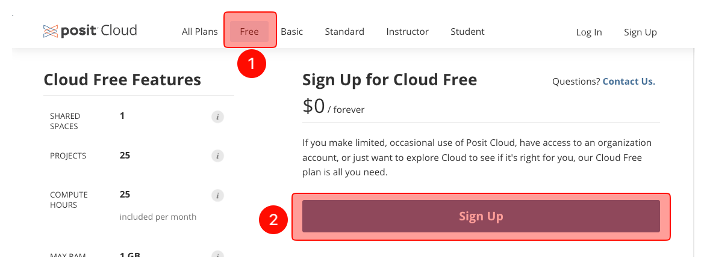
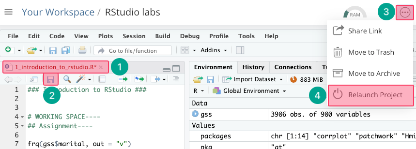
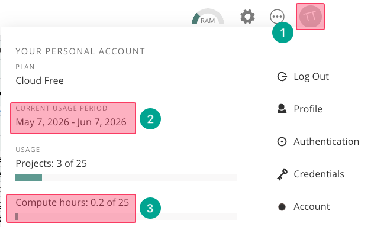
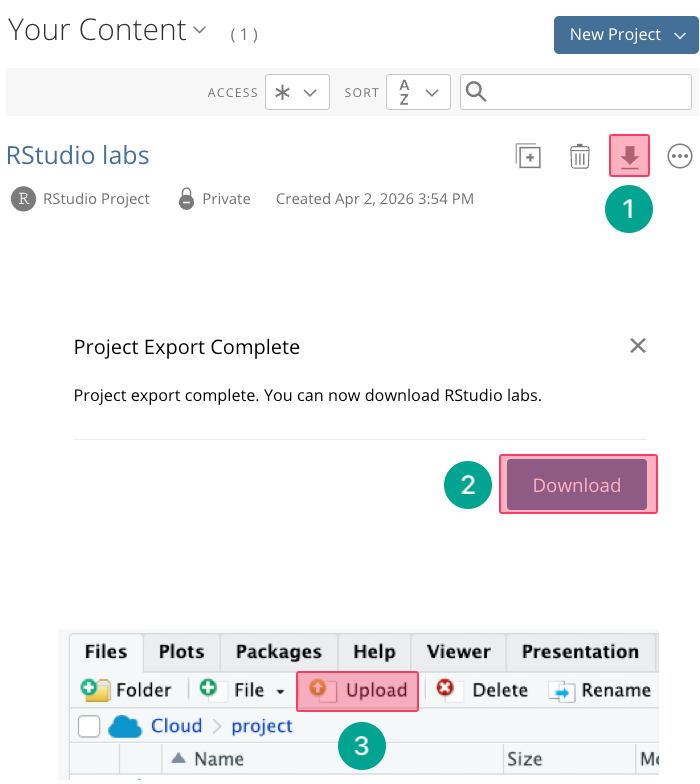

# Create a free RStudio Cloud account
## RStudio website
- {width="600"}
    1. Go to [RStudio website](https://posit.cloud/plans/free) and choose “Free.”
    2. Click "Sign up."
## Email address and a password
- {width="400"}
    1. Put your email address
    2. Put a password (at least 10 characters). You must:
        1. Use upper and lower case letters
        2. Use numbers
        3. Use special characters
    3. Click "Sign up".
## Verification
1. Go to your email inbox and click “Verify.”
2. You will be directed to [RStudio website](https://posit.cloud). If not, click on the link.

## New project (RStudio labs)
- {width="700"}
    1. Click "New Project."
    2. Choose "New RStudio Project." 
        1. You will wait 10-15 second while RStudio deploys the project. If it takes longer, refresh your page.
    3. On the new screen, click on “Untitled Project” and type “RStudio labs”.
        - !!! note "RStudio labs project"
            Many users mistakenly create a separate project for each lab. This is incorrect.  
            You will not create a new project for each lab.  
            Instead, you will always work within the existing 'RStudio labs' project throughout the modules.

# Install R and RStudio to your personal computer
- You can download R and RStudio to your personal computer.

## Mac users
### macOS 14 and higher - Apple silicon Macs (M1-5):
1. [Download R](https://cran.r-project.org/bin/macosx/sonoma-arm64/base/R-4.6.0-arm64.pkg) (4.6.0)
2. [Download RStudio](https://download1.rstudio.org/electron/macos/RStudio-2026.04.0-526.dmg)(2026.04.0+526)

### macOS 12 and higher - Intel Macs:
1. [Download R](https://cran.r-project.org/bin/macosx/big-sur-x86_64/base/R-4.6.0-x86_64.pkg) (4.6.0)
2. [Download RStudio](https://download1.rstudio.org/electron/macos/RStudio-2024.04.2-764.dmg) (2024.04.2+764)
    - !!! note "System Preferences"
        macOS may want you to allow it to download.  
        Open System Preferences ➜ Security & Privacy ➜ General ➜ Allow (you may need to click the lock at the bottom to unlock).

## Windows users
### Windows 10 and higher
1. [Download R](https://cran.r-project.org/bin/windows/base/R-4.6.0-win.exe) (4.6.0)
2. [Download RStudio](https://download1.rstudio.org/electron/windows/RStudio-2026.04.0-526.exe) (2026.04.0+526)
    - !!! note "System Preferences"
        Windows users may need to change some of their settings.  
        Select Start ➜ Settings ➜ Apps ➜ Apps & features.  
        Under Installing apps, select "Allow apps from anywhere."

# Using RStudio on a university lab computer
- Every time you log in to a lab computer, the R script files will install all the packages again.
- Because when you log out, lab computers revert to their factory settings and deletes the installed packages.
    1. Type "RStudio" on the search bar of the computer. Open RStudio.
    2. On RStudio, run the R script file code on the console.

# RStudio Cloud FAQs
## What to do if RStudio Cloud crashes?
- This may happen if your RStudio session consumes too much ram.
    - {width="600"}
        1. When we make any changes, the font of the file name will be red with an asterisk (*).
        2. Save your unsaved RScript file. 
        3. Click the three dots next to the settings gear.
        4. Click "Relaunch Project."
            - !!! note "System Preferences"
                After relaunching, we need to use the R Script file code again.

## How to check how many hours left in RStudio Cloud?
- An RStudio Cloud free account allows you 25 hours of connect time per month. 
- Every second the RStudio Cloud is open counts towards this allocated time. 
- Therefore, whenever you are not running code or generating analyses, close the RStudio Cloud browser
    - {width="500"}
        1. Click on your name.
        2. Check the time period.
        3. Check how many hours you have spent.

## What to do if you exceed 25 hours per month?
- 25 hours of connect time is enough for the modules. If you exceed this limit, open another free account using a different email address.

## What to do if you want your new free account to be identical (files, packages, etc.) to the previous account where you exceeded the time limit?
- Go to the previous account where you exceeded the time limit.
    - {width="500"}
        1. Click "Export"
        2. Click "Download"
            1. It will download a zip file.
        3. Go to your new account. Upload that zip file to your new account.

