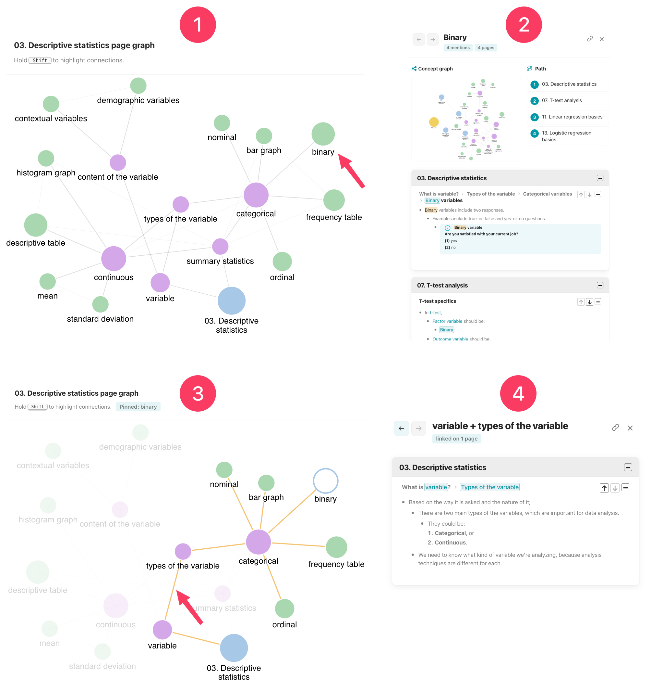

# [[Graphs]]

 - There are three different graphs:
    1. [[Site graph]]: The site graph shows the whole course at a glance.
    2. [[Page graph]]: The page graph is for active page only. It shows the concepts on the page and how they relate to each other.
    3. [[Concept graph]]: The concept graph centers on one concept. It shows that concept's neighbors, the ideas it is mentioned alongside. A small preview appears inside every [[pane]]. Clicking through opens the full view.

## [[Site graph]]

- 
    1. The default view. The user clicks on "standardized coefficient".
    2. The pane opens with:
        1. "Standardized coefficient" [[concept graph]].
        2. Its [[path]], showing the two pages mentions this concept.
        3. The context.
    3. This time, the user hovers "standardized coefficient" and holds ++shift++ to highlight its connections.
        1. This is the [[concept graph]] of "standardized coefficient" within the site graph.
            1. When a site graph freeze is active, sibling concept links appear. Sibling links are normally hidden from the base site graph.
        2. Just like in any graph, the links are clickable. The user clicks the link between "confounding variable" and "linear regression."
    4. The pane opens the context where "confounding variable" and "linear regression" are mentioned together.

## [[Page graph]]

- 
    1. The user opens a page, which shows the page graph preview at the top right corner.
        1. The user clicks that graph and clicks on "binary."
    2. The pane opens with:
        1. "Binary" [[concept graph]].
        2. Its [[path]], showing the four pages mentions this concept.
        3. The context.
    3. This time, the user hovers "binary" and holds ++shift++ to highlight its connections.
        1. This is the teaching path of this specific concept within the page. The hierarchy between the concepts shows this path.
        2. Just like in any graph, the links are clickable. The user clicks the link between "variable" and "types of variable."
    4. The pane opens the context where these two concepts mentioned together.

## [[Concept graph]]

- 
    1. The user clicks on "categorical" on a page, graph, pane, or glossary. The pane opens with:
        1. "Categorical" [[concept graph]].
        2. Its [[path]], showing the five pages mentions this concept.
        3. The context.
            1. The user clicks on "Concept graph" preview.
    2. The concept graph shows all the pages, concepts, and links involved "categorical."
        1. The user clicks "see it in site graph".
    3. The [[site graph]] opens. It automatically freezes the concept.
        1. This is the concept graph within the site graph.
    4. The user clicks on the concept in the site graph, hovers "continuous" and holds ++shift++ to highlight its connections.
        1. This is the teaching path of "categorical" and "continuous" together across the pages.
